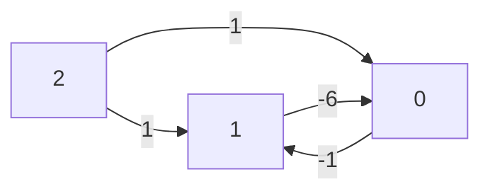

# Programming Blue3

## Motivation
Blue3 is a simple SMT solver implementation in OCaml. It was built to solve many of the simple SMT formulas that `ceval`, short for Concolic Evaluator, spits out.

Before Blue3, [Z3](https://www.microsoft.com/en-us/research/project/z3-3/) was in charge of handling the SMT solving. It still is in charge of SMT solving, but now it is used as a sort-of "fallback" for when Blue3 cannot solve the formula.

Z3 is more than capable of solving our formulas, of course, but the JHU Programming Language lab felt it was overkill for many of the cases. For instance, `ceval` might output something like:

```
(6 <= a) ^ (a < 0)
```

That formula is obviously UNSAT because `a` can't be `6` or more while also being less than `0`.

Many of the formulas `ceval` needs solved are simple / trivial like this. It's fast for Z3 to solve these formulas for sure, but our Z3 solver is the default general one. This results in Z3 performing a lot of extra processing that isn't necessary for our simple cases.

In other words, using Z3 to solve our simple formulas felt like using a bazooka to swat a fly.

Because of this along with the overhead of invoking the external Z3 C++ bindings from OCaml (since `caprice-lang` is written in OCaml), the team felt as if an in-house solver that can handle our trivial cases could improve the performance of `ceval` significantly. 

The initial solution was an informal solver that would essentially guess values for our formulas. It certainly sped up solve times for some simple cases. But it had a major design flaw which was that it had to essentially match on every formula case we deemed "simple". As it turns out, telling a computer that a formula is "simple" programatically is a somewhat nontrivial task, even if it's easy for us to see as humans.

So after diving into the SMT theory rabbit hole for a bit, I eventually landed on the Aalto University's [SMT course docs](https://users.aalto.fi/~tjunttil/2020-DP-AUT/notes-smt/index.html), which happened to have documentation on implementing a specific SMT theory solver that seemed as if it was built for our specific cases.

I am talking about the [Difference Logic](https://users.aalto.fi/~tjunttil/2020-DP-AUT/notes-smt/diff_solver.html) solver. It practically covered all of our simple cases and didn't seem too difficult to implement, so I decided to give it a go.

## Difference Logic and Bellman Ford
Difference logic is about solving **difference** formulas. Formally this means it handles terms that take on the shape:

```
(x - y) <> c
```

Where `x` and `y` are either integer *variables* or the *constant* `0`, `c` is any integer *constant*, and `<>` is a binary operator that is one of `<`, `<=`, `>`, `>=`, and `=`. Specifically, it does *not* handle the `Not equal` operator `!=`, nor does it handle formulas where the left side is the *sum* `x + y`, or any other operator other than `-` for that matter.

As it turns out, many of our "simple" cases are exactly in this difference form, including our example:

```
(6 <= a) ^ (a < 0)
```

Because we can rewrite this as:

```
(0 <= a - 6) ^ (a <= -1)
```

Then writing out out the difference with 0 explicitly...
```
(0 - a <= -6) ^ (a - 0 <= -1)
```

As humans, all this rewriting may seem like extra work because we don't need to do all this to figure out this formula is UNSAT; we just "know" from looking at the formula that it is UNSAT.

But Difference Logic allows us to encode how we "know" that this is UNSAT in a way a computer can understand. Moreover, it is able to handle the "simple" formula cases that we didn't even know were "simple", because it formalizes what type of formula it can solve.

We get the computer to tell us whether formulas like `(6 <= a) ^ (a < 0)` are satisfiable through a familiar shortest distance path graph search.

### Bellman Ford
The Bellman Ford algorithm finds the shortest distance paths from a particular node to all others in a directed graph.

Suppose we have a graph with 3 nodes and 2 edges:

```ocaml
let () =
  let num_nodes = 3 in
  let edges = [|
    (1, 0, -6) ;
    (0, 1, -1) ;
    (2, 0, 1) ;
    (2, 1, 1) ;
  |] in
  ...
```

It looks something like this:




## An extra IDL formula case
Difference logic doesn't know anything about boolean logic, including `iff` statements that have difference encodable formula terms in them. Consider the unit clause:

```
(0 <= a) = (a <= b)
```

This represents a biconditional and asserts that either `(0 <= a)` and `(a <= b)` are both true or `(0 <= a)` and `(a <= b)` are both false.

As a disjunction, you can write this as:

```txt
((0 <= a) ^ (a <= b)) v (not (0 <= a) ^ not (a <= b))
```

It turns out this can be expressed as CNF:

```txt
(not (0 <= a) v (a <= b)) ^ ((0 <= a) v not (a <= b))
```

> While we *could* rewrite the `not` cases as their truthful literals `a > 0` and `a > b`, this would generate new formula terms which is not directly encodeable as CNF because the CDCL solver would see `(p v q) ^ (r v s)` for a clause, which is *not* in CNF.

The first version of Blue3 couldn't handle this so we added specific handling for the `Equal` on two `bool` formula cases:

```diff
 | Equal ->
-  begin match x, y with
-  | Const_bool true, e -> e
-  | e, Const_bool true -> e
-  | Const_bool false, e -> not_ e
-  | e, Const_bool false -> not_ e
-  | Const_int _, Key _ -> Binop (Equal, y, x)
-  | Const_int i1, Const_int i2 -> Const_bool (i1 = i2)
-  | e1, e2 when equal e1 e2 -> true_
-  | e1, e2 -> Binop (Equal, e1, e2)
+  begin match bool_opt x, bool_opt y with
+  | Some bx, Some by -> iff bx by
+  | _ ->
+    begin match x, y with
+    | Const_int _, Key _ -> Binop (Equal, y, x)
+    | Const_int i1, Const_int i2 -> Const_bool (i1 = i2)
+    | e1, e2 when equal e1 e2 -> true_
+    | e1, e2 -> Binop (Equal, e1, e2)
+    end
   end
```

Which uses the newly introduced `iff` function:

```ocaml
  and iff (x : (bool, 'k) t) (y : (bool, 'k) t) : (bool, 'k) t =
    match x, y with
    | Const_bool true, e | e, Const_bool true -> e
    | Const_bool false, e | e, Const_bool false -> not_ e
    | e1, e2 when equal e1 e2 -> true_
    | e1, e2 -> and_ [ or_ [not_ e1; e2] ; or_ [e1; not_ e2] ]
```

`iff` propagates the literals in the first two cases that match on the `Const_bool` cases (since `true <-> e => e` and `false <-> e => not e`). Then it simplifies to `true` when `e1` and `e2` are equal.

Finally, we hit our non-trivial case:

```ocaml
| e1, e2 -> and_ [ or_ [not_ e1; e2] ; or_ [e1; not_ e2] ]
```

Which is just our CNF encoding of the biconditional. 

And you may have noticed the new `or_` constructor function. It allows you to express `Or` clauses as lists rather than
as a binary operation. It does so by nesting `Or`s over a fold on the literals:

```ocaml
and or_ (ls : (bool, 'k) t list) : (bool, 'k) t =
  match ls with
  | [] -> const_bool false
  | [x] -> x
  | x :: xs ->
    List.fold_left
      (fun acc f -> binop Or acc f)
      x
      xs
```

Those were all the changes to `Formula` that were necessary to handle this special bijection case, as I tried to keep the additions to a minimum here.
