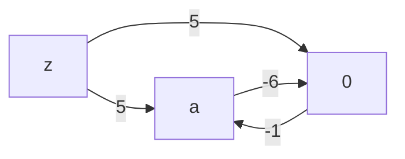
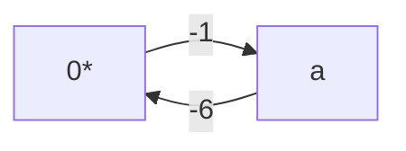
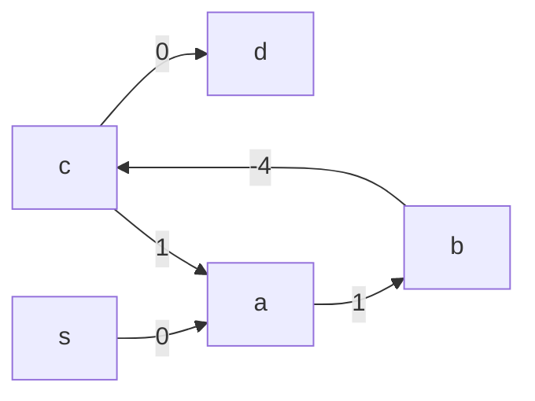
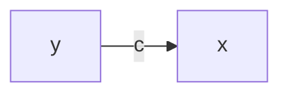
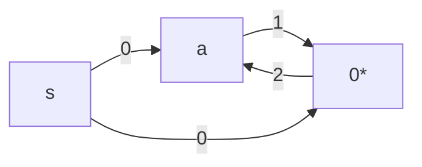
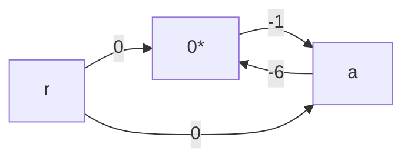
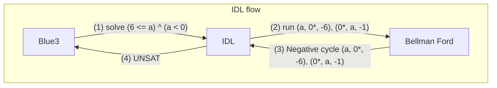
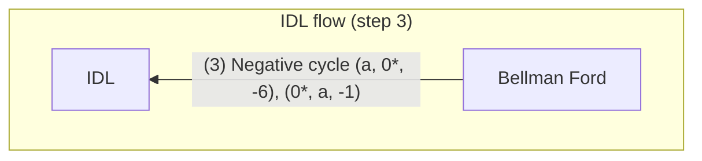
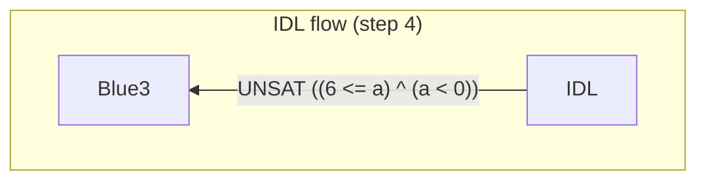

## Difference Logic
Recall that the goal of Blue3 is to solve "simple" formulas that are overkill for the Z3 solver, such as:

```math
(6 \leq a) \land (a \lt 0)
```

A roadblock to implementing our solver was that we had no way to decide whether a formula was "simple". That was indicative of the more general issue of having no way to classify our generic formula AST type.

Luckily, `caprice-lang`'s formula AST is simple and only works with formulas that only operate over `bool`s and `int`s. Although we did not have a way to classify formulas as "simple" or not yet, we could at least tell that these simple formulas tended to work with ints, such as:

| formula_id |            formula             | 
|------------|--------------------------------|
| 9          | (0 < a) ^ ((a + 1) <= a)       |
| 8          | (0 < a) ^ ((a + 1) <= 1)       |
| 56         | (not (a = 0)) ^ ((a + 10) = 0) |
| 11         | (1 < a) ^ (a < 0)              |
| 88         | (0 < a) ^ (a < 1)              |

Integer Difference Logic, or IDL for short, is about solving **difference** formulas with only `int` variables. Speaking in SMT-LIB terms, IDL is a "sub-logic" of the Linear Integer Arithmetic logic which operates under the linear arithmetic theory, known as the `Ints` theory.

There is a variant of IDL that works over the reals, but caprice only uses ints for its formulas, so we will describe the integer version here. More formally, a solver for IDL solves satisfiability for literals that take on the shape:

```math
(x \leq y) \text{<>} c
```

Where $x$ and $y$ are either integer variables or the constant $0$, $c$ is any integer constant, and $<>$ is a binary operator that is one of $\lt, \leq, \gt, \geq$, and $=$. Specifically, it does *not* handle the `Not equal` operator $\neq$, nor does it handle formulas where the left side is the *sum* $x + y$, or any other operator other than $-$ for that matter.

As it turns out, many of our "simple" cases are in this difference form, including our example:

```math
(6 \leq a) \land (a \lt 0)
```

Because we can rewrite this as:

```math
(0 \leq a - 6) \land (a \leq -1)
```

Then writing out the difference with 0 explicitly:

```math
(0 - a \leq -6) \land (a - 0 \leq -1)
```

As humans, all this rewriting may seem like extra work because we don't need to do all this to figure out this formula is UNSAT; we just "know" from looking at the formula that it is UNSAT.

But Difference Logic allows us to encode how we "know" that this is UNSAT in a way a computer can understand. Moreover, it is able to handle the "simple" formula cases that we didn't even know were "simple", because it encodes what types of formulas it can solve.

We get the computer to tell us whether formulas like $(6 \leq a) \land (a \lt 0)$ are satisfiable through a familiar shortest distance graph algorithm.

### Bellman Ford
The Bellman Ford algorithm finds the shortest distance paths from a particular node to all others in a directed graph.

Suppose we have a graph with the following edges:

```ocaml [intro_graph]
let edges = 
  [ ('a', '0', 3)
  ; ('0', 'a', -1)
  ; ('z', '0', 5)
  ; ('z', 'a', 5)
  ]
```

It looks something like this:


If we wanted to find the shortest distance paths from `z` to every other node,we can run bellman ford against the edge list and it will tell us:

```ocaml
print_bellman_ford ~label:"OK cycle" ~src:'z' edges
```

```bash
No negative cycle found.
```

| Node | Distance |
|------|----------|
| $a$  |   $4$    |
| $0$  |   $5$    |

The shortest distance path from `z` to `0` is just the direct edge `z -> 0` with weight `5`.

The shortest distance path from `z` to `a` is `4`, because we can go from `z` to `0` for cost `5`, then from `0` to `a` with cost `-1` to give us a shortest distance of `4`.

If we jumped from `a` back to `0` for a cost of `3`, our distance would go from `4` to `7`. So even though we can go back and forth from `a` to `0`, it will just add cost to our path to `a` to cycle back to `0`. This means there is **no negative cycle**.

But if we changed the edge from `a -> 0` to have cost `-6`...

```ocaml
let edges =
  [ ('a', '0', -6)
  ; ('0', 'a', -1)
  ; ('z', '0', 5)
  ; ('z', 'a', 5)
  ]
in
print_bellman_ford ~label:"Negative Cycle" ~src:'z' edges;
```



...then Bellman Ford will tell us:

```bash
Negative cycle found!
```



After going from `z` to `0` for cost `5`, going to `0` from `a` costs us `-1`, which leads us to total cost of `4`. And now going from `a` *back* to `0` would cost us `-6` weight for a total sum of `-2`, which is less than our previous path to `a`. We can do this as many times as we want and will end up with lower and lower weights.

So there is no shortest path from `z` to `a`, because for any shortest-path `P` we find for it, we can find a shorter path `P'` by circling over `a` and `0`. And as a consequence, we have no shortest path from `z` to *any* other node, because we can loop over the `a` and `0` edges once more for any other claimed shortest path and get a lower distance path. Thus, we have a **negative cycle**.

#### Just Loop over the Edges

Bellman Ford is able to tell us all this about our graphs rather elegantly. The main idea is to iterate over the edges and "relax" the distance state at each iteration. At each iteration at some edge `(from, to, cost)`, we lower the distance state of the `to` node based on our current distance to the `from` node with our current distance to the `to` node:

```ocaml
let relax_edge (dist : tbl) (was_updated : bool) (edge : Node.t edge) : bool =
  let from_, to_, cost = edge in
  match Hashtbl.find dist from_, Hashtbl.find dist to_ with
  ...
```

If our current distance to `from` plus `cost` is less than our current shortest distance to the `to` node (`dist(from) + cost < dist(to)`), then we update our shortest distance to `to` with that sum.

Our distance table implementation uses an option to represent the distance state, with `None` being the initial "Infinity" state and `Some dist` being a concrete distance sum from the graph. In either case, we are effectively finding that `dist(from) + cost < dist(to)`, with the `Some` case being the case where we explicitly compare the sum

```ocaml
let relax_edge (dist : tbl) (was_updated : bool) (edge : Node.t edge) : bool =
  let from_, to_, cost = edge in
  match Hashtbl.find tbl from_, Hashtbl.find tbl to_ with
  | (Some du, _), (None, _) -> ...
  | (Some du, _), (Some dv, _) when du + cost < dv -> ...
```

For a graph with `NUM_NODES` nodes, we run the above edges iteration a max of `NUM_NODES - 1` times:

```ocaml
let relax_edges (edges : Node.t edge list) (dist : tbl) (i : int)
  : [ `Continue of tbl | `Stop of tbl ] =
  let num_nodes = Hashtbl.length dist in
  if i >= num_nodes - 1 then `Stop dist
  ...
```

A common optimization is to early return when no distances are updated in some iteration. We can implement this using a `fold_until` loop where we only `Continue` the next relaxation iteration when at least one distance has been updated. We are able to track this state by having our `relax_edge` function return whether it updated the distance table.

If we relax at least one distance at any point during the edges iteration, we return `true` by or-ing the previous boolean value with a `true`:

```ocaml
let relax_edge (dist : tbl) (was_updated : bool) (edge : Node.t edge) : bool =
  ...
  match Hashtbl.find dist from_, Hashtbl.find dist to_ with
  | (Some du, _), (None, _) ->
    ...
    was_updated || true
  | (Some du, _), (Some dv, _) when du + cost < dv ->
    ...
    was_updated || true
```

Otherwise we just `OR` the boolean state value with a `false`:

```ocaml
  let relax_edge (dist : tbl) (was_updated : bool) (edge : Node.t edge) : bool =
    let from_, to_, cost = edge in
    match Hashtbl.find dist from_, Hashtbl.find dist to_ with
    ...
    | _ -> was_updated || false
```

Notice how once we return a `true` flag, subsequent calls to relax_distance will *always* return `true` because even if a subsequent call doesn't relax a distance, or-ing a `false` with a `true` is still `true`:

So the parent `relax_edges` just checks that boolean flag at the end of each iteration to decide whether it should continue or stop.

```ocaml
let relax_edges (edges : Node.t edge list) (dist : tbl) (i : int)
  ...
  else
    let is_dist_updated = List.fold_left (relax_edge dist) false edges
    in
    if is_dist_updated then `Continue dist
    else `Stop dist
```

Then building the final distance table state is just a matter of initializing the table and then iterating over the *nodes*:

```ocaml
let find_shortest_paths ~(src : Node.t) (edges : Node.t edge list) =
  let dist = create_tbl ~src edges in
  let num_nodes = Hashtbl.length dist in
  let vertices = List.init num_nodes Fun.id in
  let final_tbl = List_utils.fold_until
    (relax_edges edges)
    Fun.id
    dist
    vertices
  in
  final_tbl
```

Where `create_tbl` explicitly initializes each node table entry and sets the distance from `src` to itself to 0 so we can advance the distance table state in the initial iteration:

```ocaml
let create_tbl ~(src : Node.t) (edges : Node.t edge list) =
  let bindings =
    edges
    |> to_node_list
    |> List.map (fun node -> node, (None, None))
    |> List.to_seq
  in
  let tbl = Hashtbl.of_seq bindings in
  let () =
    Hashtbl.replace tbl src (Some 0, None)
  in
  tbl
```

#### Predecessors and the Minimum Distance Path

You can think of `find_shortest_paths` as the "raw" Bellman Ford implementation that returns the final distance table regardless of whether a negative cycle exists. When there is no negative cycle, then the table is effectively our return value of the `bellman_ford` implementation:

```ocaml
let bellman_ford
  (type node)
  (module Node : Baby.OrderedType with type t = node)
 ~(src : node)
  (edges : node edge list)
  : [ `No_negative_cycle of (node * int) list
    | `Negative_cycle of node edge list
    ] =
  let open Make (Node) in
  let tbl = find_shortest_paths ~src edges in
  match find_cycle_entry_opt edges tbl with
  | None -> `No_negative_cycle (
    tbl
    |> Hashtbl.to_seq_keys
    |> Seq.map (fun node -> node, find_distance node tbl)
    |> List.of_seq
  )
```

The only change we make to the bindings is picking out the first tuple element `dist` from the values with `find_distance`: 

```ocaml
let find_distance (node : Node.t) (dist : tbl) : int =
  match fst @@ Hashtbl.find dist node with
  | None -> Int.max_int
  | Some v -> v
```

We do this because our distance table state encodes a second "predecessor edge" for the second element in the values.

The predecessor edge is the edge that connects the previous node in the shortest-distance path to the key-ed node. In other words, it is the edge that caused the last update to the distance state for that particular node.

For `relax_edge`, this is just the `edge` argument. Whenever the relaxation condition is met, we append the 2-tuple of `du + cost`, `edge` rather than `du + cost` alone:

```ocaml
let relax_edge (dist : tbl) (was_updated : bool) (edge : Node.t edge) : bool =
  let from_, to_, cost = edge in
  match Hashtbl.find dist from_, Hashtbl.find dist to_ with
  | (Some du, _), (None, _) ->
    Hashtbl.replace dist to_ (Some (du + cost), Some edge);
    ...
  | (Some du, _), (Some dv, _) when du + cost < dv ->
    Hashtbl.replace dist to_ (Some (du + cost), Some edge);
    ...
```

You can think of the `(distance, predecessor)` as *separate* derivations of the *same* state. `distance` tells us the shortest distance, while `predecessor` tells us the corresponding shortest-distance path from `src`.

We can lookup the `predecessor` *edge* with `find_predecessor_edge`:

```ocaml
let find_predecessor_edge (node : Node.t) (dist : tbl)
  : Node.t edge option =
  snd @@ Hashtbl.find dist node
```

And we can lookup the `predecessor` *node* with `find_predecessor` by reading the from node element:

```ocaml
let find_predecessor (node : Node.t) (tbl : tbl) : Node.t option =
  Option.map (fun (from_, _, _) -> from_) (find_predecessor_edge node tbl)
```

> The typical implementation of Bellman Ford keeps two separate tables for both distance and the predecessor. This is usually the better option, but I felt that it would be more idiomatic to merge them into 1 table because they are dependent on the same state (not unlike the [grouping related state pattern](https://react.dev/learn/choosing-the-state-structure#group-related-state) from React) for OCaml.

Revisiting our `OK cycle` example of a non-negative cyclic graph where we set `src` to `z`:

```ocaml
let edges =
  [ ('a', '0', 3)
  ; ('0', 'a', -1)
  ; ('z', '0', 5)
  ; ('z', 'a', 5)
  ]
```


The shortest path from `z` to `a` has distance `4`, which we can immediately *read* from our distance table state:

```ocaml
let module BellmanFord = Bellman_ford.Make (Char) in
let dist = BellmanFord.find_shortest_paths ~src:'z' edges in
Printf.printf "Minimum distance to 'a' = %d\n" (fst @@ Hashtbl.find dist 'a');
```

```bash
Minimum distance to 'a' = 4
```

The shortest distance path is `z -> 0 -> a`, which we can *derive* from the predecessor edge:

```ocaml
let predecessor_edge_of_a = BellmanFord.find_predecessor_edge 'a' dist in
Printf.printf "Predecessor edge is: %s\n" (pp_edge_opt predecessor_edge_of_a);
```

```bash
Predecessor edge is: 0 -> a (-1)
```

`predecessor_edge_of_a` says `0` is the last node in the shortest-distance path before we hit `a`. Then finding the predecessor edge of `0`...

```ocaml
let predecessor_edge_of_0 = BellmanFord.find_predecessor_edge '0' dist in
Printf.printf "Predecessor edge is: %s\n" (pp_edge_opt predecessor_edge_of_0);
```

```bash
Predecessor edge is: z -> 0 (5)
```

Leads us back to our source node `z`. So the main takeaway is that 1 edge is enough to trace back the minimum distance path.

#### Detecting Negative Cycles
For Blue3 specifically, we don't care about the shortest distance paths. We only care about the distance values themselves when bellman ford is able to return a meaningful distance table. This is why we filter out the predecessor in the `No_negative_cycle` case:

```ocaml
let bellman_ford
  ...
  match find_cycle_entry_opt edges tbl with
  | None -> `No_negative_cycle (
    tbl
    |> Hashtbl.to_seq
    |> Seq.map (fun node -> node, find_distance node tbl)
```

The predecessor becomes useful when `find_cycle_entry_opt` returns the other `Negative_cycle` case:

```ocaml
let bellman_ford
  ...
  match find_cycle_entry_opt edges tbl with
  | None -> ...
  | Some entry -> (* we need predecessor to handle this case *)
```

`find_cycle_entry_opt` finds the first node from the edges list that is within the negative cycle. It does this by first running one more relaxation pass over the edges with a call to `find_relaxed_node_opt`:

```ocaml
let find_cycle_entry_opt (edges : Node.t edge list) (dist : tbl)
  : Node.t option =
  ...
  let relaxed_predecessor = find_relaxed_node_opt edges dist in
```

If `find_relaxed_node_opt` is able to update at least one more entry, it returns the `to` node of that entry:

```ocaml
let find_relaxed_node_opt (edges : Node.t edge list) (dist : tbl) : Node.t option =
  List.find_map (fun ((_, to_, _) as edge) ->
    if relax_edge dist false edge then
      Some to_
    else None)
  edges
```

The basic idea is that the minimum distance paths take at most `NUM_NODES - 1` iterations over the edges to find. If we can relax any edge after those `NUM_NODES - 1` iterations, then there is a negative cycle, because the subsequent `NUM_NODES + 1, NUM_NODES + 2, ...` iterations of `relax_edge` will also return `true` infinitely.

This returned node by `find_relaxed_node_opt` may not necessarily be in the cycle, however.

Consider the graph where we have the negative cycle of `a -> b -> c -> a`:



If we use the node from `find_relaxed_node_opt` instead of a real node in the cycle, then we'd incorrectly include `c -> d` in the reconstructed cycle:

```ocaml
let edges =
  [ ('c', 'd', 0)   (* outgoing edge from cycle to non-cycle node *)
  ; ('s', 'a', 0)
  ; ('a', 'b', 1)
  ; ('b', 'c', -4)
  ; ('c', 'a', 1)
  ]
in
let cycle_entry = BellmanFord.find_relaxed_node edges (fst dist) in
Printf.printf "First relaxed node found: %c\n" cycle_entry;
let cycle_from_entry = BellmanFord.collect_cycle cycle_entry dist in
List.iter (fun edge ->
  Printf.printf "- %s\n" (pp_edge edge))
  cycle_from_entry
```

```bash
First relaxed node found: d
- b -> c (-4)
- c -> a (1)
- a -> b (1)
- b -> c (-4)
- c -> d (0)
```

To find a node that is actually in the cycle, we have to back track from `to` until we've backtracked `NUM_NODES` parents (because after following NUM_NODES predecessor links, the pigeonhole principle guarantees we have skipped any non-cycle tail and landed on a node inside the cycle.) or until we hit our start node again:

```ocaml
let find_cycle_entry_opt (edges : Node.t edge list) (tbl, num_nodes : t)
  : Node.t option =
  let relaxed_predecessor = find_relaxed_node_opt edges tbl in
  match relaxed_predecessor with
  | None -> None
  | Some entry ->
    let rec move_back node n =
      if n = 0 then node
      else if n < num_nodes && node = entry then node
      else
        match find_predecessor node tbl with
        | None -> node
        | Some from_ -> move_back from_ (n - 1)
    in
    Some (move_back entry num_nodes)
```

Then with this entry node found, we can terminate the algorithm by building the negative cycle. We build it by backtracking one more time along the predecessor edges starting from our entry node:

```ocaml
let collect_cycle (start : Node.t) (tbl, num_nodes : t) : Node.t edge list =
  let rec loop curr n acc =
    if n = 0 then
      acc
    else
      match find_predecessor_edge curr tbl with
      | None -> acc
      | Some ((from_, _, _) as pred_edge) ->
        let acc = pred_edge :: acc in
        if Node.compare from_ start = 0 then acc
        else loop from_ (n - 1) acc
  in
  loop start num_nodes []
```

And that's all Bellman Ford needs to return the negative cycle edges:

```ocaml
let bellman_ford
  (type node)
  (module Node : Baby.OrderedType with type t = node)
 ~(src : node)
  (edges : node edge list)
  : [ `No_negative_cycle of (node * int) list
    | `Negative_cycle of node edge list
    ] =
  let open Make (Node) in
  let tbl = find_shortest_paths ~src edges in
  match find_cycle_entry_opt edges tbl with
  | None -> ...
  | Some entry -> `Negative_cycle (collect_cycle entry tbl)
```

```ocaml
let edges =
  [ ('s', 'a', 2)
  ; ('a', 'b', 1)
  ; ('b', 'c', -4)
  ; ('c', 'a', 1)
  ; ('c', 'd', 3)
  ]
in
let dist = BellmanFord.find_shortest_paths ~src:'s' edges in
let cycle_entry = BellmanFord.find_cycle_entry edges dist in
let cycle_from_entry = BellmanFord.collect_cycle cycle_entry dist in
Printf.printf "Negative cycle found:\n";
List.iter (fun edge ->
  Printf.printf "- %s\n" (pp_edge edge))
  cycle_from_entry;
```

```bash
Negative cycle found:
- b -> c (-4)
- c -> a (1)
- a -> b (1)
```

### Bellman Ford as a Difference Logic solver
Bellman Ford is useful because it solves our difference formulas. You may remember that difference formulas are made of literals:

```math
(x - y) \text{<>} c \\
(x \text{<>} y + c)
```

where $x$ and $y$ are either an int variable or the constant $0$, $c$ is some constant, and $<>$ is an operator that is one of:

```math
\lt, \leq, \gt, \geq, =
```

Our specific implementation normalizes everything to $\leq$, but it can be any of them just as long as you are consistent with it.

Bellman Ford doesn't know anything about difference logic (it's just a graph algorithm), so we need to *encode* the difference literals into a graph. For the case of Bellman Ford, a graph is represented going from difference literals to an input graph is not too bad. For each difference literal, we just encode an edge *from* $y$ *to* $x$ with cost $c$ like so:



And then add a dummy node that directs to every other node with weight $0$, and set that as the source node for Bellman Ford. Then we let Bellman Ford run against the graph and report SAT or UNSAT based on the result.

#### Case 0. Split
Before getting into the main `SAT` and `UNSAT` cases, we'll go over a third "case" that we call a Split case. We said earlier that difference logic allows for comparison operators other than $\neq$. Whenever our IDL solver finds any $x \neq y$ cases, it will return the split cases:

```math
x \neq y \implies (x \leq (y - 1)) ^ ((y + 1) \leq x)
```

```ocaml
let solve_int_diff (literals : 'k Theory.literal list)
  : 'k Theory.theory_solution =
  let lits, remaining_splits = resolve_splits literals in
  match remaining_splits with
  | _ :: _ as splits -> Theory.split splits
```

In our implementation, we split the literal like so:

```ocaml
let find_split_opt (lit : 'k Theory.literal)
  : 'k split_neq_case option =
  let one = Formula.const_int 1 in
  match lit with
  | Neg Predicate (Equal, x, y) ->
    begin match Ints.reflect_int_opt x, Ints.reflect_int_opt y with
    | Some x', Some y' ->
      let lower =
        Theory.Predicate (Less_than_eq, x', Formula.minus y' one)
      in
      let upper =
        Theory.Predicate (Less_than_eq, Formula.plus y' one, x')
      in
      let eq = Theory.Predicate (Equal, x, y) in
      Some (~lower:(Pos lower), ~upper:(Pos upper), ~eq:(Pos eq))
```

We include the `Pos eq` case as well because we don't want our IDL solver to assume that the SMT solver is "locked" into asserting $x \neq y$ and can also try the $x = y$ case, where we'd treat that as the *inequalities* $(x \leq y) \land (y \leq x)$.

For most if not all of our cases, we *are* locked into asserting $x \neq y$ because they tend to show up as unit clauses, which will make more sense once we get to the next section on the SAT solver. For now, just know that the disequality operator $\neq$ is where IDL case splits.

#### Case 1. SAT
We'll go over the arguably less interesting case of a SAT solution. Let's say we wanted to show that the formula:

```math
(-a \leq 1) \land (a \leq 2) 
```

was satisfiable, because we can set $a = 1$ and this will satisfy the equation. So would $a = 0$, and $a = -1$.

$-a \leq 1$ is the difference $0 - a\leq 1$, which means we can use our generic map of $x - y \leq c$ to edge $(y, x, c)$, so that $x = 0$, $y = a$, and $c = 1$.

To make clear when $0$ is a node versus an edge weight, let's denote the $x$ and $y$ cases as $0^*$

```math
\text{encode\_literal}(-a \leq 1) = (a, 0^*, 1)
```

$a \leq 2$ is the difference $(a - 0) \leq 2$, so just like we did with $-a \leq 1$, we can map this to the edge $(0, a, 2)$.

Our edges are $(a, 0^*, 1)$ and $(0^*, a, 2)$. Now we add our dummy source node, let's call it $s$, and connect it our $a$ and $0$ nodes. Our final edge set is:

```math
\text{Edges} = \set{(a, 0^*, 1), (0^*, a, 2), (s, a, 0), (s, 0^*, 0)}
```

So the graph looks like:



```ocaml
let sat_graph () =
  let edges =
    [ ("a", "0*", 1)
    ; ("0*", "a", 2)
    ; ("s", "0*", 0)
    ; ("s", "a", 0)
  ] in
  print_bellman_ford ~label:"SAT Graph" ~src:"s" edges
```

This prints:
```bash
No negative cycle found.
```

| Node | Distance |
|------|----------|
| $a$  |   $0$    |
| $0^*$  |   $0$    |

At this point, we know the original formula is **SAT**. We can *prove* that by returning a model that maps the variables to concrete values, which are all `int`s here.

To create a model, we use the distance table returned by bellman ford. Bellman ford returns the *minimum* distances to each node from our source. We used a dummy node $s$ with $0$-weight edges to every other node, including the $0$ node, as our source node.

When the minimum distance to the $0$ node remains $0$, we can just return the distance table as our model, such as our example:

```math
\text{distance}[a] = 0 \implies \\
(-a \leq 1) \land (a \leq 2) = \\
(0 \leq 1) \land (0 \leq 2) = \\
\text{true} \land \text{true} = \\
\text{true}
```

```math
(0 \leq 1) \land (0 \leq 2) = \text{true} \land \text{true} = \text{true}
```

On the other hand, if we used the distance table for a formula like:

```math
(0 \leq (a - 1)) \land (a \leq 2)
```

```ocaml
let sat_graph_offset () =
  let edges =
    [ ('a', '0', -1)
    ; ('0', 'a', 2)
    ; ('s', '0', 0)
    ; ('s', 'a', 0)
  ] in
  print_bellman_ford ~label:"SAT Graph (with offset)" ~src:'s' edges
```

```bash
No negative cycle found.
```

| Node | Distance |
|------|----------|
| $a$  |   $0$    |
| $0^*$  |   $-1$    |

Then we wouldn't be able to just use $a = 0$ as our model value:

```math
(0 \leq (0 - 1)) \land (0 \leq 2) = (0 \leq -1) \land \text{true} = (0 \leq -1) = \text{false}
```

We also need to treat the implicit $0^*$ node as a variables too. If we plugged in the distance table's value for $0^*$ as well:

```math
(0^* \leq (a - 1)) \land ((a - 0^*)\leq 2) = \\
(-1 \leq (a - 1)) \land ((a - -1) \leq 2) = \\
(-1 \leq (a - 1)) \land ((a + 1) \leq 2)
```

Then plug in $a = 0$:

```math
(-1 \leq (0 - 1)) \land ((0 + 1) \leq 2) = \\
(-1 \leq -1) \land (1 \leq 2) = \\
\text{true}
```

Now it works out. From math, we know that we can add and subtract from an inequality just as long as we do it from both sides:

```math
3 \leq 4 \equiv \\
3 + 1 \leq 4 + 1 \equiv \\
4 \leq 5 \equiv \\
\text{true}
```

Since we'd like to assign our $0^*$ variable to, well, $0$, we can just subtract its value by itself:

```math
\text{distance}[0^*] - \text{distance}[0^*] = 0
```

And do the same with the rest of our distances:

```math
\text{distance}[a] - \text{distance}[0^*] = 0 - (-1) = 0 + 1 = 1
```

Now plugging that back in, we see it is *SAT*:

```math
(0^* \leq (a - 1)) \land ((a - 0^*)\leq 2) = \\
(0 \leq (1 - 1)) \land ((1 - 0) \leq 2) = \\
(0 \leq 0) \land (1 \leq 2) = \text{true}
```

and are able to our original formula with $0 = 0$.

The implementation looks like this, where we subtract the `z0_dist` from each variable to get our final model:

```ocaml
let solve_int_diff (literals : 'k Theory.literal list)
  ...
  let distance_map = NodeMap.of_list distances in
  let z0_dist = NodeMap.find Node.zero distance_map in
  let local_model =
    vars
    |> List.map (fun uid ->
      let var_dist = NodeMap.find (Node.symbol_key uid) distance_map in
      uid, Model.Int (var_dist - z0_dist))
    |> Uid.Map.of_list
  in
  let model = Model.from_value_map local_model in
  Theory.sat model
```

#### Case 2. UNSAT

Referring back to our example UNSAT formula:

```math
(6 \leq a) \land (a \lt 0)
```

Encoding this as a constraint graph looks something like:



Then running Bellman Ford on this with source node `src` set to `r`, it tells us:

```bash
Negative cycle found!
```


In other words this is a negative cycle made up of edges `('a', '0*', -6)`, `('0*', 'a', -1)`, which is our encoded difference literals.

We are able to map a negative cycle to an `UNSAT` solution, which is exactly what we wanted our solver to find.



We can do more than just return that the formula is `UNSAT`. We can also return the *reason* why it's UNSAT, which in this case, is because there was a negative cycle at edges $(a, 0^*, -6), (0^*, a, -1)$:



That maps back to the formula literals:

```math
(a, 0^*, -6) \implies (6 \leq a) \\
(0^*, a, -1) \implies (a \lt 0)
```

So the IDL solver would tell Blue3:



We refer the `reason` literals as the UNSAT core, or just core for short. Returning the core allows our SAT solver to make some "smart" heuristics in its otherwise brute-force search.