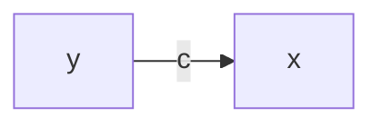
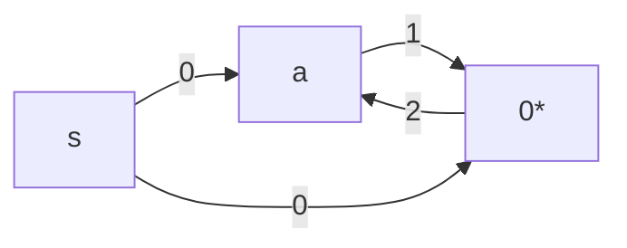
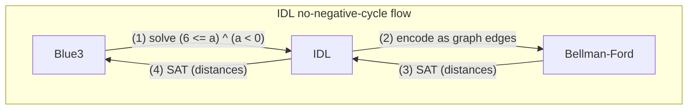
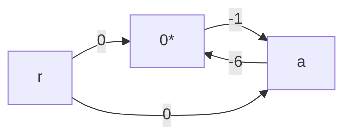
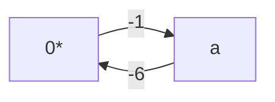
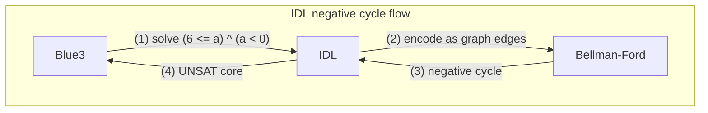

# Programming Blue3: An SMT solver for Caprice-Lang
Blue3 is an SMT solver for JHU's [`caprice-lang`](https://github.com/JHU-PL-Lab/caprice-lang). It is used by its typechecker known as the [Concolic Evaluator](https://github.com/JHU-PL-Lab/caprice-lang/blob/main/docs/caprice.md), or `ceval`.

Before Blue3, `ceval` used [Z3](https://www.microsoft.com/en-us/research/project/z3-3/) to solve SMT formulas. `ceval` still uses Z3, but is now used as a fallback rather than being the sole solver for when Blue3 cannot solve the formula.

Z3 is more than capable of solving our formulas, of course, but the JHU Programming Language lab felt it was overkill for many of the cases. For instance, `ceval` might output something like:

$$
(6 \leq a) \land (a < 0)
$$

We say this formula is **unsatisfiable**, or UNSAT, because $a$ can't be $6$ or more while also being less than $0$.

The non-insigificant overhead of calling Z3 made an in-house solver for trivial cases seem like a promising way to improve `ceval`'s performance.

## Intro

This report introduces Blue3, a minimal SMT solver for caprice-lang. Although small, Blue3 implements a full solver pipeline using modern SAT/SMT techniques. In benchmarks, Blue3's frontend was just over 60% faster than Z3 on simple formulas.

| avg_blue3 | avg_z3 |
|-----------|--------|
| 222.0μs | 329.0μs |

When Blue3 cannot solve a formula, it falls back to Z3. This adds about 20.24μs of overhead on average, or roughly 5% compared to calling Z3 directly.

| num_slow_cases | avg_slower_by | avg_percent_slower |
|----------------|---------------|--------------------|
| 38 | 20.24μs | 4.59% |

This is a reasonable tradeoff: Blue3 solves simple formulas much faster, while still using Z3 as a backup.

Before discussing Blue3 itself, we first need some context on $P = NP$, SAT, and 3SAT.

### P = NP and Boolean Satisfiability

Oversimplifying, $P = NP$ asks:

> If we can check a solution quickly, can we also find that solution quickly?

Some problems are easy to solve and easy to check. For example, sorting a list like:

$$
[5, 2, 9, 1]
$$

into:

$$
[1, 2, 5, 9]
$$

can be done efficiently. Problems solvable in polynomial time are in the class $P$.

Other problems are harder to solve but easy to verify. Sudoku is the classic example: finding the solution may require search, but checking a completed board is straightforward. Problems whose solutions can be verified in polynomial time are in $NP$.

So another way to state $P = NP$ is:

> If a solution can be verified in polynomial time, can it also be found in polynomial time?

We do not know the answer. Most computer scientists believe $P \neq NP$, but no one has proven it.

This matters because some problems are **NP-complete**: they are in $NP$, and every other problem in $NP$ can be reduced to them in polynomial time. If we found a polynomial-time algorithm for one NP-complete problem, then every problem in $NP$ could be solved efficiently.

That would have massive consequences for optimization, science, and cryptography.

### 3SAT and Boolean Satisfiability

3SAT asks:

> Given a propositional formula in CNF with at most 3 literals per clause, is there some assignment that makes it true?

A formula is **satisfiable** if at least one assignment makes it true. For example:

$$
(p \lor q) \land (\neg p \lor \neg q)
$$

is satisfiable because this model works:

```json
{
  "p": true,
  "q": false
}
```

Plugging those values in gives:

$$
(\text{true} \lor \text{false}) \land (\neg \text{true} \lor \neg \text{false})
$$

which evaluates to true.

But this formula is unsatisfiable:

$$
(p \lor q) \land (\neg p \lor q) \land (p \lor \neg q) \land (\neg p \lor \neg q)
$$

No assignment of $p$ and $q$ can make every clause true at once.

3SAT is important because it is NP-complete. So if we could solve 3SAT in polynomial time, we would prove $P = NP$.

Blue3 obviously does not solve $P = NP$. Instead, it uses practical SAT/SMT techniques to solve many real formulas efficiently.

SMT solvers extend SAT by allowing richer theory constraints. For example:

$$
(6 \leq a) \land (a < 0)
$$

is not purely propositional, because it talks about integer inequalities. Blue3 maps theory atoms like these into propositional variables:

$$
p \land q
$$

where:

- $p$ represents $(6 \leq a)$
- $q$ represents $(a < 0)$

The SAT solver handles the propositional structure, while the theory solver checks whether the underlying constraints are actually consistent.

### Useful Terminology

A **formula** is a boolean-valued expression. In this report, unless stated otherwise, "formula" usually means a formula in **CNF**.

A formula in **CNF** is an AND of clauses:

$$
(p \lor q \lor r) \land (s \lor t \lor \neg u)
$$

A **clause** is one OR-group:

$$
(p \lor q \lor r)
$$

A **literal** is an atom with a sign. For example:

$$
p
$$

and:

$$
\neg p
$$

are both literals.

An **atom** is the unsigned condition underneath a literal. So $p$ and $\neg p$ refer to the same atom: $p$.

In SMT, atoms can be theory constraints, such as:

$$
a = 1
$$

or:

$$
a \neq 1
$$

We will use three main formula categories:

1. A **SAT formula** is purely propositional:

   $$
   p \land q
   $$

2. A **theory formula** is handled by a theory solver:

   $$
   (6 \leq a) \land (a < 0)
   $$

3. An **SMT formula** combines propositional logic with theory constraints:

   $$
   (6 \leq a) \land (a < 0) \land (r \lor s)
   $$

Finally, a **solver** takes a formula and returns either **SAT**, usually with a satisfying model, or **UNSAT**, meaning no satisfying assignment exists.

## Difference Logic

Recall that Blue3 is meant to handle formulas that are too simple to justify calling Z3, such as:

$$
(6 \leq a) \land (a < 0)
$$

The first challenge was deciding what “simple” meant for `caprice-lang` formulas. Since its formula AST only works over `bool`s and `int`s, we focused on the integer-heavy formulas that appeared often in our benchmarks:

| formula_id |            formula             | 
|------------|--------------------------------|
| 9          | (0 < a) ^ ((a + 1) <= a)       |
| 8          | (0 < a) ^ ((a + 1) <= 1)       |
| 56         | (not (a = 0)) ^ ((a + 10) = 0) |
| 11         | (1 < a) ^ (a < 0)              |
| 88         | (0 < a) ^ (a < 1)              |

This led us to **Integer Difference Logic**, or **IDL**, a fragment of linear integer arithmetic where constraints compare the difference between two integer terms. In SMT-LIB terms, IDL is a sub-logic of Linear Integer Arithmetic over the `Ints` theory.

More formally, an IDL solver decides satisfiability for literals shaped like:

$$
(x \leq y) \text{<>} c
$$

Here, $x$ and $y$ are integer variables or the constant $0$, $c$ is an integer constant, and $<>$ is one of $<, \leq, >, \geq,$ or $=$. IDL does **not** directly handle $\neq$, nor sums like $x + y$ or any other operator other than $-$ for that matter.

Many of our “simple” formulas fit this difference form, including:

$$
(6 \leq a) \land (a < 0)
$$

We can rewrite it as:

$$
((0 - a) \leq -6) \land ((a - 0) \leq -1)
$$

This rewriting looks unnecessary to us because we can immediately see the contradiction: $a$ cannot be both at least $6$ and less than $0$. But IDL gives our computer a precise way to recognize that contradiction mechanically.

It turns out there is a natural graph interpretation of IDL, where each difference constraint becomes an edge, and satisfiability can be checked with a shortest-path algorithm.

### Bellman-Ford

Bellman-Ford finds the shortest paths from one source node to every other node in a directed weighted graph. It also detects **negative cycles**, which are cycles whose total weight is negative.

For example:

```{.ocaml #simple-no-neg-intro}
let simple_no_neg =
  [ ("a", "0*", 3) ; ("0*", "a", -1)
  ; ("r", "0*", 9) ; ("r", "a", 5)
  ] in
print_mermaid_lr ~id:"simple-no-neg" simple_no_neg;
```

```{.mermaid #simple-no-neg-mermaid}
graph LR
  na["a"] -->|"3"| n0_["0*"]
  n0_["0*"] -->|"-1"| na["a"]
  nr["r"] -->|"9"| n0_["0*"]
  nr["r"] -->|"5"| na["a"]
```

Running Bellman-Ford from `r` gives:

| Node | Distance |
|------|----------|
| $a$ | $5$ |
| $0^*$ | $8$ |

The shortest path to `a` is:

$$
r \to a
$$

with cost $5$. The shortest path to $0^*$ is:

$$
r \to a \to 0^*
$$

with cost:

$$
5 + 3 = 8
$$

This beats the direct edge $r \to 0^*$, which costs $9$.

The cycle between `a` and $0^*$ has cost:

$$
3 + (-1) = 2
$$

Since the cycle is positive, looping only makes paths more expensive. So there is **no negative cycle**.

Now change the edge $0^* \to a$ from $-1$ to $-4$:

```{.ocaml #print-simple-neg}
let simple_neg =
  [ ("a", "0*", 3) ; ("0*", "a", -4)
  ; ("r", "0*", 9) ; ("r", "a", 5)
  ] in
print_mermaid_lr ~id:"simple-neg-mermaid" simple_neg;
print_bellman_ford ~label:"simple-neg-bf" ~src:"r" simple_neg
```

Now the cycle cost is:

$$
3 + (-4) = -1
$$

Each loop makes the path cheaper, so there is no true shortest path. Bellman-Ford reports:

```txt
Negative cycle found!
```

```{.mermaid #simple-neg-bf}
graph LR
  n0*["0*"] -->|"-4"| na["a"]
  na["a"] -->|"3"| n0*["0*"]
```

#### Relaxing Edges

Bellman-Ford repeatedly loops over every edge and tries to improve the known distance to each node. This update step is called **relaxation**.

An edge is relaxed when:

$$
dist[from] + cost < dist[to]
$$

In code:

```{.ocaml #relax-edge-cases}
let relax_edge tbl was_updated edge =
  let from_, to_, cost = edge in
  match Hashtbl.find tbl from_, Hashtbl.find tbl to_ with
  | (Some du, _), (None, _) ->
    set_distance to_ tbl ~min:(du + cost) ~pred:edge
  | (Some du, _), (Some dv, _) when du + cost < dv ->
    set_distance to_ tbl ~min:(du + cost) ~pred:edge
  | _ -> was_updated
```

The table starts with every node at infinity, represented by `None`, except the source, which starts at distance `0`.

```{.ocaml #create-distance-table}
let create_tbl ~src edges =
  let tbl =
    edges
    |> to_node_list
    |> ...
  in
  Hashtbl.replace tbl src (Some 0, None);
  tbl
```

Bellman-Ford relaxes all edges at most $N - 1$ times, where $N$ is the number of nodes:

```{.ocaml #relax-edges-stop-case}
let relax_edges edges dist i =
  if i >= Hashtbl.length dist - 1 then `Stop dist
  else ...
```

We also stop early if a full pass over the edge list does not update anything:

```{.ocaml #relax-edges-early-stop}
let is_dist_updated = List.fold_left (relax_edge dist) false edges in
if is_dist_updated then `Continue dist
else `Stop dist
```

So the core algorithm is:

```{.ocaml #find-shortest-paths}
let find_shortest_paths ~src edges =
  let dist = create_tbl ~src edges in
  ...
  List_utils.fold_until
    (relax_edges edges)
    Fun.id
    dist
    vertices
```

#### Predecessors

Each table entry stores both the current shortest-known distance and the predecessor edge that produced it:

```{.ocaml #distance-predecessor-state}
(distance, predecessor_edge)
```

The distance tells us the cost from `src`; the predecessor edge lets us reconstruct the path.

For the earlier graph, the shortest path to `a` is direct:

```txt
Minimum distance to "a" = 5
Predecessor edge of "a" is = r -> a (5)
```

The shortest path to $0^*$ goes through `a`:

```txt
Minimum distance to "0*" = 8
Predecessor edge of "0*" is = a -> 0* (3)
```

Tracing predecessors gives:

$$
r \to a \to 0^*
$$

So one predecessor edge per node is enough to reconstruct a shortest path.

#### Detecting Negative Cycles

After the normal relaxation loop, Bellman-Ford runs one extra pass over the edges. If any edge can still be relaxed, then the graph has a negative cycle.

```{.ocaml #find-relaxed-node-opt}
let find_relaxed_node_opt edges dist =
  List.find_map
    (fun ((_, to_, _) as edge) ->
      if relax_edge dist false edge then Some to_
      else None)
    edges
```

The relaxed node proves a negative cycle exists, but it may not itself be inside the cycle. For example:

```{.ocaml #relnode-not-in-neg-cycle}
let relnode_not_in_neg_cycle =
  [ ("c", "d", 0) ; ("s", "a", 0)
  ; ("a", "b", 1) ; ("b", "c", -4)
  ; ("c", "a", 1)
  ] in
print_mermaid_lr ~id:"relnode-not-in-neg-cycle-mermaid" relnode_not_in_neg_cycle;
```

```{.mermaid #relnode-not-in-neg-cycle-mermaid}
graph LR
  nc["c"] -->|"0"| nd["d"]
  ns["s"] -->|"0"| na["a"]
  na["a"] -->|"1"| nb["b"]
  nb["b"] -->|"-4"| nc["c"]
  nc["c"] -->|"1"| na["a"]
```

Here, the first relaxed node can be `d`, even though `d` is only reached from the cycle:

```txt
Relaxed: d
```

To guarantee we land inside the cycle, we follow predecessor links `NUM_NODES` times. By the pigeonhole principle, this skips any non-cycle tail.

```{.ocaml #find-cycle-entry-opt}
let find_cycle_entry_opt edges (tbl, num_nodes) =
  match find_relaxed_node_opt edges tbl with
  | None -> None
  | Some entry ->
    let rec move_back node n =
      if n = 0 then node
      else
        match find_predecessor node tbl with
        | None -> node
        | Some from_ -> move_back from_ (n - 1)
    in
    Some (move_back entry num_nodes)
```

Then we collect predecessor edges until we return to the start node:

```{.ocaml #collect-cycle}
let collect_cycle start (tbl, num_nodes) =
  let rec loop curr n acc =
    if n = 0 then acc
    else
      match find_predecessor_edge curr tbl with
      | None -> acc
      | Some ((from_, _, _) as pred_edge) ->
        let acc = pred_edge :: acc in
        if Node.compare from_ start = 0 then acc
        else loop from_ (n - 1) acc
  in
  loop start num_nodes []
```

In short, Bellman Ford's steps are:

1. Compute the distance table.
2. Run one extra relaxation pass.
3. If nothing changes, return the distances.
4. If something changes, backtrack predecessors and return the negative cycle.

### Bellman-Ford as a Difference Logic Solver

Bellman-Ford works for difference logic because each constraint can be encoded as a graph edge.

Difference logic literals have the general shape:

$$
x - y \leq c
$$

where $x$ and $y$ are integer variables or the special constant node $0^*$.

We encode:

$$
x - y \leq c
$$

as an edge:

$$
(y, x, c)
$$

or visually:



Then we add a dummy source node with $0$-weight edges to every other node and run Bellman-Ford. If Bellman-Ford finds a negative cycle, the formula is **UNSAT**. Otherwise, it is **SAT**.

#### Case 0. Split

IDL can directly solve inequalities like $\leq$, but disequality needs a case split.

For integers:

$$
x \neq y \implies (x \leq y - 1) \lor (y + 1 \leq x)
$$

In our implementation, the solver returns these split cases when it sees a negated equality:

```ocaml
let find_split_opt (lit : 'k Theory.literal)
  ...
  match lit with
  | Neg Predicate (Equal, x, y) ->
    begin match Ints.reflect_int_opt x, Ints.reflect_int_opt y with
    | Some x', Some y' ->
      ...
      Some (~lower:(Pos lower), ~upper:(Pos upper), ~eq:(Pos eq))
```

We also include the equality case, because the SAT solver may still need to explore $x = y$ depending on the propositional context.

#### Case 1. SAT

Consider:

$$
(-a \leq 1) \land (a \leq 2)
$$

This is satisfiable. Encoding each literal as an edge gives:

$$
-a \leq 1 \equiv 0^* - a \leq 1 \implies (a, 0^*, 1)
$$

$$
a \leq 2 \equiv a - 0^* \leq 2 \implies (0^*, a, 2)
$$

After adding dummy source edges, the full graph is:

$$
\text{Edges} = (a, 0^*, 1), (0^*, a, 2), (s, a, 0), (s, 0^*, 0)
$$



Running Bellman-Ford prints:

```bash
No negative cycle found.
```

So the formula is **SAT**.

Bellman-Ford returns minimum distances from the dummy source. These distances can be turned into a model by normalizing around the special $0^*$ node:

$$
\text{model}[x] = \text{distance}[x] - \text{distance}[0^*]
$$

For example, if:

$$
\text{distance}[a] = 0
$$

and:

$$
\text{distance}[0^*] = -1
$$

then:

$$
a = 0 - (-1) = 1
$$

We do this normalization in our solver as well:

```{.ocaml #z0-normalize}
Model.Int (var_dist - z0_dist)
```

So when we have a SAT case, we propagate up the distance table through each layer's type wrappers:



#### Case 2. UNSAT

Now consider:

$$
(6 \leq a) \land (a < 0)
$$

This encodes to:



Bellman-Ford reports:

```bash
Negative cycle found!
```



The negative cycle contains:

$$
(a, 0^*, -6)
$$

and:

$$
(0^*, a, -1)
$$

Mapping these edges back gives:

$$
(a, 0^*, -6) \implies 6 \leq a
$$

$$
(0^*, a, -1) \implies a < 0
$$

So the original formula is **UNSAT**.



The negative cycle is also the **UNSAT core**, meaning the specific literals responsible for the contradiction. Blue3 passes this core back to the SAT solver so it can learn from the failed assignment.

## SAT

3SAT was the first problem shown to be $\text{NP-complete}$: it is in $\text{NP}$, and every problem in $\text{NP}$ can be reduced to it in polynomial time.

More generally, $\text{k-SAT}$ asks:

> Given a formula with at most $k$ literals per clause, can we determine whether it is satisfiable?

For example:

$$
(p \lor q \lor \neg r) \land (\neg p \lor r) \land (q \lor r) \land \neg r
$$

This formula is satisfiable because:

```json
{
  "p": false,
  "q": true,
  "r": false
}
```

makes the whole formula evaluate to `true`.

At the time of writing, no polynomial-time SAT algorithm is known. So practical SAT solvers are still, at a high level, very smart brute-force search algorithms.

### Conflict-Driven Clause Learning

Blue3 uses **Conflict-Driven Clause Learning**, or `CDCL`, to solve boolean formulas.

The rough CDCL loop is:

1. Infer any assignments that must be true.
2. If nothing can be inferred, guess.
3. If a contradiction appears, learn from it.
4. Repeat until `SAT` or `UNSAT`.

In Blue3, this loop is implemented in `bcp`:

```ocaml
let rec bcp (level : int) (trail : Trail.trail) (formula : Formula.formula) : Solution.solution =
  begin match unit_propagate formula trail with
  ...
```

The first step is `unit_propagate`.

### Unit Propagation

Unit propagation finds literals that are forced.

For example:

$$
p \land \neg q \land (\neg p \lor q \lor \neg r)
$$

immediately forces:

$$
p = \text{true}
$$

and:

$$
q = \text{false}
$$

because $p$ and $\neg q$ appear as unit clauses.

A **unit clause** is a clause with exactly one unassigned literal and no already-satisfied literal. Since every clause in CNF must be true, that last remaining literal must be assigned.

In Blue3:

```ocaml
let unit_propagate formula model =
  let rec search_empty
    ...
  in
  let rec search_unit (formula : Formula.formula) : next =
    ...
  in
  search_unit formula
```

The main scan is:

```ocaml
match formula with
| [] -> Decide
| clause :: clauses' ->
  match Model.eval_clause clause model with
  | `Falsified -> Conflict clause
  | `Undecided [lit] -> search_empty clauses' clause lit
  | _ -> search_unit clauses'
```

There are three cases:

1. No clauses are left, so CDCL must `Decide`.
2. A clause is falsified, so CDCL reports a `Conflict`.
3. A clause has one remaining literal, so CDCL returns an `Implication`.

For example, if we have:

$$
(\neg p \lor q \lor r)
$$

and the model says:

```json
{
  "p": true,
  "q": false
}
```

then the clause becomes:

$$
(\text{false} \lor \text{false} \lor r)
$$

so unit propagation forces:

$$
r = \text{true}
$$

Blue3 stops once it finds one implication, but it still scans the rest of the formula to make sure there is no conflict that should take priority.

### Deciding

Sometimes unit propagation cannot infer anything.

For example:

$$
(p \lor q) \land (\neg p \lor r)
$$

has no unit clauses at the start. So `unit_propagate` returns:

```ocaml
Decide
```

This tells CDCL to pick an unassigned variable and guess a value.

If CDCL guesses:

$$
p = \text{true}
$$

then:

$$
(\neg p \lor r)
$$

becomes:

$$
(\text{false} \lor r)
$$

so unit propagation now forces:

$$
r = \text{true}
$$

This is the basic CDCL rhythm: guess, propagate, and repeat.

### Conflicts

Sometimes a guess leads to a contradiction.

Consider:

$$
(p \lor q) \land (\neg p \lor q) \land (p \lor \neg q) \land (\neg p \lor \neg q)
$$

There are no unit clauses at the start, so CDCL guesses. Suppose it decides:

$$
p = \text{true}
$$

Then:

$$
(\neg p \lor q)
$$

forces:

$$
q = \text{true}
$$

But now:

$$
(\neg p \lor \neg q)
$$

becomes:

$$
(\text{false} \lor \text{false})
$$

so we have a conflict.

A plain backtracking solver would just try another branch. CDCL does more: it analyzes the conflict and learns a new clause to avoid repeating the same mistake.

In this case, the bad combination was:

$$
p = \text{true}
$$

and:

$$
q = \text{true}
$$

so CDCL can learn:

$$
\neg p \lor \neg q
$$

In larger formulas, learned clauses are often not present in the original formula, which is what makes CDCL powerful.

### A Full Example

Consider:

$$
(p \lor q) \land (\neg p \lor r) \land (\neg r \lor q)
$$

Blue3 starts with:

```ocaml
let cdcl formula = bcp 0 [] formula
```

where `0` is the starting decision level and `[]` is the empty trail.

Inside `bcp`, Blue3 builds a model from the trail and calls `unit_propagate`:

```ocaml
let rec bcp level trail formula =
  let model = Trail.to_model trail in
  begin match unit_propagate formula model with
  | Decide -> ...
  | Conflict clause -> ...
  | Implication (clause, lit) -> ...
  end
```

At the start, there are no unit clauses, so Blue3 decides. Suppose it makes the bad decision:

$$
q = \text{false}
$$

This is added to the trail:

```ocaml
and decide ~lit level trail =
  let next_lvl = level + 1 in
  let trail' = Trail.decided ~lit next_lvl trail in
  bcp next_lvl trail'
```

Now:

$$
(p \lor q)
$$

forces:

$$
p = \text{true}
$$

Then:

$$
(\neg p \lor r)
$$

forces:

$$
r = \text{true}
$$

So the model is now:

```json
{
  "q": false,
  "p": true,
  "r": true
}
```

But the third clause:

$$
(\neg r \lor q)
$$

is now false, so Blue3 gets a conflict.

The conflict branch is:

```ocaml
| Conflict clause ->
  let clause', backtrack_lvl = Trail.analyze_conflict ~clause level trail in
  if backtrack_lvl < 0 then UNSAT
  else backtrack_learn ~level:backtrack_lvl clause' trail formula
```

The trail stores each assignment, its decision level, and why it was made:

```ocaml
type reason =
  | Decided
  | Propagated of literal list

type step = { level : int ; lit : literal ; reason : reason }

type trail = step list
```

This lets `analyze_conflict` walk backward through the trail and resolve the conflict against the reasons for propagated literals.

Here, the conflict clause is:

$$
(\neg r \lor q)
$$

Since $r$ was propagated from:

$$
(\neg p \lor r)
$$

resolving gives:

$$
(q \lor \neg p)
$$

Since $p$ was propagated from:

$$
(p \lor q)
$$

resolving again gives:

$$
q
$$

So Blue3 learns the unit clause:

$$
q
$$

Then it backjumps and adds the learned clause:

```ocaml
and backtrack_learn ~level clause trail formula =
  let trail' = Trail.backjump ~level trail in
  let formula' = clause :: formula in
  bcp level trail' formula'
```

Now the formula effectively becomes:

$$
q \land (p \lor q) \land (\neg p \lor r) \land (\neg r \lor q)
$$

So Blue3 has learned:

> The branch where $q = \text{false}$ cannot work.

After backtracking, the learned unit clause forces:

$$
q = \text{true}
$$

Then the formula is satisfiable. For example:

```json
{
  "q": true,
  "p": false
}
```

works regardless of $r$.

The key idea is that a conflict does not always mean the formula is UNSAT. It may only mean the current branch is impossible. CDCL learns from that branch, backjumps, and continues.

### From SAT to SMT

So far, the solver only understands boolean variables like $p$, $q$, and $r$.

But Blue3 solves formulas with theory constraints too, such as:

$$
(6 \le a) \land (a < 0)
$$

A SAT solver alone does not know what these inequalities mean. It can only treat each one as a boolean atom.

So Blue3 connects the SAT solver to a theory solver. The SAT solver handles the boolean structure, while the theory solver checks whether the selected theory constraints are actually consistent.

This is where Blue3 moves from SAT solving to SMT solving.

## SMT

So far, Blue3 has two main pieces:

1. The **SAT solver**, which handles boolean structure:

$$
p \land (\neg p \lor q)
$$

2. The **IDL solver**, which handles integer difference constraints:

$$
x - y \le c
$$

But Blue3 needs to solve formulas that mix both:

$$
(6 \le a) \land (a < 0)
$$

A SAT solver sees `6 <= a` and `a < 0` as plain boolean atoms. It does not know they contradict each other. The SMT layer connects the SAT solver to a theory solver:

> SAT handles boolean structure; the theory solver checks whether the chosen theory literals are actually consistent.

In Blue3, this is the `cdcl_T` loop.

### Theory atoms

Blue3 represents theory-level boolean expressions as `Theory.atom`s:

```ocaml
type 'k atom =
  | Bool_key of (bool, 'k) Symbol.t
  | Predicate : ('a * 'a * bool) Binop.t * ('a, 'k) Formula.t * ('a, 'k) Formula.t -> 'k atom
```

A plain boolean variable like:

$$
p
$$

becomes:

```ocaml
Bool_key p
```

An arithmetic predicate like:

$$
a < 0
$$

becomes:

```ocaml
Predicate (Less_than, a, 0)
```

Theory literals are signed atoms:

```ocaml
type 'k literal =
  | Pos of 'k atom
  | Neg of 'k atom
```

So a theory solver receives a list of literals:

```ocaml
type 'k theory_solver = 'k literal list -> 'k theory_solution
```

This list is interpreted as a conjunction:

$$
lit_1 \land lit_2 \land lit_3
$$

### Theory results

A theory solver returns:

```ocaml
type 'k theory_solution =
  | Theory_unknown
  | Theory_sat of 'k Model.t
  | Theory_unsat of 'k core
  | Theory_split of 'k formula
```

The meanings are:

- `Theory_sat model`: the theory literals are consistent.
- `Theory_unsat core`: the literals are inconsistent, and `core` explains why.
- `Theory_split formula`: the solver needs more SAT-level case splits.
- `Theory_unknown`: Blue3 should fall back to the next solver.

### Boolean abstraction

The SAT solver cannot directly reason about theory atoms, so Blue3 abstracts each theory atom into a fresh SAT atom.

This is handled by the connector:

```ocaml
type 'k connector =
  { to_sat : ('k Theory.atom, Sat.Formula.atom) Hashtbl.t
  ; from_sat : (Sat.Formula.atom, 'k Theory.atom) Hashtbl.t
  ; mutable count : int
  }
```

For example:

```text
p1 := (6 <= a)
p2 := (a < 0)
```

Then:

$$
(6 \le a) \land (a < 0)
$$

becomes:

$$
p_1 \land p_2
$$

The mapping is created by `abstract_atom`:

```ocaml
let abstract_atom ?uid atom conn =
  match Hashtbl.find_opt conn.to_sat atom with
  | Some uid -> uid
  | None ->
      let sat_atom = next_uid ?uid conn in
      Hashtbl.add conn.to_sat atom sat_atom;
      Hashtbl.add conn.from_sat sat_atom atom;
      sat_atom
```

If an atom was seen before, Blue3 reuses its SAT variable. Otherwise, it creates a fresh one.

### The CDCL(T) loop

The main SMT loop is:

```ocaml
let cdcl_T ~(solver : 'k Theory.theory_solver) (formula : (bool, 'k) Formula.t)
  : 'k Solution.t =
  let conn = make 64 in
  let propositional = abstract (Theory.from_smt_formula formula) conn in
  let rec loop conn sat_formula =
    match Sat.Cdcl.cdcl sat_formula with
    | UNSAT -> Solution.Unsat
    | SAT model ->
      let theory_lits = make_theory_literals model conn in
      match solver theory_lits with
      | Theory_unknown -> Solution.Unknown
      | Theory_unsat core ->
        let learned = theory_learn core conn in
        let sat_formula' = Sat.Formula.conjoin1 learned sat_formula in
        loop conn sat_formula'
      | Theory_sat model -> Solution.Sat model
      | Theory_split clauses ->
        let sat_formula' =
          List.fold_left
            (fun acc clause ->
              let sat_clause = abstract_clause clause conn in
              Sat.Formula.conjoin1 sat_clause acc)
            sat_formula
            clauses
        in
        loop conn sat_formula'
  in
  loop conn propositional
```

At a high level:

1. Abstract the SMT formula into SAT.
2. Run CDCL.
3. If SAT returns `UNSAT`, the whole formula is `UNSAT`.
4. If SAT returns a model, convert it back into theory literals.
5. Ask the theory solver whether those literals are consistent.
6. If theory says `SAT`, return the model.
7. If theory says `UNSAT`, learn a clause and retry.
8. If theory says `SPLIT`, add split clauses and retry.

This is CDCL plus a theory solver: `CDCL(T)`.

### Example

Consider:

$$
(6 \le a) \land (a < 0)
$$

Blue3 abstracts this to:

```text
p1 := (6 <= a)
p2 := (a < 0)
```

So the SAT formula is:

$$
p_1 \land p_2
$$

The SAT solver can satisfy this with:

```json
{
  "p1": true,
  "p2": true
}
```

Blue3 then maps the SAT model back to theory literals:

$$
(6 \le a) \land (a < 0)
$$

The IDL solver normalizes these into difference constraints:

$$
0 - a \le -6
$$

and:

$$
a - 0 \le -1
$$

which encode as graph edges:

$$
(a, 0, -6)
$$

and:

$$
(0, a, -1)
$$

Bellman-Ford finds a negative cycle, so the theory solver returns:

```ocaml
Theory_unsat core
```

where the core is:

$$
(6 \le a) \land (a < 0)
$$

### Learning from theory conflicts

When the theory solver returns `Theory_unsat core`, Blue3 learns a SAT clause:

```ocaml
| Theory_unsat core ->
  let learned = theory_learn core conn in
  let sat_formula' = Sat.Formula.conjoin1 learned sat_formula in
  loop conn sat_formula'
```

The learning function negates each literal in the core:

```ocaml
let theory_learn (Core core : 'k Theory.core) conn =
  core
  |> List.map (fun lit -> abstract_literal lit conn)
  |> List.map Sat.Formula.negate
```

So if the conflict was:

$$
(6 \le a) \land (a < 0)
$$

and the abstraction was:

```text
p1 := (6 <= a)
p2 := (a < 0)
```

then Blue3 learns:

$$
\neg p_1 \lor \neg p_2
$$

This means:

> Do not choose both `(6 <= a)` and `(a < 0)` again.

The SAT formula becomes:

$$
p_1 \land p_2 \land (\neg p_1 \lor \neg p_2)
$$

Now CDCL sees the boolean abstraction itself is impossible, so it returns `UNSAT`.

### Theory splitting

Sometimes the theory solver needs to split a literal into cases. This happens with integer disequality:

$$
x \ne y
$$

IDL does not solve disequality directly. Over integers:

$$
x \ne y
$$

means:

$$
x \le y - 1
$$

or:

$$
y + 1 \le x
$$

Blue3 adds this as a guarded split clause:

$$
(x = y) \lor (x \le y - 1) \lor (y + 1 \le x)
$$

In the SMT loop:

```ocaml
| Theory_split clauses ->
  let sat_formula' =
    List.fold_left
      (fun acc clause ->
        let sat_clause = abstract_clause clause conn in
        Sat.Formula.conjoin1 sat_clause acc)
      sat_formula
      clauses
  in
  loop conn sat_formula'
```

So the theory solver gives Blue3 more structure, and the SAT solver continues with the new clauses.

### The final Blue3 wrapper

The public solver is:

```ocaml
let blue3
  : type k. solver:k Theory.theory_solver -> k solver -> (bool, k) Formula.t -> k Solution.t =
  fun ~solver next formula ->
  let solve formula = cdcl_T ~solver formula in
  if contains_unsolvable formula then next formula
  else
    match formula with
    | Const_bool true -> Solution.Sat Model.empty
    | Const_bool false -> Solution.Unsat
    | _ ->
      match solve formula with
      | Solution.Unknown -> next formula
      | solution -> solution
```

Blue3 first checks whether the formula contains operations it cannot solve internally:

```ocaml
let contains_unsolvable formula =
  Formula.contains_binops [Times ; Divide ; Modulus ; Plus] formula
```

If so, it falls back to the next solver. Otherwise, it handles trivial constants or runs `cdcl_T`.

### Putting it together

The SAT solver handles boolean structure.

The IDL solver handles difference constraints.

The SMT layer connects them:

> SAT proposes a boolean assignment. The theory solver checks it. If it fails, Blue3 learns a new SAT clause from the theory conflict.

That is the core of Blue3's SMT strategy.

## Benchmarks and Last Words
To finish this writeup, let's go over one instance of our benchmark script output.

Measurements were taken using the [Benchmark](https://ocaml.org/p/benchmark/1.7) library and compared the Blue3 solver with all of its ad-hoc rewrite heuristics + the cdcl loop against the Z3 solver by itself and used the 179 `f2.txt` formulas list outputted from a real run of the concolic evaluator.

The measurements below are averages across 100 trial runs, where each formula was solved 100 times by each solver, and then their average across those 100 runs were saved into the database. We recorded whether or not Z3 had to be called or not to determine which types of formulas Blue3 was able to solve by itself vs. which formulas had to be parsed by Blue3 just to send it to Z3 because it determined it can't solve it.

### Measurements

#### What were the average runtimes from both solvers?

| avg_blue3 | avg_z3  |
|-----------|---------|
| 225.0μs   | 334.0μs |

On average, Blue3 was faster than calling Z3 directly on this benchmark set. This does not mean Blue3 is a better general-purpose SMT solver than Z3, but it does show that for the restricted formulas it was designed around, the extra simplification and CDCL(T)-style loop can pay off.

#### How many formulas were solved by Blue3 only?

| blue3_only_formula_count |
|--------------------------|
| 89                       |

Blue3 solved 89 of the 179 formulas without having to defer to Z3. This is the most important number for the project, because it shows that Blue3 was not just acting as a wrapper around Z3; it was actually able to solve a substantial portion of the concolic evaluator’s formulas on its own.

#### How many formulas had to be deferred to Z3?

| z3_deferred_formula_count |
|---------------------------|
| 90                        |

Blue3 deferred 90 formulas to Z3. This makes sense because Blue3 intentionally avoids formulas outside its current theory-solving scope, especially formulas involving operations like multiplication, division, and modulus. :contentReference[oaicite:3]{index=3}

#### On average, how much slower were the deferred cases than just calling Z3 by itself?

| num_deferred_cases | avg_slower_by | avg_percent_slower_than_z3 |
|--------------------|---------------|----------------------------|
| 90                 | -10.14μs      | -0.91%                     |

The deferred cases were not meaningfully slower than just calling Z3 directly. This suggests that Blue3’s initial parsing/checking overhead was small enough that even when it failed to solve a formula internally, it did not add a major penalty before handing the formula off.

#### How much faster were the fast cases on average?

| num_fast_cases | avg_faster_by | avg_percent_faster |
|----------------|---------------|--------------------|
| 136            | 148.85μs      | 65.42%             |

In the cases where Blue3 was faster, it was much faster on average. This is likely because many benchmark formulas had simple contradictions, redundant bounds, or IDL-style structure that Blue3’s lightweight simplification passes could exploit before needing a heavy general-purpose solver.

#### How much slower were the slow cases on average?

| num_slow_cases | avg_slower_by | avg_percent_slower |
|----------------|---------------|--------------------|
| 43             | 14.87μs       | 3.94%              |

When Blue3 was slower, it was only slightly slower on average. This is a good tradeoff for this prototype: the fast cases gained a lot, while the slow cases generally only lost a small amount

#### Top 10 fastest Blue3-only cases

| formula_id |            formula             | avg_time_us_blue3 | avg_time_us_z3 | avg_slower_by |
|------------|--------------------------------|-------------------|----------------|---------------|
| 9          | (0 < a) ^ ((a + 1) <= a)       | 0.1μs             | 90.78μs        | -90.68μs      |
| 8          | (0 < a) ^ ((a + 1) <= 1)       | 0.14μs            | 88.31μs        | -88.17μs      |
| 63         | (a < 0) ^ (0 < a)              | 0.28μs            | 113.9μs        | -113.62μs     |
| 56         | (not (a = 0)) ^ ((a + 10) = 0) | 0.28μs            | 256.38μs       | -256.1μs      |
| 88         | (0 < a) ^ (a < 1)              | 0.28μs            | 115.02μs       | -114.74μs     |
| 11         | (1 < a) ^ (a < 0)              | 0.29μs            | 111.89μs       | -111.6μs      |
| 159        | (a < 65) ^ (97 <= a)           | 0.29μs            | 127.14μs       | -126.85μs     |
| 64         | (0 < a) ^ (a < 0)              | 0.3μs             | 114.37μs       | -114.07μs     |
| 91         | (2 <= a) ^ (a <= 0)            | 0.3μs             | 122.11μs       | -121.81μs     |
| 10         | (1 < a) ^ (a <= 0)             | 0.31μs            | 105.69μs       | -105.38μs     |

The fastest Blue3-only cases are mostly simple contradictions or tight integer-bound formulas. These are exactly the kinds of formulas where a small custom solver can beat a general-purpose solver, because Blue3 can simplify them almost immediately instead of paying the cost of invoking a much larger solving pipeline.

#### Top 10 slowest Blue3-only cases

| formula_id |                           formula                            | avg_time_us_blue3 | avg_time_us_z3 | avg_slower_by |
|------------|--------------------------------------------------------------|-------------------|----------------|---------------|
| 168        | (48 <= a) ^ (not (a = 108)) ^ (not (a = 105)) ^ (not (a = 98... | 180.6μs           | 445.17μs       | -264.57μs     |
| 167        | (not (a = 108)) ^ (not (a = 105)) ^ (not (a = 98)) ^ ...      | 174.7μs           | 425.32μs       | -250.62μs     |
| 172        | (65 <= a) ^ (48 <= a) ^ (57 < a) ^ ...                       | 109.92μs          | 529.72μs       | -419.8μs      |
| 170        | (48 <= a) ^ (57 < a) ^ (not (a = 108)) ^ ...                 | 105.11μs          | 458.29μs       | -353.18μs     |
| 175        | (65 <= a) ^ (48 <= a) ^ (90 < a) ^ ...                       | 64.6μs            | 446.25μs       | -381.65μs     |
| 127        | (b <= a) ^ (0 <= a) ^ (0 <= b) ^ (not (b = a)) ^ (a <= b)    | 28.06μs           | 159.42μs       | -131.36μs     |
| 98         | (not (a = 0)) ^ (not (a = 1))                                | 18.66μs           | 192.11μs       | -173.45μs     |
| 72         | (not (a = 0)) ^ (not ((a - 1) = 0))                          | 17.53μs           | 211.74μs       | -194.21μs     |
| 125        | (b <= a) ^ (0 <= a) ^ (0 <= b) ^ (not (b = a))               | 14.14μs           | 281.65μs       | -267.51μs     |
| 85         | (0 <= a) ^ (not (a = 0)) ^ (not (a = 1))                     | 13.82μs           | 269.83μs       | -256.01μs     |

The slowest Blue3-only cases are still faster than Z3 in this benchmark, but they reveal where Blue3 does more work. Many of these formulas contain long lists of disequalities or redundant bounds, which means Blue3 has to spend more time simplifying, splitting, or pruning before it can conclude satisfiability or unsatisfiability.

#### What was the max time difference Blue3 beat Z3 by?

| max_diff |
|----------|
| 516.0μs  |

The largest win shows the upside of building a specialized solver for a narrow formula fragment. When the formula matches Blue3’s strengths, the difference is not just a small constant-factor improvement; it can be hundreds of microseconds faster on a single formula.

#### What was the max time difference Z3 beat Blue3 by?

| max_diff |
|----------|
| 98.0μs   |

The largest loss was much smaller than the largest win. This suggests that, at least on this benchmark set, Blue3’s downside risk was relatively limited compared to the potential speedup it got on formulas it could solve well.

#### What formulas did Z3 beat Blue3 on?

| formula_id |                           formula                            | time_us_blue3 | time_us_z3  |
|------------|--------------------------------------------------------------|---------------|-------------|
| 109        | (c <= (b % a)) ^ (c <= a) ^ (b <= ((b * a) / c)) ^ ...       | 1711.04908    | 1703.710556 |
| 107        | (not (a = 0)) ^ (c <= (b % a)) ^ (c <= a) ^ ...              | 1085.107327   | 1058.518887 |
| 103        | (0 < a) ^ (0 < b) ^ (0 < c) ^ ...                            | 970.878601    | 915.20071   |
| 105        | (0 < a) ^ (0 < b) ^ (0 < c) ^ ...                            | 916.521549    | 895.490646  |
| 99         | (0 < a) ^ (0 < b) ^ (not (a = 0)) ^ ...                      | 862.751007    | 854.830742  |

The formulas where Z3 beats Blue3 involve operations like modulus, multiplication, and division. This is expected because Blue3 is not trying to be a full arithmetic solver; once formulas leave the IDL-style fragment, Z3’s general-purpose machinery becomes the right tool.

### Last words

$P = NP$ fascinates me because it gets at the core of what problem solving is. If checking a solution and finding a solution are secretly the same kind of task, then a huge part of what we call creativity, insight, or cleverness starts to look different...

Theoretical computer scientist Scott Aaronson once said:

> “If P=NP, then the world would be a profoundly different place than we usually assume it to be. There would be no special value in ‘creative leaps,’ no fundamental gap between solving a problem and recognizing the solution once it's found. Everyone who could appreciate a symphony would be Mozart; everyone who could follow a step-by-step argument would be Gauss; everyone who could recognize a good investment strategy would be Warren Buffett.”

For however long we don't know $P = NP$, you will always be able to make the case that there's something special about the way we as people approach our problems that a computer will never be able to fully replicate, and that there is something irreducible about the way we notice, create, and care about things.

Or maybe not, but if that were the case, we can't be certain about that, and that's a fact for as long as $P = NP$ hasn't been proven.

And I think that's pretty poetic, because wanting to be special, even if just a little, is one of the most human things there is.

Blue3 obviously didn't answer $P = NP$. It didn't even come close. But building it showed me why these questions matter, and I hope it did for you as well.
