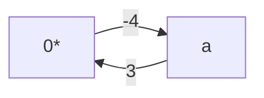
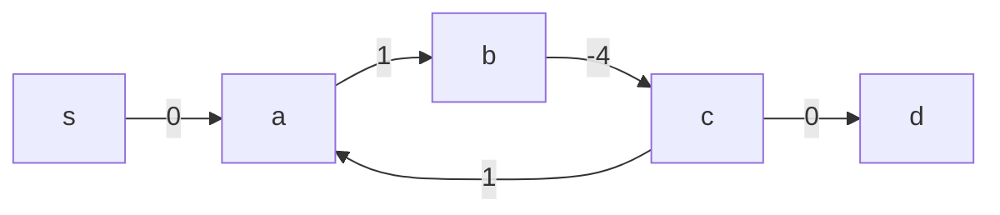
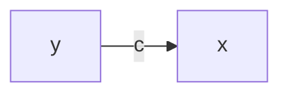
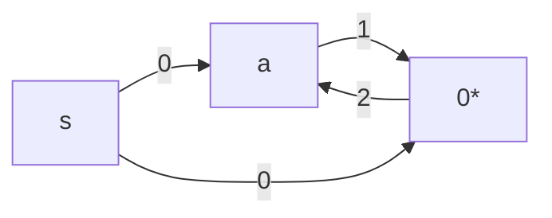
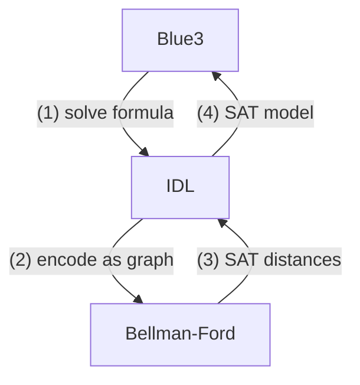
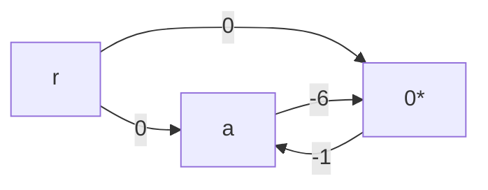
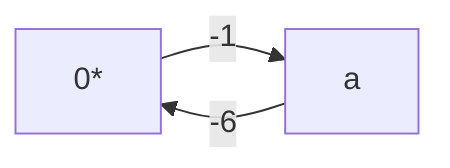
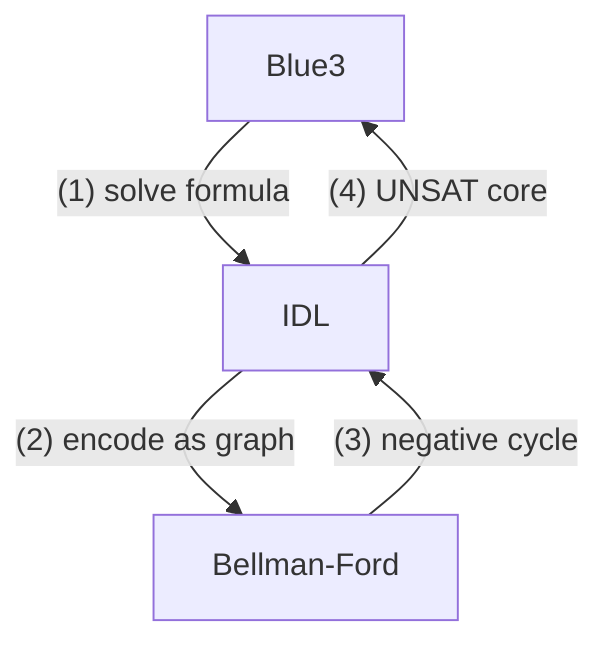

# Programming Blue3: An SMT solver for Caprice-Lang

By: Nathanael Oh

Blue3 is an SMT solver for JHU's [`caprice-lang`](https://github.com/JHU-PL-Lab/caprice-lang). It is used by the typechecker's [Concolic Evaluator](https://github.com/JHU-PL-Lab/caprice-lang/blob/main/docs/caprice.md), or `ceval`.

Before Blue3, `ceval` used [Z3](https://www.microsoft.com/en-us/research/project/z3-3/) directly. Z3 is powerful, but often overkill for simple formulas like:

$$
(6 \leq a) \land (a < 0)
$$

This formula is **UNSAT**, because $a$ cannot be at least $6$ and less than $0$ at the same time. Since calling Z3 has overhead, Blue3 was built to solve simple cases internally and fall back to Z3 when needed.

I will reference both theory bits along with implementation details throughout the report, leaning a bit more on the implementation side since this paper is meant for a general computer science audience. The full source code can be found on the [`caprice-lang`](https://github.com/JHU-PL-Lab/caprice-lang) repository if you want to see the implementations in full.

## Intro

Blue3 is a small SMT solver with a full SAT/SMT pipeline. In benchmarks, Blue3's frontend was just over 60% faster than Z3 on simple formulas.

| avg_blue3 | avg_z3 |
|-----------|--------|
| 222.0μs | 329.0μs |

When Blue3 cannot solve a formula, it falls back to Z3. This adds about 20.24μs of overhead on average, or roughly 5%.

| num_slow_cases | avg_slower_by | avg_percent_slower |
|----------------|---------------|--------------------|
| 38 | 20.24μs | 4.59% |

So Blue3 gives a good tradeoff: faster simple cases, with Z3 as a backup.

### P = NP and Boolean Satisfiability

Oversimplifying, $P = NP$ asks:

> If we can check a solution quickly, can we also find that solution quickly?

Problems solvable in polynomial time are in $P$. Problems whose solutions can be verified in polynomial time are in $NP$.

So another way to state $P = NP$ is:

> If a solution can be verified efficiently, can it also be found efficiently?

We do not know. Most computer scientists believe $P \neq NP$, but no one has proven it.

This matters because some problems are **NP-complete**: every problem in $NP$ can be reduced to them in polynomial time. If we found a polynomial-time algorithm for one NP-complete problem, every problem in $NP$ could be solved efficiently.

### 3SAT and Boolean Satisfiability

3SAT asks:

> Given a propositional formula in CNF with at most 3 literals per clause, is there some assignment that makes it true?

For example:

$$
(p \lor q) \land (\neg p \lor \neg q)
$$

is satisfiable because $p = \text{true}$ and $q = \text{false}$ makes the formula true.

But:

$$
(p \lor q) \land (\neg p \lor q) \land (p \lor \neg q) \land (\neg p \lor \neg q)
$$

is unsatisfiable because no assignment of $p$ and $q$ can satisfy every clause.

3SAT is important because it is NP-complete. If we could solve 3SAT in polynomial time, we would prove $P = NP$.

Blue3 obviously does not solve $P = NP$. Instead, it uses practical SAT/SMT techniques to solve many real formulas efficiently.

SMT extends SAT with theory constraints. For example:

$$
(6 \leq a) \land (a < 0)
$$

can be abstracted into:

$$
p \land q
$$

where $p$ represents $(6 \leq a)$ and $q$ represents $(a < 0)$. The SAT solver handles the boolean structure, while the theory solver checks whether the constraints are actually consistent.

### Useful Terminology

A **formula** is a boolean-valued expression. In this report, "formula" usually means a formula in **CNF**.

A formula in **CNF** is an AND of clauses:

$$
(p \lor q \lor r) \land (s \lor t \lor \neg u)
$$

A **clause** is one OR-group. A **literal** is an atom with a sign, like $p$ or $\neg p$. An **atom** is the unsigned condition underneath a literal.

We will use three main formula categories:

1. A **SAT formula** is purely propositional.
2. A **theory formula** is handled by a theory solver.
3. An **SMT formula** combines propositional logic with theory constraints.

A **solver** takes a formula and returns either **SAT**, usually with a satisfying model, or **UNSAT**.

## Difference Logic

Blue3 is meant for formulas too simple to justify calling Z3, such as:

$$
(6 \leq a) \land (a < 0)
$$

In our benchmarks, many of these formulas were integer-heavy:

| formula_id |            formula             |
|------------|--------------------------------|
| 9          | (0 < a) ^ ((a + 1) <= a)       |
| 8          | (0 < a) ^ ((a + 1) <= 1)       |
| 56         | (not (a = 0)) ^ ((a + 10) = 0) |
| 11         | (1 < a) ^ (a < 0)              |
| 88         | (0 < a) ^ (a < 1)              |

This led us to **Integer Difference Logic**, or **IDL**, a fragment of linear integer arithmetic where constraints compare differences between integer terms.

IDL literals have the shape:

$$
x - y \leq c
$$

where $x$ and $y$ are integer variables or $0$, and $c$ is an integer constant.

For example:

$$
(6 \leq a) \land (a < 0)
$$

can be rewritten as:

$$
((0 - a) \leq -6) \land ((a - 0) \leq -1)
$$

IDL gives Blue3 a mechanical way to recognize contradictions like this.

## Bellman-Ford

Bellman-Ford finds shortest paths in a directed weighted graph. It also detects **negative cycles**, which are cycles whose total weight is negative.

For example:

```ocaml
let simple_no_neg =
  [ ("a", "0*", 3); ("0*", "a", -1)
  ; ("r", "0*", 9); ("r", "a", 5) ]
```


Running Bellman-Ford from `r` gives:

| Node | Distance |
|------|----------|
| $a$ | $5$ |
| $0^*$ | $8$ |

The shortest path to $0^*$ is $r \to a \to 0^*$, with cost $5 + 3 = 8$. The cycle between `a` and $0^*$ has cost:

$$
3 + (-1) = 2
$$

Since the cycle is positive, looping only makes paths more expensive.

Now change the edge $0^* \to a$ from $-1$ to $-4$. The cycle cost becomes:

$$
3 + (-4) = -1
$$

Each loop makes the path cheaper, so Bellman-Ford reports a negative cycle.

```ocaml
let simple_neg =
  [ ("a", "0*", 3); ("0*", "a", -4)
  ; ("r", "0*", 9); ("r", "a", 5) ]
```



### Relaxing Edges

Bellman-Ford repeatedly tries to improve distances. This is called **relaxation**.

An edge is relaxed when:

$$
dist[from] + cost < dist[to]
$$

In our implementation, we opt for `options` over explicit int-max values to represent the initial distances states; that first case where we find there is a min distance of `None` to the `to_` node represents the initial state.

So in either the initial state or any state after, we are effectively checking for $dist[from] + cost < dist[to]$:

```ocaml {filename="utils/bellman_ford.ml" .numberLines}
let relax_edge (tbl : tbl) (was_updated : bool) ((from_, to_, cost) as edge : Node.t edge) : bool =
  match Hashtbl.find tbl from_, Hashtbl.find tbl to_ with
  | (Some du, _), (None, _) ->
    set_distance to_ tbl ~min:(du + cost) ~pred:edge
  | (Some du, _), (Some dv, _) when du + cost < dv ->
    set_distance to_ tbl ~min:(du + cost) ~pred:edge
  | _ -> was_updated
```

The source starts at distance `0`; every other node starts at infinity. Bellman-Ford relaxes edges at most $N - 1$ times, where $N$ is the number of nodes, so we stop when we are at iteration number $N - 1$, or when a full pass does not update anything as a small optimization:

```ocaml {filename="utils/bellman_ford.ml" .numberLines}
let relax_edges (edges : Node.t edge list) (tbl : tbl) (i : int)
  : [ `Continue of tbl | `Stop of tbl ] =
  if i >= (Hashtbl.length tbl) - 1 then `Stop tbl
  else
    let is_dist_updated = List.fold_left (relax_edge tbl) false edges in
    if is_dist_updated then `Continue tbl
    else `Stop tbl
```

### Predecessors and Negative Cycles

Each table entry stores:

$$
(\text{distance}, \text{predecessor edge})
$$

The distance gives the shortest-known cost from the source. The predecessor edge lets us reconstruct the path.

After the normal relaxation loop, Bellman-Ford runs one extra pass. If any edge can still be relaxed, the graph has a negative cycle.

We invoke this extra pass via `find_relaxed_node_opt`:

```ocaml {filename="utils/bellman_ford.ml" .numberLines}
let find_relaxed_node_opt (edges : Node.t edge list) (dist : tbl) : Node.t option =
  List.find_map (fun ((_, to_, _) as edge) ->
    if relax_edge dist false edge then
      Some to_
    else None)
  edges
```

Where we just return the `to_` node of the first edge that was relaxed.

The relaxed node may not itself be inside the cycle:



To find a node in the cycle, we walk backward from that relaxed node:

```ocaml {filename="utils/bellman_ford.ml" .numberLines}
let find_cycle_node_opt (edges : Node.t edge list) (dist : tbl)
  : Node.t option =
  let num_nodes = Hashtbl.length dist in
  let relaxed_predecessor = find_relaxed_node_opt edges dist in
  ...
```

For a graph with $\text{NUM\_NODES}$ nodes, we need to move back $\text{NUM\_NODES}$ from the relaxed node to return a node guaranteed to be in the cycle because of the pigeonhole principle:

```ocaml {filename="utils/bellman_ford.ml" .numberLines}
let find_cycle_node_opt (edges : Node.t edge list) (dist : tbl)
  ...
  let rec move_back node n =
    if n = 0 then node
    else
      match find_predecessor node dist with
      | None -> node
      | Some from_ -> move_back from_ (n - 1)
  in
  Option.map (fun entry -> move_back entry num_nodes) relaxed_predecessor
```

The `start` node is all we need to collect the edges in the negative cycle because we can just backtrack from it:
```ocaml {.numberLines filename="utils/bellman_ford.ml"}
let collect_cycle (start : Node.t) (dist : tbl) : Node.t edge list =
  let num_nodes = Hashtbl.length dist in
  let rec loop curr n acc =
    if n = 0 then
      acc
    else
      match find_predecessor_edge curr dist with
      | None -> acc
      | Some ((from_, _, _) as pred_edge) ->
        let acc = pred_edge :: acc in
        if Node.compare from_ start = 0 then acc
        else loop from_ (n - 1) acc
  in
  loop start num_nodes []
```

Now that we can collect negative cycles, our bellman ford implementation is finished.

```ocaml {filename="utils/bellman_ford.ml"}
let bellman_ford
  (type node)
  (module Node : Baby.OrderedType with type t = node)
 ~(src : node)
  (edges : node edge list)
  : [ `No_negative_cycle of (node * int) list
    | `Negative_cycle of node edge list
    ] =
  let open Make (Node) in
  let tbl = find_shortest_paths ~src edges in
  match find_cycle_node_opt edges tbl with
  | None -> `No_negative_cycle (
    tbl
    |> Hashtbl.to_seq_keys
    |> Seq.map (fun node -> node, find_distance node tbl)
    |> List.of_seq
  )
  | Some entry -> `Negative_cycle (collect_cycle entry tbl)
```

## Bellman-Ford as a Difference Logic Solver

Bellman-Ford solves difference logic because each constraint can be encoded as a graph edge.

We can encode:

$$
x - y \leq c
$$

as:

$$
(y, x, c)
$$



It looks like this for Blue3:

```ocaml {filename="smt/idl.ml" .numberLines}
let leq_to_diff (left : Ints.affine) (right : Ints.affine) : diff =
  match left, right with
  | Var_plus_const (x, kx), Var_plus_const (y, ky) ->
    { x = Node.symbol_key x ; y = Node.symbol_key y ; c = ky - kx }
  ...
```

Where we pattern match to build our `diff` record.

Then we add a dummy source node with $0$-weight edges to every node and run Bellman-Ford. If it finds a negative cycle, the formula is **UNSAT**. Otherwise, it is **SAT**.

### Case 0. Split

IDL can solve inequalities like $\leq$, but disequality needs a split:

$$
x \neq y \implies (x \leq y - 1) \lor (y + 1 \leq x)
$$

```ocaml {.numberLines filename="smt/idl.ml"}
let find_split_opt (lit : 'k Theory.literal)
  : 'k split_neq_case option =
  let one = Formula.const_int 1 in
  match lit with
  | Neg Predicate (Equal, x, y) ->
    ...
```

Where on that case, we return both lower and upper bounds:

```ocaml {.numberLines filename="smt/idl.ml"}
match lit with
| Neg Predicate (Equal, x, y) ->
  begin match Ints.reflect_opt x, Ints.reflect_opt y with
  | Some x', Some y' ->
    let lower =
      Theory.Predicate (Less_than_eq, x', Formula.minus y' one)
    in
    let upper =
      Theory.Predicate (Less_than_eq, Formula.plus y' one, x')
    in ...
```

We also include the equality case...

```ocaml {.numberLines filename="smt/idl.ml"}
begin match Ints.reflect_opt x, Ints.reflect_opt y with
| Some x', Some y' ->
  ...
  let eq = Theory.Predicate (Equal, x, y) in
  Some (~lower:(Pos lower), ~upper:(Pos upper), ~eq:(Pos eq))
```

...because the SAT solver may still need to explore $x = y$ depending on context.

### Case 1. SAT

Consider:

$$
(-a \leq 1) \land (a \leq 2)
$$

Encoding each literal gives:

$$
-a \leq 1 \equiv 0^* - a \leq 1 \implies (a, 0^*, 1)
$$

$$
a \leq 2 \equiv a - 0^* \leq 2 \implies (0^*, a, 2)
$$

After adding dummy source edges:

$$
\text{Edges} = (a, 0^*, 1), (0^*, a, 2), (s, a, 0), (s, 0^*, 0)
$$



Bellman-Ford finds no negative cycle, so the formula is **SAT**.

To get a concrete model, we normalize distances around the special $0^*$ node:

$$
\text{model}[x] = \text{distance}[x] - \text{distance}[0^*]
$$

So all we need to do is get the the $0^*$ node's distance `z0_dist`:

```ocaml {.numberLines filename="smt/idl.ml"}
let solve_int_diff (literals : 'k Theory.literal list)
  : 'k Theory.theory_solution =
  ...
    let { edges ; edge_sources ; vars } = encode_graph lits in
    match bellman_ford ~src:Node.root edges with
    | `Negative_cycle edges -> ...
    | `No_negative_cycle distances ->
      let distance_map = NodeMap.of_list distances in
      let z0_dist = NodeMap.find Node.zero distance_map in
```

And then subtract it from every other value with `var_dist - z0_dist`:

```ocaml {.numberLines filename="smt/idl.ml"}
...
| `No_negative_cycle distances ->
  ...
  vars
  |> List.map (fun uid ->
      let var_dist = NodeMap.find (Node.symbol_key uid) distance_map in
      uid, Model.Int (var_dist - z0_dist))
  ...
```

So the SAT flow looks like this:



### Case 2. UNSAT

Now consider:

$$
(6 \leq a) \land (a < 0)
$$

This encodes to:



Bellman-Ford finds this negative cycle:



And returns the edges of the cycle:

```ocaml {.numberLines filename="smt/idl.ml"}
let solve_int_diff (literals : 'k Theory.literal list)
  : 'k Theory.theory_solution =
  ...
    let { edges ; edge_sources ; vars } = encode_graph lits in
    match bellman_ford ~src:Node.root edges with
    | `Negative_cycle edges -> ...
```

The cycle edges map back to:

$$
(a, 0^*, -6) \implies 6 \leq a
$$

$$
(0^*, a, -1) \implies a < 0
$$

```ocaml {.numberLines filename="smt/idl.ml"}
match bellman_ford ~src:Node.root edges with
| `Negative_cycle edges ->
  let core =
    edges
    |> List.filter_map (fun edge -> source_from_edge edge edge_sources)
    |> List.sort_uniq compare
  in
  Theory.unsat core
```

So the original formula is **UNSAT**.



The negative cycle is also the **UNSAT core**, meaning the specific literals responsible for the contradiction.

With our `solve_int_diff` function we can now use bellman ford to solve our simple formulas.

## SAT solving

3SAT was the first problem shown to be $\text{NP-complete}$. More generally, $\text{k-SAT}$ asks:

> Given a formula with at most $k$ literals per clause, is it satisfiable?

For example:

$$
(p \lor q \lor \neg r) \land (\neg p \lor r) \land (q \lor r) \land \neg r
$$

is satisfiable with $p = \text{false}, q = \text{true}, r = \text{false}$.

No polynomial-time SAT algorithm is known, so practical SAT solvers are still very smart search algorithms.

### Conflict-Driven Clause Learning

Blue3 uses **Conflict-Driven Clause Learning**, or `CDCL`, for boolean solving.

The (simple) loop goes like:

1. *Propagate* forced boolean constraints
2. *Decide* on a variable once nothing is forced
3. *Learn* from contradictions caused from decisions and *backtrack* to some unique implication cut.
4. Repeat until `SAT` or `UNSAT`.

So we begin with propagation via the boolean constraint propagation function `bcp`:

```ocaml {.numberLines filename="sat/cdcl.ml"}
let cdcl formula = bcp 0 [] formula
```

```ocaml {.numberLines filename="sat/cdcl.ml"}
let rec bcp (level : int) (trail : Trail.trail) (formula : Formula.formula) : Solution.solution =
  let model = Trail.to_model trail in
  match unit_propagate formula model with
  | Decide -> ...
  | Conflict clause -> ...
  | Implication (clause, lit) -> ...
```

Which calls `unit_propagate`. Depending on the result of `unit_propagate`, we will either `backtrack_learn`:

```ocaml {.numberLines filename="sat/cdcl.ml"}
let rec bcp (level : int) (trail : Trail.trail) (formula : Formula.formula) : Solution.solution =
...
and backtrack_learn ~level clause trail formula =
  let trail' = Trail.backjump ~level trail in
  let formula' = clause :: formula in
  bcp level trail' formula'
```

or `decide`:

```ocaml {.numberLines filename="sat/cdcl.ml"}
and decide ~lit next_lvl trail =
  let trail' = Trail.decide ~lit next_lvl trail in
  bcp next_lvl trail'
```

### Unit Propagation

Unit propagation finds literals that must be true.

For example:

$$
p \land \neg q \land (\neg p \lor q \lor \neg r)
$$

forces:

$$
p = \text{true}
$$

and:

$$
q = \text{false}
$$

because $p$ and $\neg q$ are unit clauses.

Then it returns the `next` step which is one of `Decide`, `Conflict`, or `Implication`.

```ocaml {.numberLines filename="sat/cdcl.ml"}
let unit_propagate formula model =
  let rec search_empty
    (formula : Formula.formula)
    (reason_clause : literal list)
    (lit : Formula.literal)
    : next = ...
  in
  let rec search_unit (formula : Formula.formula) : next = ...
  in search_unit formula
```

It first calls `search_unit`:

```ocaml {.numberLines filename="sat/cdcl.ml"}
let rec search_unit (formula : Formula.formula) : next =
  match formula with
  | [] -> Decide
  | clause :: clauses' ->
    match Model.eval_clause clause model with
    | `Falsified -> Conflict clause
    | `Undecided [lit] -> search_empty clauses' clause lit
    | _ -> search_unit clauses'
```

`search_unit` scans through the formula one clause at a time under the current model. If a clause is already falsified, then propagation has discovered a contradiction and returns `Conflict clause`.

If a clause has exactly one undecided literal, then that literal must be assigned in order to satisfy the clause. In that case, `search_unit` calls `search_empty` with the unit clause as the `reason_clause` and the forced literal as `lit`.

For example, if the clause is:

$$
(\neg p \lor q \lor r)
$$

and the model says:

$$
p = \text{true}
\qquad
q = \text{false}
$$

then the clause reduces to:

$$
(\text{false} \lor \text{false} \lor r)
$$

so unit propagation forces:

$$
r = \text{true}
$$

Before returning that implication, `search_empty` checks the rest of the formula:

```ocaml {.numberLines filename="sat/cdcl.ml"}
let rec search_empty
  (formula : Formula.formula)
  (reason_clause : literal list)
  (lit : Formula.literal)
  : next =
  match formula with
  | [] -> Implication (reason_clause, lit)
  | clause :: clauses' ->
    match Model.eval_clause clause model with
    | `Falsified -> Conflict clause
    | _ -> search_empty clauses' reason_clause lit
```

This second scan gives conflicts priority over implications. If the rest of the formula already contains a falsified clause, then CDCL should handle the conflict first. Otherwise, once the scan finishes, it returns:

```ocaml
Implication (reason_clause, lit)
```

In which case the loop adds the implied `lit` along with the `reason` clause behind that assignment to the trail state:

```ocaml {filename="sat/cdcl.ml"}
let rec bcp (level : int) (trail : Trail.trail) (formula : Formula.formula) : Solution.solution =
  let model = Trail.to_model trail in
  begin match unit_propagate formula model with
  ...
  | Implication (clause, lit) ->
    let trail' = Trail.imply ~reason:clause level lit trail in
    bcp level trail' formula
```

Besides the implication case, `unit_propagate` returns 2 more cases:

1. `Decide`: no conflict was found, and no unit clause is available, so decide on a variable

2. `Conflict clause`: some clause is already false under the current model

### Deciding and Conflicts

Sometimes nothing is forced:

$$
(p \lor q) \land (\neg p \lor r)
$$

So CDCL makes a **decision**, meaning it guesses an unassigned variable:

If CDCL guesses:

```ocaml {.numberLines filename="sat/cdcl.ml"}
let rec bcp (level : int) (trail : Trail.trail) (formula : Formula.formula) : Solution.solution =
  let model = Trail.to_model trail in
  begin match unit_propagate formula model with
  | Decide ->
    let atoms = List.map Formula.atom_from_literal model in
    begin match Formula.find_free_variable_opt atoms formula with
    | None -> ...
    | Some x -> decide ~lit:(Formula.pos x) level trail formula
  ...
and decide ~lit next_lvl trail =
  let trail' = Trail.decide ~lit next_lvl trail in
  bcp next_lvl trail'
```

```ocaml {.numberLines filename="sat/trail.ml"}
let decide ~lit level trail = { level ; lit ; reason = Decided } :: trail
```

$$
p = \text{true}
$$

then:

$$
(\neg p \lor r)
$$

forces:

$$
r = \text{true}
$$

But guesses can lead to conflicts. For example:

$$
(p \lor q) \land (\neg p \lor q) \land (p \lor \neg q) \land (\neg p \lor \neg q)
$$

If CDCL guesses $p = \text{true}$, then it is forced to set $q = \text{true}$. But then $(\neg p \lor \neg q)$ becomes false.

CDCL learns from this conflict with the `Trail.analyze_conflict` function:

```ocaml {.numberLines filename="sat/cdcl.ml"}
let rec bcp (level : int) (trail : Trail.trail) (formula : Formula.formula) : Solution.solution =
  let model = Trail.to_model trail in
  begin match unit_propagate formula model with
  ...
  | Conflict clause ->
    let clause', backtrack_lvl = Trail.analyze_conflict ~clause level trail
```

which prevents the same bad assignment from being repeated.

It does so by first filtering for all literals in the conflict clause at the current decision level:

```ocaml {filename="sat/trail.ml"}
let rec analyze_conflict ~clause level trail =
  match List.filter (fun lit -> find_level lit trail = level) clause with
```

Say we have the conflict clause:

$$
\neg p \lor \neg q \lor \neg r
$$

where:

$$
p \text{ is assigned at level } 1
$$

$$
q \text{ is assigned at level } 2
$$

$$
r \text{ is assigned at level } 3
$$

If the current decision level is `3`, then filtering the clause for literals at level `3` gives:

$$
\neg{r}
$$

That means the clause has exactly one literal from the current decision level, so it is ready to learn:

```ocaml {filename="sat/trail.ml"}
| [hd] ->
  if level = 0 then [], -1
  else
    let new_lvl =
      clause
      |> List_utils.remove1 hd
      |> List.fold_left
          (fun lvl' lit ->
            max lvl' (find_level lit trail)) 0
    in
    clause, new_lvl
```

This case returns the learned `clause` and computes the level to backjump to. It removes the single current-level literal `hd`, then finds the highest decision level among the remaining literals.

For the example:

$$
\neg p \lor \neg q \lor \neg r
$$

we remove:

$$
\neg r
$$

and compute:

$$
\max(\text{level}(\neg p), \text{level}(\neg q)) = \max(1, 2) = 2
$$

So `analyze_conflict` returns:

```ocaml
([¬p; ¬q; ¬r], 2)
```

This tells CDCL to learn:

$$
\neg p \lor \neg q \lor \neg r
$$

and backjump to level `2`:

```ocaml {filename="sat/cdcl.ml"}
let rec bcp ...
  | Conflict clause ->
    let clause', backtrack_lvl = Trail.analyze_conflict ~clause level trail in
    if backtrack_lvl < 0 then UNSAT
    else backtrack_learn ~level:backtrack_lvl clause' trail formula
...
and backtrack_learn ~level clause trail formula =
  let trail' = Trail.backjump ~level trail in
  let formula' = clause :: formula in
  bcp level trail' formula'
```

```ocaml {filename="sat/trail.ml"}
let backjump ~level:backtrack_level trail =
  List.filter (fun { level ; _ } -> level <= backtrack_level) trail
```

After backjumping, `r` becomes unassigned, while `p` and `q` remain assigned, so the learned clause becomes unit and immediately forces:

$$
r = \text{false}
$$

If there is more than one literal from the current decision level, then the clause is not ready to learn yet:

```ocaml {filename="sat/trail.ml"}
| current_level_lits ->
  let reason = find_reason current_level_lits trail in
  let clause' = Formula.resolve_pair clause reason in
  analyze_conflict ~clause:clause' level trail
```

In that case, `analyze_conflict` finds the reason clause for one of the current-level literals, resolves it with the current conflict clause, and recursively tries again. This removes one current-level literal and replaces it with the literals that caused it, gradually moving the explanation backward until only one current-level literal remains.

### A Full Example

Let's run through the example:

$$
(p \lor q) \land (\neg p \lor r) \land (\neg r \lor q)
$$

There are no unit clauses to propagate, so `unit_propagate` returns `Decide`:

```ocaml {.numberLines filename="sat/cdcl.ml"}
let rec bcp (level : int) (trail : Trail.trail) (formula : Formula.formula) : Solution.solution =
  let model = Trail.to_model trail in
  begin match unit_propagate formula model with
  | Decide ->
    let atoms = List.map Formula.atom_from_literal model in
    begin match Formula.find_free_variable_opt atoms formula with
    | None ->
      if Model.is_tautology formula model then SAT model
      else UNSAT
    | Some x -> decide ~lit:(Formula.neg x) (level + 1) trail formula
    end
```

Suppose Blue3 makes the bad decision:

$$
q = \text{false}
$$

The `decide` helper records that assignment on the trail at the next decision level, then immediately returns to `bcp`:

```ocaml {.numberLines filename="sat/cdcl.ml"}
and decide ~lit next_lvl trail formula =
  let trail' = Trail.decide ~lit next_lvl trail in
  bcp next_lvl trail' formula
```

So the trail now contains:

$$
q = \text{false}
$$

at decision level `1`.

Now `bcp` calls `unit_propagate` again. Under the current model, the clause:

$$
(p \lor q)
$$

becomes:

$$
(p \lor \text{false})
$$

so unit propagation forces:

$$
p = \text{true}
$$

That returns an `Implication`:

```ocaml {.numberLines filename="sat/cdcl.ml"}
| Implication (clause, lit) ->
  let trail' = Trail.imply ~reason:clause level lit trail in
  bcp level trail' formula
```

Blue3 records this implication on the trail, along with the reason clause:

$$
(p \lor q)
$$

So the trail is now:

$$
[
  p = \text{true} \;\text{ because of } (p \lor q);
  \;
  q = \text{false}
]
$$

Then `bcp` loops again. Now the clause:

$$
(\neg p \lor r)
$$

becomes:

$$
(\text{false} \lor r)
$$

so unit propagation forces:

$$
r = \text{true}
$$

Blue3 records the implication and its reason:

```ocaml {.numberLines filename="sat/cdcl.ml"}
| Implication (clause, lit) ->
  let trail' = Trail.imply ~reason:clause level lit trail in
  bcp level trail' formula
```

Now the trail is:

$$
[
  r = \text{true} \;\text{ because of } (\neg p \lor r);
  \;
  p = \text{true} \;\text{ because of } (p \lor q);
  \;
  q = \text{false}
]
$$

Then `bcp` calls `unit_propagate` again. This time, the clause:

$$
(\neg r \lor q)
$$

becomes:

$$
(\text{false} \lor \text{false})
$$

so the clause is falsified. `unit_propagate` returns a conflict:

```ocaml {.numberLines filename="sat/cdcl.ml"}
let unit_propagate ...
  let rec search_unit (formula : Formula.formula) : next =
    match formula with
    | [] -> Decide
    | clause :: clauses' ->
      match Model.eval_clause clause model with
      | `Falsified -> Conflict clause
```

So `bcp` enters the conflict case:

```ocaml {.numberLines filename="sat/cdcl.ml"}
let rec bcp ...
  match unit_propagate ... with
  | Conflict clause ->
    let clause', backtrack_lvl = Trail.analyze_conflict ~clause level trail in
    if backtrack_lvl < 0 then UNSAT
    else backtrack_learn ~level:backtrack_lvl clause' trail formula
```

Here, the conflict clause is:

$$
(\neg r \lor q)
$$

The current conflict clause is:

$$
(\neg r \lor q)
$$

Both $r$ and $q$ were assigned at the current decision level, so there is more than one current-level literal. That means the clause is not ready to learn yet, so Blue3 uses the recursive case:

```ocaml {.numberLines filename="sat/trail.ml"}
| current_level_lits ->
  let reason = find_reason current_level_lits trail in
  let clause' = Formula.resolve_pair clause reason in
  analyze_conflict ~clause:clause' level trail
```

Since $r$ came from:

$$
(\neg p \lor r)
$$

Blue3 resolves the conflict clause:

$$
(\neg r \lor q)
$$

with the reason clause:

$$
(\neg p \lor r)
$$

The complementary literals $r$ and $\neg r$ cancel, giving:

$$
(q \lor \neg p)
$$

Now `analyze_conflict` recursively checks the new clause:

$$
(q \lor \neg p)
$$

Again, both $q$ and $p$ were assigned at the current decision level, so there is still more than one current-level literal. Blue3 resolves again.

Since $p$ came from:

$$
(p \lor q)
$$

Blue3 resolves:

$$
(q \lor \neg p)
$$

with:

$$
(p \lor q)
$$

The complementary literals $p$ and $\neg p$ cancel, leaving:

$$
q
$$

Now the learned clause has only one literal from the current decision level:

$$
q
$$

So `analyze_conflict` hits the return case:

```ocaml {.numberLines filename="sat/trail.ml"}
| [hd] ->
  if level = 0 then [], -1
  else
    let new_lvl =
      clause
      |> List_utils.remove1 hd
      |> List.fold_left
          (fun lvl' lit ->
            max lvl' (find_level lit trail)) 0
    in
    clause, new_lvl
```

Since the learned clause is just:

$$
q
$$

removing the current-level literal leaves no other literals, so the backtrack level is:

$$
0
$$

So Blue3 returns:

$$
(q, 0)
$$

meaning:

$$
\text{learn } q
\qquad
\text{and backjump to level } 0
$$

Then `bcp` calls `backtrack_learn`:

```ocaml {.numberLines filename="sat/cdcl.ml"}
and backtrack_learn ~level clause trail formula =
  let trail' = Trail.backjump ~level trail in
  let formula' = clause :: formula in
  bcp level trail' formula'
```

This removes the bad branch from the trail and adds the learned clause to the formula. The formula effectively becomes:

$$
q \land (p \lor q) \land (\neg p \lor r) \land (\neg r \lor q)
$$

Now Blue3 calls `bcp` again at level `0`. Since:

$$
q
$$

is a unit clause, unit propagation immediately forces:

$$
q = \text{true}
$$

So Blue3 has learned that the branch:

$$
q = \text{false}
$$

cannot work. Instead of trying that same bad assignment again, it backjumps, learns the clause $q$, and propagates the opposite assignment.

With:

$$
q = \text{true}
$$

the original formula is satisfiable:

$$
(p \lor q) \land (\neg p \lor r) \land (\neg r \lor q)
$$

because the first and third clauses are already satisfied by $q = \text{true}$, and Blue3 can choose values for the remaining variables that satisfy the rest.

The key idea is that a conflict may only mean the current branch is impossible. CDCL learns from that branch, backjumps, and continues with a new clause that prevents the same bad reasoning from happening again.

## SMT solving

Blue3 connects the propositional [CDCL solver](#conflict-driven-clause-learning) with the [Bellman Ford solver](#bellman-ford-as-a-difference-logic-solver)

### Theory atoms and results

Blue3 represents theory-level boolean expressions as `Theory.atom`s. Theory literals are signed atoms, either positive or negative. A theory solver receives a conjunction of these literals and returns one of:

- `Theory_sat`: the literals are consistent.
- `Theory_unsat`: the literals are inconsistent, with a core explaining why.
- `Theory_split`: the solver needs more case splits.
- `Theory_unknown`: Blue3 should fall back to the next solver.

```ocaml {filename="smt/theory.mli"}
type 'k theory_solution = private
  | Theory_unknown
  | Theory_sat of 'k Model.t
  | Theory_unsat of 'k core
  | Theory_split of 'k formula
```

### Boolean abstraction

The SAT solver cannot directly reason about theory atoms, so Blue3 maps them to fresh SAT atoms.

For example:

```text
p1 := (6 <= a)
p2 := (a < 0)
```

So:

$$
(6 \le a) \land (a < 0)
$$

becomes:

$$
p_1 \land p_2
$$

Blue3 stores this mapping in a connector:

```ocaml {filename="smt/blue3.ml"}
type 'k connector =
  { to_sat : ('k Theory.atom, Sat.Formula.atom) Hashtbl.t
  ; from_sat : (Sat.Formula.atom, 'k Theory.atom) Hashtbl.t
  ; mutable count : int
  }
```

The `to_sat` table maps theory atoms to SAT atoms, while `from_sat` maps SAT atoms back to their original theory atoms.

When Blue3 sees a theory atom, it either reuses the existing SAT atom or creates a fresh one:

```ocaml {filename="smt/blue3.ml"}
let abstract_atom
    ?uid
    (atom : 'k Theory.atom)
    (conn : 'k connector)
  : Sat.Formula.atom =
  match Hashtbl.find_opt conn.to_sat atom with
  | Some uid -> uid
  | None ->
      let sat_atom = next_uid ?uid conn in
      Hashtbl.add conn.to_sat atom sat_atom;
      Hashtbl.add conn.from_sat sat_atom atom;
      sat_atom
```

Literals preserve their sign during abstraction:

```ocaml {filename="smt/blue3.ml"}
let abstract_literal
    ?uid
    (lit : 'k Theory.literal)
    (conn : 'k connector)
  : Sat.Formula.literal =
  match lit with
  | Neg smt_atom -> Sat.Formula.neg (abstract_atom ?uid smt_atom conn)
  | Pos smt_atom -> Sat.Formula.pos (abstract_atom ?uid smt_atom conn)
```

Then clauses and formulas are abstracted by mapping over their literals:

```ocaml {filename="smt/blue3.ml"}
let abstract_clause
    ?uid
    (Clause clause : 'k Theory.clause)
    (conn : 'k connector)
  : Sat.Formula.literal list =
  List.map (fun lit -> abstract_literal ?uid lit conn) clause

let abstract
    ?uid
    (formula : 'k Theory.formula)
    (conn : 'k connector)
  : Sat.Formula.literal list list =
  List.map (fun clause -> abstract_clause ?uid clause conn) formula
```

Once SAT finds a boolean model, Blue3 converts the SAT literals back into theory literals before calling the theory solver:

```ocaml {filename="smt/blue3.ml"}
let make_theory_literals
  (sat_model : Sat.Formula.literal list)
  (conn : 'k connector)
  : 'k Theory.literal list =
  List.map
    (function
     | Sat.Formula.Pos sat_atom
     | Sat.Formula.Neg sat_atom -> make_theory_literal sat_model sat_atom conn)
    sat_model
```

So the connector lets Blue3 move in both directions:

```text
theory formula -> SAT formula -> SAT model -> theory literals
```

### CDCL(T)

After boolean abstraction, Blue3 runs a simple CDCL(T) loop:

```ocaml {filename="smt/blue3.ml"}
let cdcl_T ~(solver : 'k Theory.theory_solver) (formula : (bool, 'k) Formula.t)
  : 'k Solution.t =
  let conn = make 64 in
  let propositional = abstract (Theory.from_smt_formula formula) conn in
  let rec loop conn sat_formula =
    match Sat.Cdcl.cdcl sat_formula with
    | UNSAT -> Solution.Unsat
    | SAT model ->
      let theory_lits =
        make_theory_literals model conn
      in
      match solver theory_lits with
      | Theory_unknown -> Solution.Unknown
      | Theory_unsat core ->
        let learned = theory_learn core conn in
        let sat_formula' = Sat.Formula.conjoin1 learned sat_formula in
        loop conn sat_formula'
      | Theory_sat model -> Solution.Sat model
      | Theory_split clauses ->
        let sat_formula' =
          List.fold_left
            (fun acc clause ->
              let sat_clause = abstract_clause clause conn in
              Sat.Formula.conjoin1 sat_clause acc)
            sat_formula
            clauses
        in
        loop conn sat_formula'
  in
  loop conn propositional
```

First, Blue3 creates a connector and abstracts the SMT formula into a propositional SAT formula:

```ocaml {filename="smt/blue3.ml"}
let conn = make 64 in
let propositional = abstract (Theory.from_smt_formula formula) conn in
```

The connector remembers which SAT atom corresponds to which theory atom, so the SAT solver can work on boolean variables while Blue3 can later recover the original theory literals.

Then Blue3 calls the SAT solver:

```ocaml {filename="smt/blue3.ml"}
match Sat.Cdcl.cdcl sat_formula with
| UNSAT -> Solution.Unsat
| SAT model -> ...
```

If the propositional abstraction is already unsatisfiable, then the original SMT formula is also unsatisfiable. But if SAT finds a boolean model, Blue3 still needs to ask whether that model makes sense in the theory.

So it converts the SAT model back into theory literals:

```ocaml {filename="smt/blue3.ml"}
let theory_lits =
  make_theory_literals model conn
in
match solver theory_lits with
```

For example, if the SAT model contains:

```text
p1 = true
p2 = true
```

and the connector says:

```text
p1 := (6 <= a)
p2 := (a < 0)
```

then Blue3 sends the theory solver:

$$
(6 \le a) \land (a < 0)
$$

The theory solver can then return one of four results.

If the theory solver does not know how to solve the formula, Blue3 returns `Unknown` so the next solver can try:

```ocaml {filename="smt/blue3.ml"}
| Theory_unknown -> Solution.Unknown
```

If the theory solver says the literals are inconsistent, it returns an unsat core:

```ocaml {filename="smt/blue3.ml"}
| Theory_unsat core ->
  let learned = theory_learn core conn in
  let sat_formula' = Sat.Formula.conjoin1 learned sat_formula in
  loop conn sat_formula'
```

The unsat core explains which theory literals caused the contradiction. Blue3 turns that core into a learned SAT clause, conjoins it to the SAT formula, and reruns the loop.

For example, if the theory solver says:

$$
(6 \le a) \land (a < 0)
$$

is impossible, then Blue3 learns that the SAT solver should not try that same boolean assignment again.

If the theory solver says the literals are consistent, then Blue3 has found a real SMT model:

```ocaml {filename="smt/blue3.ml"}
| Theory_sat model -> Solution.Sat model
```

Finally, the theory solver may say that it needs more case splits:

```ocaml {filename="smt/blue3.ml"}
| Theory_split clauses ->
  let sat_formula' =
    List.fold_left
      (fun acc clause ->
        let sat_clause = abstract_clause clause conn in
        Sat.Formula.conjoin1 sat_clause acc)
      sat_formula
      clauses
  in
  loop conn sat_formula'
```

In that case, Blue3 abstracts each theory clause into a SAT clause, adds those clauses to the SAT problem, and continues.

So the loop is:

```text
abstract SMT formula into SAT
run CDCL
convert SAT model back into theory literals
ask the theory solver
learn theory conflicts or add theory splits
repeat
```

This is the simple version of CDCL(T): the SAT solver and theory solver communicate by repeatedly adding learned clauses back into the SAT formula. 

More production-grade solvers like Z3 use a much more incremental version of this idea, with tighter communication between the SAT core and theory solvers, instead of restarting this simple outer loop each time. See the Programming Z3 section on [CDCL(T)](https://theory.stanford.edu/~nikolaj/programmingz3.html#sec-cdclt).

### Example and Theory Learning

Consider:

$$
(6 \le a) \land (a < 0)
$$

Blue3 abstracts this to:

```text
p1 := (6 <= a)
p2 := (a < 0)
```

The SAT formula is:

$$
p_1 \land p_2
$$

SAT can satisfy this with both $p_1$ and $p_2$ set to true. But when Blue3 maps that model back to theory literals, IDL sees:

$$
(6 \le a) \land (a < 0)
$$

which normalizes to:

$$
0 - a \le -6
$$

and:

$$
a - 0 \le -1
$$

These encode as graph edges:

$$
(a, 0, -6)
$$

and:

$$
(0, a, -1)
$$

Bellman-Ford finds a negative cycle, so the theory solver returns `Theory_unsat` with this core:

$$
(6 \le a) \land (a < 0)
$$

Since the core was $p_1 \land p_2$, Blue3 learns:

$$
\neg p_1 \lor \neg p_2
$$

```ocaml
core
|> List.map (fun lit -> abstract_literal lit conn)
|> List.map Sat.Formula.negate
```

The SAT formula becomes:

$$
p_1 \land p_2 \land (\neg p_1 \lor \neg p_2)
$$

Now CDCL can prove the boolean abstraction itself is impossible.

### Theory Splitting

Disequality needs a split:

$$
x \ne y
$$

means:

$$
x \le y - 1
$$

or:

$$
y + 1 \le x
$$

Blue3 adds this as a guarded split clause:

$$
(x = y) \lor (x \le y - 1) \lor (y + 1 \le x)
$$

So the theory solver gives SAT more structure, and the loop continues.

```ocaml
| Theory_split clauses ->
  let sat_formula' = abstract_clauses clauses conn sat_formula in
  loop conn sat_formula'
```

### The Blue3 wrapper

The top-level `blue3` function wraps the CDCL(T) loop with a few fallback checks:

```ocaml {filename="smt/blue3.ml"}
let blue3
  : type k. solver:k Theory.theory_solver -> k solver -> (bool, k) Formula.t -> k Solution.t =
  fun ~solver next formula ->
  let solve formula = cdcl_T ~solver formula in
  if contains_unsolvable formula then next formula
  else
    match formula with
    | Const_bool true -> Solution.Sat Model.empty
    | Const_bool false -> Solution.Unsat
    | _ ->
      match solve formula with
      | Solution.Unknown -> next formula
      | solution -> solution
```

Blue3 first checks whether the formula contains operations outside its internal fragment, like multiplication, division, modulus, or general addition:

```ocaml {filename="smt/blue3.ml"}
let contains_unsolvable formula =
  Formula.contains_binops [Times ; Divide ; Modulus ; Plus] formula
```

If the formula contains one of these operations, Blue3 immediately delegates to the next solver:

```ocaml {filename="smt/blue3.ml"}
if contains_unsolvable formula then next formula
```

Otherwise, it handles the trivial boolean constants directly:

```ocaml {filename="smt/blue3.ml"}
match formula with
| Const_bool true -> Solution.Sat Model.empty
| Const_bool false -> Solution.Unsat
```

For every other formula, Blue3 calls its internal CDCL(T) solver:

```ocaml {filename="smt/blue3.ml"}
| _ ->
  match solve formula with
  | Solution.Unknown -> next formula
  | solution -> solution
```

If CDCL(T) returns `Unknown`, Blue3 falls back to the next solver. Otherwise, it returns the solution it found.

So the final architecture is:

```text
Formula -> Blue3 checks -> CDCL(T)
CDCL(T) -> SAT abstraction -> CDCL -> Theory solver
Theory solver -> learning / splitting
Result -> SAT / UNSAT / fallback
```

## Benchmarks and Last Words

These measurements use the [Benchmark](https://ocaml.org/p/benchmark/1.7) library on 179 formulas from a real `ceval` run. Each formula was solved 2000 times by each solver, and the averages were saved.

Analysis was done via SQLite queries against a saved results table.

### Measurements

#### Average runtimes

```sql
SELECT 
    ROUND(AVG(time_us_blue3)) || 'μs' AS blue3,
    ROUND(AVG(time_us_z3)) || 'μs' AS z3
FROM benchmarks;
```

|  blue3  |   z3    |
|---------|---------|
| 241.0μs | 359.0μs |

On average, blue3 outperforms z3 by just under ~40%.

#### Blue3-only count

```sql
SELECT COUNT(DISTINCT formula_id) AS count
FROM benchmarks
WHERE was_backend_used = 'true';
```

| count |
|-------|
| 89    |

Out of the 179 formulas solved by Blue3, it solved 89 of them without having to fallback to Z3.

#### Z3-deferred count

```sql
SELECT COUNT(DISTINCT formula_id) AS count
FROM benchmarks
WHERE was_backend_used = 'true';
```

| count |
|-------|
| 90    |

Out of the 179 formulas solved by Blue3, it deferred 90 formulas to Z3 .

#### Deferred overhead

```sql
SELECT
  COUNT(*) AS cases,
  ROUND(AVG(time_us_blue3 - time_us_z3), 2) || 'μs' AS diff,
  ROUND(AVG(((time_us_blue3 - time_us_z3) * 100.0) / time_us_z3), 2) || '%' AS pct
FROM benchmarks
WHERE was_backend_used = 'true';
```

| cases |   diff   |  pct   |
|-------|----------|--------|
| 90    | -12.83μs | -2.41% |

On average, running Z3 through the Blue3 solve pipeline incurs a ~13 microsecond overhead over running Z3 alone.

#### Fast cases

```sql
SELECT
  COUNT(*) AS cases,
  ROUND(AVG(time_us_z3 - time_us_blue3), 2) || 'μs' AS diff,
  ROUND(AVG(((time_us_z3 - time_us_blue3) * 100.0) / time_us_z3), 2) || '%' AS pct
FROM benchmarks
WHERE time_us_blue3 < time_us_z3;
```

| cases |   diff   |  pct   |
|-------|----------|--------|
| 146   | 146.61μs | 61.54% |

On the cases that Blue3 was able to solve faster than Z3, regardless of if it deferred to Z3 or not, it was able to solve it was around ~60% faster. While a more thorough analysis would need to be done to say this for certain, I am guessing that the $146 - 89$ cases that were deferred to Z3 were faster than the Z3 call alone because of the simplifications Blue3 performs.

#### Slow cases

```sql
SELECT
  COUNT(*) AS cases,
  ROUND(AVG(time_us_blue3 - time_us_z3), 2) || 'μs' AS diff,
  ROUND(AVG(((time_us_blue3 - time_us_z3) * 100.0) / time_us_blue3), 2) || '%' AS pct
FROM benchmarks
WHERE time_us_blue3 > time_us_z3;
```

| cases |  diff   | pct  |
|-------|---------|------|
| 33    | 10.05μs | 3.2% |

When Z3-only solver outperformed Blue3, it was by 3.2%.

#### Top 5 fastest Blue3-only cases

```sql
SELECT
  formula_id AS id,
  formula,
  ROUND(AVG(time_us_blue3), 2) || 'μs' AS blue3,
  ROUND(AVG(time_us_z3), 2) || 'μs' AS z3,
  ROUND(AVG(time_us_blue3) - AVG(time_us_z3), 2) || 'μs' AS diff
FROM benchmarks
WHERE was_backend_used = 'false'
GROUP BY formula_id, formula
ORDER BY AVG(time_us_blue3) ASC
LIMIT 5;
```

| id  |            formula             | blue3  |    z3    |   diff    |
|-----|--------------------------------|--------|----------|-----------|
| 8   | (0 < a) ^ ((a + 1) <= 1)       | 0.21μs | 91.41μs  | -91.2μs   |
| 9   | (0 < a) ^ ((a + 1) <= a)       | 0.28μs | 88.46μs  | -88.18μs  |
| 56  | (not (a = 0)) ^ ((a + 10) = 0) | 0.29μs | 230.75μs | -230.46μs |
| 117 | (0 <= a) ^ ((1 + a) < 0)       | 0.3μs  | 124.54μs | -124.24μs |
| 178 | (0 <= a) ^ ((a + 2) < 0)       | 0.31μs | 127.94μs | -127.64μs |

Blue3 greatly outperforms Z3 on small IDL cases.

#### Top 5 slowest Blue3-only cases

```sql
SELECT
  formula_id AS id,
  formula,
  ROUND(AVG(time_us_blue3), 2) || 'μs' AS blue3,
  ROUND(AVG(time_us_z3), 2) || 'μs' AS z3,
  ROUND(AVG(time_us_blue3) - AVG(time_us_z3), 2) || 'μs' AS diff
FROM benchmarks
WHERE was_backend_used = 'false'
GROUP BY formula_id, formula
ORDER BY AVG(time_us_blue3) DESC
LIMIT 5;
```

| id  |                           formula                            |  blue3   |    z3    |   diff    |
|-----|--------------------------------------------------------------|----------|----------|-----------|
| 167 | (not (a = 108)) ^ (not (a = 105)) ^ (not (a = 98)) ^ (not (a | 177.42μs | 477.72μs | -300.29μs |
|     |  = 97)) ^ (not (a = 61)) ^ (not (a = 45)) ^ (not (a = 43)) ^ |          |          |           |
|     |  (not (a = 42)) ^ (not (a = 41)) ^ (not (a = 40)) ^ (not (a  |          |          |           |
|     | = 32)) ^ (48 <= a)                                           |          |          |           |
| 168 | (48 <= a) ^ (not (a = 108)) ^ (not (a = 105)) ^ (not (a = 98 | 175.71μs | 456.12μs | -280.41μs |
|     | )) ^ (not (a = 97)) ^ (not (a = 61)) ^ (not (a = 45)) ^ (not |          |          |           |
|     |  (a = 43)) ^ (not (a = 42)) ^ (not (a = 41)) ^ (not (a = 40) |          |          |           |
|     | ) ^ (not (a = 32)) ^ (57 < a)                                |          |          |           |
| 172 | (65 <= a) ^ (48 <= a) ^ (57 < a) ^ (not (a = 108)) ^ (not (a | 103.67μs | 507.73μs | -404.05μs |
|     |  = 105)) ^ (not (a = 98)) ^ (not (a = 97)) ^ (not (a = 61))  |          |          |           |
|     | ^ (not (a = 45)) ^ (not (a = 43)) ^ (not (a = 42)) ^ (not (a |          |          |           |
|     |  = 41)) ^ (not (a = 40)) ^ (not (a = 32)) ^ (90 < a)         |          |          |           |
| 170 | (48 <= a) ^ (57 < a) ^ (not (a = 108)) ^ (not (a = 105)) ^ ( | 101.82μs | 477.36μs | -375.55μs |
|     | not (a = 98)) ^ (not (a = 97)) ^ (not (a = 61)) ^ (not (a =  |          |          |           |
|     | 45)) ^ (not (a = 43)) ^ (not (a = 42)) ^ (not (a = 41)) ^ (n |          |          |           |
|     | ot (a = 40)) ^ (not (a = 32)) ^ (65 <= a)                    |          |          |           |
| 175 | (65 <= a) ^ (48 <= a) ^ (90 < a) ^ (57 < a) ^ (not (a = 108) | 66.57μs  | 492.07μs | -425.5μs  |
|     | ) ^ (not (a = 105)) ^ (not (a = 98)) ^ (not (a = 97)) ^ (not |          |          |           |
|     |  (a = 61)) ^ (not (a = 45)) ^ (not (a = 43)) ^ (not (a = 42) |          |          |           |
|     | ) ^ (not (a = 41)) ^ (not (a = 40)) ^ (not (a = 32)) ^ (97 < |          |          |           |
|     | = a)                                                         |          |          |           |

These are Blue3’s slowest solved cases that are purely IDL-compatible. They contain many disequalities and redundant lower bounds, causing more simplification and case-analysis work before the formula collapses and outperforms calling Z3 alone.

#### Cases Z3 beat Blue3

```sql
SELECT
  b.formula_id AS id,
  b.formula,
  ROUND(b.time_us_blue3, 2) AS blue3,
  ROUND(b.time_us_z3, 2) AS z3
FROM benchmarks b
WHERE time_us_z3 < time_us_blue3
ORDER BY time_us_blue3 DESC
LIMIT 5;

```

| id  |                           formula                            |  blue3  |   z3    |
|-----|--------------------------------------------------------------|---------|---------|
| 94  | (b <= a) ^ (0 < b) ^ (0 < a) ^ (not ((a % b) = 0)) ^ (not (b | 1163.14 | 1157.67 |
|     |  = 0)) ^ ((b + 1) <= c)                                      |         |         |
| 105 | (0 < a) ^ (0 < b) ^ (0 < c) ^ (not ((c % b) = 0)) ^ (not (b  | 1065.32 | 1047.21 |
|     | = 0)) ^ (b < a)                                              |         |         |
| 103 | (0 < a) ^ (0 < b) ^ (0 < c) ^ (not ((c % b) = 0)) ^ (not (b  | 996.61  | 985.42  |
|     | = 0)) ^ (a <= b)                                             |         |         |
| 70  | (not ((a % 2) = 0)) ^ (not (a = 0)) ^ (not (((a - 1) % 2) =  | 703.25  | 661.79  |
|     | 0))                                                          |         |         |
| 102 | ((b % a) = 0) ^ (0 < a) ^ (0 < b) ^ (not (a = 0)) ^ (((b * a | 664.39  | 655.5   |
|     | ) / a) < b)                                                  |         |         |

Z3 wins on formulas involving modulus, multiplication, and division, which Blue3 intentionally leaves to a general-purpose solver, because the simplifications Blue3 performs on these formulas before sending to Z3 does not make up for the overhead of those simplifications.

### Last words

$P = NP$ fascinates me because it gets at the core of problem solving. If checking a solution and finding a solution are secretly the same kind of task, then creativity, insight, and cleverness start to look very different.

Theoretical computer scientist Scott Aaronson once said:

> "If P=NP, then the world would be a profoundly different place than we usually assume it to be. There would be no special value in 'creative leaps,' no fundamental gap between solving a problem and recognizing the solution once it's found. Everyone who could appreciate a symphony would be Mozart; everyone who could follow a step-by-step argument would be Gauss; everyone who could recognize a good investment strategy would be Warren Buffett."

For however long we do not know whether $P = NP$, there is still room to believe that something about human problem solving is special and to believe there is something irreducible about how we notice, create, and care about things.

Or maybe not. But until $P = NP$ is proven either way, we can't say for sure.

And that's pretty poetic, because wanting to be special, even if just a little, is one of the most human things there is.

Blue3 obviously did not answer $P = NP$, but building it showed me why these questions matter, and I hope it did for you as well.
