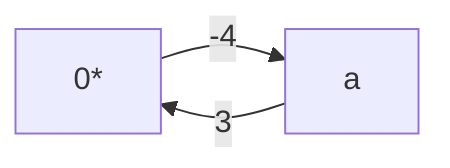
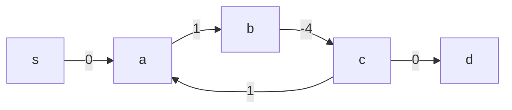
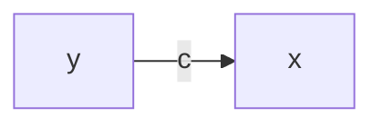
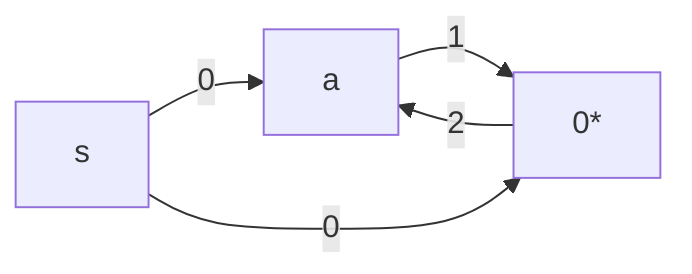
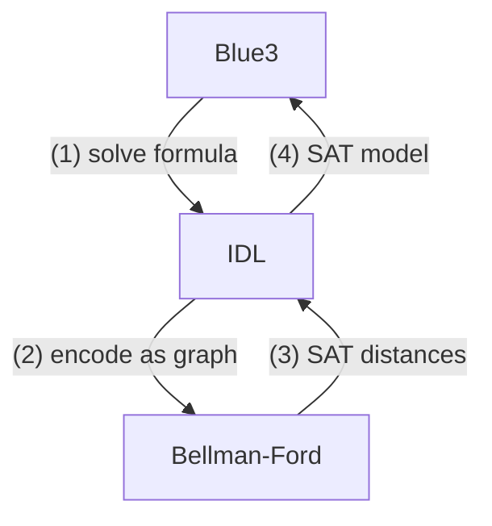
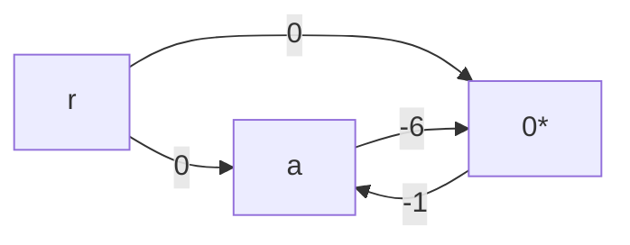
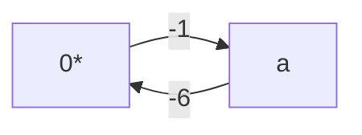
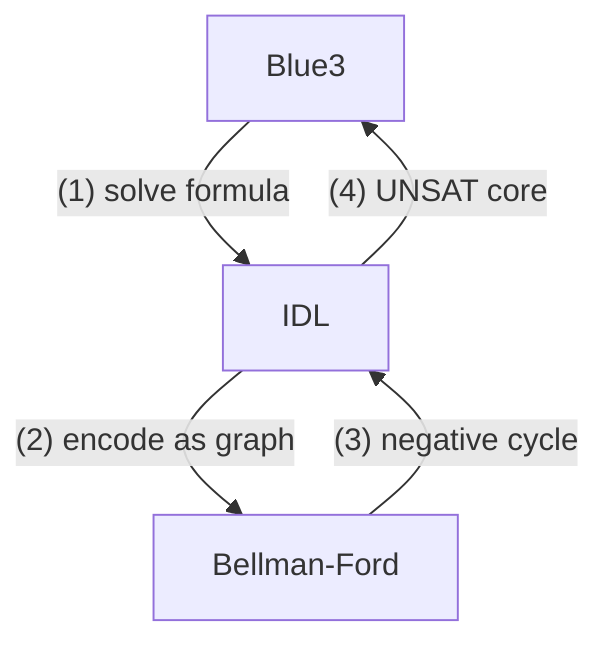

# Programming Blue3: An SMT solver for Caprice-Lang

Blue3 is an SMT solver for JHU's [`caprice-lang`](https://github.com/JHU-PL-Lab/caprice-lang). It is used by the typechecker's [Concolic Evaluator](https://github.com/JHU-PL-Lab/caprice-lang/blob/main/docs/caprice.md), or `ceval`.

Before Blue3, `ceval` used [Z3](https://www.microsoft.com/en-us/research/project/z3-3/) directly. Z3 is powerful, but often overkill for simple formulas like:

$$
(6 \leq a) \land (a < 0)
$$

This formula is **UNSAT**, because $a$ cannot be at least $6$ and less than $0$ at the same time. Since calling Z3 has overhead, Blue3 was built to solve simple cases internally and fall back to Z3 when needed.

## Intro

Blue3 is a small SMT solver with a full SAT/SMT pipeline. In benchmarks, Blue3's frontend was just over 60% faster than Z3 on simple formulas.

| avg_blue3 | avg_z3 |
|-----------|--------|
| 222.0μs | 329.0μs |

When Blue3 cannot solve a formula, it falls back to Z3. This adds about 20.24μs of overhead on average, or roughly 5%.

| num_slow_cases | avg_slower_by | avg_percent_slower |
|----------------|---------------|--------------------|
| 38 | 20.24μs | 4.59% |

So Blue3 gives a good tradeoff: faster simple cases, with Z3 as a backup.

### P = NP and Boolean Satisfiability

Oversimplifying, $P = NP$ asks:

> If we can check a solution quickly, can we also find that solution quickly?

Problems solvable in polynomial time are in $P$. Problems whose solutions can be verified in polynomial time are in $NP$.

So another way to state $P = NP$ is:

> If a solution can be verified efficiently, can it also be found efficiently?

We do not know. Most computer scientists believe $P \neq NP$, but no one has proven it.

This matters because some problems are **NP-complete**: every problem in $NP$ can be reduced to them in polynomial time. If we found a polynomial-time algorithm for one NP-complete problem, every problem in $NP$ could be solved efficiently.

### 3SAT and Boolean Satisfiability

3SAT asks:

> Given a propositional formula in CNF with at most 3 literals per clause, is there some assignment that makes it true?

For example:

$$
(p \lor q) \land (\neg p \lor \neg q)
$$

is satisfiable because $p = \text{true}$ and $q = \text{false}$ makes the formula true.

But:

$$
(p \lor q) \land (\neg p \lor q) \land (p \lor \neg q) \land (\neg p \lor \neg q)
$$

is unsatisfiable because no assignment of $p$ and $q$ can satisfy every clause.

3SAT is important because it is NP-complete. If we could solve 3SAT in polynomial time, we would prove $P = NP$.

Blue3 obviously does not solve $P = NP$. Instead, it uses practical SAT/SMT techniques to solve many real formulas efficiently.

SMT extends SAT with theory constraints. For example:

$$
(6 \leq a) \land (a < 0)
$$

can be abstracted into:

$$
p \land q
$$

where $p$ represents $(6 \leq a)$ and $q$ represents $(a < 0)$. The SAT solver handles the boolean structure, while the theory solver checks whether the constraints are actually consistent.

### Useful Terminology

A **formula** is a boolean-valued expression. In this report, "formula" usually means a formula in **CNF**.

A formula in **CNF** is an AND of clauses:

$$
(p \lor q \lor r) \land (s \lor t \lor \neg u)
$$

A **clause** is one OR-group. A **literal** is an atom with a sign, like $p$ or $\neg p$. An **atom** is the unsigned condition underneath a literal.

We will use three main formula categories:

1. A **SAT formula** is purely propositional.
2. A **theory formula** is handled by a theory solver.
3. An **SMT formula** combines propositional logic with theory constraints.

A **solver** takes a formula and returns either **SAT**, usually with a satisfying model, or **UNSAT**.

## Difference Logic

Blue3 is meant for formulas too simple to justify calling Z3, such as:

$$
(6 \leq a) \land (a < 0)
$$

In our benchmarks, many of these formulas were integer-heavy:

| formula_id |            formula             | 
|------------|--------------------------------|
| 9          | (0 < a) ^ ((a + 1) <= a)       |
| 8          | (0 < a) ^ ((a + 1) <= 1)       |
| 56         | (not (a = 0)) ^ ((a + 10) = 0) |
| 11         | (1 < a) ^ (a < 0)              |
| 88         | (0 < a) ^ (a < 1)              |

This led us to **Integer Difference Logic**, or **IDL**, a fragment of linear integer arithmetic where constraints compare differences between integer terms.

IDL literals have the shape:

$$
x - y \leq c
$$

where $x$ and $y$ are integer variables or $0$, and $c$ is an integer constant.

For example:

$$
(6 \leq a) \land (a < 0)
$$

can be rewritten as:

$$
((0 - a) \leq -6) \land ((a - 0) \leq -1)
$$

IDL gives Blue3 a mechanical way to recognize contradictions like this.

## Bellman-Ford

Bellman-Ford finds shortest paths in a directed weighted graph. It also detects **negative cycles**, which are cycles whose total weight is negative.

For example:

```ocaml
let simple_no_neg =
  [ ("a", "0*", 3); ("0*", "a", -1)
  ; ("r", "0*", 9); ("r", "a", 5) ]
```


Running Bellman-Ford from `r` gives:

| Node | Distance |
|------|----------|
| $a$ | $5$ |
| $0^*$ | $8$ |

The shortest path to $0^*$ is $r \to a \to 0^*$, with cost $5 + 3 = 8$. The cycle between `a` and $0^*$ has cost:

$$
3 + (-1) = 2
$$

Since the cycle is positive, looping only makes paths more expensive.

Now change the edge $0^* \to a$ from $-1$ to $-4$. The cycle cost becomes:

$$
3 + (-4) = -1
$$

Each loop makes the path cheaper, so Bellman-Ford reports a negative cycle.

```ocaml
let simple_neg =
  [ ("a", "0*", 3); ("0*", "a", -4)
  ; ("r", "0*", 9); ("r", "a", 5) ]
```



### Relaxing Edges

Bellman-Ford repeatedly tries to improve distances. This is called **relaxation**.

An edge is relaxed when:

$$
dist[from] + cost < dist[to]
$$

```ocaml
match Hashtbl.find tbl from_, Hashtbl.find tbl to_ with
| (Some du, _), (None, _) -> set_distance to_ tbl ~min:(du + cost) ~pred:edge
| (Some du, _), (Some dv, _) when du + cost < dv ->
  set_distance to_ tbl ~min:(du + cost) ~pred:edge
| _ -> was_updated
```

The source starts at distance `0`; every other node starts at infinity. Bellman-Ford relaxes edges at most $N - 1$ times, where $N$ is the number of nodes. We also stop early if a full pass does not update anything.

```ocaml
let is_dist_updated =
  List.fold_left (relax_edge dist) false edges
in
if is_dist_updated then `Continue dist else `Stop dist
```

### Predecessors and Negative Cycles

Each table entry stores:

$$
(\text{distance}, \text{predecessor edge})
$$

The distance gives the shortest-known cost from the source. The predecessor edge lets us reconstruct the path.

After the normal relaxation loop, Bellman-Ford runs one extra pass. If any edge can still be relaxed, the graph has a negative cycle.

```ocaml
List.find_map
  (fun ((_, to_, _) as edge) ->
    if relax_edge dist false edge then Some to_ else None)
  edges
```

The relaxed node may not itself be inside the cycle:



So we walk backward through predecessor links `NUM_NODES` times. By the pigeonhole principle, this lands inside the cycle. Then we collect predecessor edges until we loop back to the start.

```ocaml
let rec move_back node n =
  if n = 0 then node else
  match find_predecessor node tbl with
  | None -> node | Some from_ -> move_back from_ (n - 1)
```

In short:

1. Compute distances.
2. Run one extra relaxation pass.
3. If nothing changes, return distances.
4. If something changes, backtrack predecessors and return the negative cycle.

## Bellman-Ford as a Difference Logic Solver

Bellman-Ford solves difference logic because each constraint can be encoded as a graph edge.

We encode:

$$
x - y \leq c
$$

as:

$$
(y, x, c)
$$



Then we add a dummy source node with $0$-weight edges to every node and run Bellman-Ford. If it finds a negative cycle, the formula is **UNSAT**. Otherwise, it is **SAT**.

### Case 0. Split

IDL can solve inequalities like $\leq$, but disequality needs a split:

$$
x \neq y \implies (x \leq y - 1) \lor (y + 1 \leq x)
$$

We also include the equality case, because the SAT solver may still need to explore $x = y$ depending on context.

```ocaml
match lit with
| Neg Predicate (Equal, x, y) ->
  Some (~lower:(Pos lower), ~upper:(Pos upper), ~eq:(Pos eq))
| _ -> None
```

### Case 1. SAT

Consider:

$$
(-a \leq 1) \land (a \leq 2)
$$

Encoding each literal gives:

$$
-a \leq 1 \equiv 0^* - a \leq 1 \implies (a, 0^*, 1)
$$

$$
a \leq 2 \equiv a - 0^* \leq 2 \implies (0^*, a, 2)
$$

After adding dummy source edges:

$$
\text{Edges} = (a, 0^*, 1), (0^*, a, 2), (s, a, 0), (s, 0^*, 0)
$$



Bellman-Ford finds no negative cycle, so the formula is **SAT**.

To get a concrete model, we normalize distances around the special $0^*$ node:

$$
\text{model}[x] = \text{distance}[x] - \text{distance}[0^*]
$$

```ocaml
let z0_dist = NodeMap.find Node.zero distance_map in
let var_dist = NodeMap.find (Node.symbol_key uid) distance_map in
uid, Model.Int (var_dist - z0_dist)
```



### Case 2. UNSAT

Now consider:

$$
(6 \leq a) \land (a < 0)
$$

This encodes to:



Bellman-Ford finds this negative cycle:



The cycle edges map back to:

$$
(a, 0^*, -6) \implies 6 \leq a
$$

$$
(0^*, a, -1) \implies a < 0
$$

So the original formula is **UNSAT**.



The negative cycle is also the **UNSAT core**, meaning the specific literals responsible for the contradiction.

## SAT

3SAT was the first problem shown to be $\text{NP-complete}$. More generally, $\text{k-SAT}$ asks:

> Given a formula with at most $k$ literals per clause, is it satisfiable?

For example:

$$
(p \lor q \lor \neg r) \land (\neg p \lor r) \land (q \lor r) \land \neg r
$$

is satisfiable with $p = \text{false}, q = \text{true}, r = \text{false}$.

No polynomial-time SAT algorithm is known, so practical SAT solvers are still very smart search algorithms.

### Conflict-Driven Clause Learning

Blue3 uses **Conflict-Driven Clause Learning**, or `CDCL`, for boolean solving.

The loop is:

1. Infer forced assignments.
2. If nothing is forced, guess.
3. If there is a contradiction, learn from it.
4. Repeat until `SAT` or `UNSAT`.

```ocaml
let rec bcp level trail formula =
  match unit_propagate formula (Trail.to_model trail) with
  | Decide -> ...
  | Conflict clause -> ...
  | Implication (clause, lit) -> ...
```

### Unit Propagation

Unit propagation finds literals that must be true.

For example:

$$
p \land \neg q \land (\neg p \lor q \lor \neg r)
$$

forces:

$$
p = \text{true}
$$

and:

$$
q = \text{false}
$$

because $p$ and $\neg q$ are unit clauses.

The main `unit_propagate` result is one of three useful cases: `Decide`, `Conflict`, or `Implication`.

```ocaml
match Model.eval_clause clause model with
| `Falsified -> Conflict clause
| `Undecided [lit] -> Implication (clause, lit)
| _ -> search_unit clauses'
```

For example, if:

$$
(\neg p \lor q \lor r)
$$

and the model says $p = \text{true}$ and $q = \text{false}$, then unit propagation forces:

$$
r = \text{true}
$$

### Deciding and Conflicts

Sometimes nothing is forced:

$$
(p \lor q) \land (\neg p \lor r)
$$

So CDCL makes a **decision**, meaning it guesses an unassigned variable.

If CDCL guesses:

$$
p = \text{true}
$$

then:

$$
(\neg p \lor r)
$$

forces:

$$
r = \text{true}
$$

But guesses can lead to conflicts. For example:

$$
(p \lor q) \land (\neg p \lor q) \land (p \lor \neg q) \land (\neg p \lor \neg q)
$$

If CDCL guesses $p = \text{true}$, then it is forced to set $q = \text{true}$. But then $(\neg p \lor \neg q)$ becomes false.

CDCL learns from this conflict instead of blindly backtracking. In this case, it can learn:

$$
\neg p \lor \neg q
$$

which prevents the same bad assignment from being repeated.

### A Full Example

Consider:

$$
(p \lor q) \land (\neg p \lor r) \land (\neg r \lor q)
$$

Suppose Blue3 makes the bad decision:

$$
q = \text{false}
$$

Then $(p \lor q)$ forces $p = \text{true}$, and $(\neg p \lor r)$ forces $r = \text{true}$.

Now:

$$
(\neg r \lor q)
$$

is false, so Blue3 gets a conflict.

Here, the conflict clause is:

$$
(\neg r \lor q)
$$

Since $r$ came from $(\neg p \lor r)$, resolving gives:

$$
(q \lor \neg p)
$$

Since $p$ came from $(p \lor q)$, resolving again gives:

$$
q
$$

So Blue3 learns:

$$
q
$$

```ocaml
let trail' = Trail.backjump ~level trail in
let formula' = clause :: formula in
bcp level trail' formula'
```

The formula effectively becomes:

$$
q \land (p \lor q) \land (\neg p \lor r) \land (\neg r \lor q)
$$

So Blue3 has learned that $q = \text{false}$ cannot work. After backtracking, $q = \text{true}$ is forced, and the formula becomes satisfiable.

The key idea is that a conflict may only mean the current branch is impossible. CDCL learns from the branch, backjumps, and continues.

## SMT

Blue3 has two main pieces:

1. The **SAT solver**, which handles boolean structure.
2. The **IDL solver**, which handles difference constraints.

The SMT layer connects them:

> SAT handles boolean structure; the theory solver checks whether the selected theory literals are consistent.

### Theory atoms and results

Blue3 represents theory-level boolean expressions as `Theory.atom`s. Theory literals are signed atoms, either positive or negative. A theory solver receives a conjunction of these literals and returns one of:

- `Theory_sat`: the literals are consistent.
- `Theory_unsat`: the literals are inconsistent, with a core explaining why.
- `Theory_split`: the solver needs more case splits.
- `Theory_unknown`: Blue3 should fall back to the next solver.

```ocaml
type 'k theory_solution =
  | Theory_unknown | Theory_sat of 'k Model.t
  | Theory_unsat of 'k core
  | Theory_split of 'k formula
```

### Boolean abstraction

The SAT solver cannot directly reason about theory atoms, so Blue3 maps them to fresh SAT atoms.

For example:

```text
p1 := (6 <= a)
p2 := (a < 0)
```

So:

$$
(6 \le a) \land (a < 0)
$$

becomes:

$$
p_1 \land p_2
$$

Blue3 keeps both directions of this mapping so it can move between SAT literals and theory literals.

```ocaml
Hashtbl.add conn.to_sat atom sat_atom;
Hashtbl.add conn.from_sat sat_atom atom;
sat_atom
```

### The CDCL(T) loop

The main SMT loop is:

1. Abstract SMT into SAT.
2. Run CDCL.
3. Convert the SAT model back into theory literals.
4. Ask the theory solver whether they are consistent.
5. If theory says `UNSAT`, learn a clause and retry.
6. If theory says `SPLIT`, add split clauses and retry.

This is CDCL plus a theory solver: `CDCL(T)`.

```ocaml
match Sat.Cdcl.cdcl sat_formula with
| UNSAT -> Solution.Unsat
| SAT model ->
  let theory_lits = make_theory_literals model conn in
  match solver theory_lits with ...
```

### Example and Theory Learning

Consider:

$$
(6 \le a) \land (a < 0)
$$

Blue3 abstracts this to:

```text
p1 := (6 <= a)
p2 := (a < 0)
```

The SAT formula is:

$$
p_1 \land p_2
$$

SAT can satisfy this with both $p_1$ and $p_2$ set to true. But when Blue3 maps that model back to theory literals, IDL sees:

$$
(6 \le a) \land (a < 0)
$$

which normalizes to:

$$
0 - a \le -6
$$

and:

$$
a - 0 \le -1
$$

These encode as graph edges:

$$
(a, 0, -6)
$$

and:

$$
(0, a, -1)
$$

Bellman-Ford finds a negative cycle, so the theory solver returns `Theory_unsat` with this core:

$$
(6 \le a) \land (a < 0)
$$

Since the core was $p_1 \land p_2$, Blue3 learns:

$$
\neg p_1 \lor \neg p_2
$$

```ocaml
core
|> List.map (fun lit -> abstract_literal lit conn)
|> List.map Sat.Formula.negate
```

The SAT formula becomes:

$$
p_1 \land p_2 \land (\neg p_1 \lor \neg p_2)
$$

Now CDCL can prove the boolean abstraction itself is impossible.

### Theory Splitting

Disequality needs a split:

$$
x \ne y
$$

means:

$$
x \le y - 1
$$

or:

$$
y + 1 \le x
$$

Blue3 adds this as a guarded split clause:

$$
(x = y) \lor (x \le y - 1) \lor (y + 1 \le x)
$$

So the theory solver gives SAT more structure, and the loop continues.

```ocaml
| Theory_split clauses ->
  let sat_formula' = abstract_clauses clauses conn sat_formula in
  loop conn sat_formula'
```

### The final Blue3 wrapper

Blue3 falls back if the formula contains operations outside its internal fragment, like multiplication, division, modulus, or general addition.

```ocaml
let contains_unsolvable formula =
  Formula.contains_binops [Times; Divide; Modulus; Plus] formula
```

So the final architecture is:

```text
Formula -> Blue3 checks -> CDCL(T)
CDCL(T) -> SAT abstraction -> CDCL -> Theory solver
Theory solver -> learning / splitting
Result -> SAT / UNSAT / fallback
```

## Benchmarks and Last Words

These measurements use the [Benchmark](https://ocaml.org/p/benchmark/1.7) library on 179 formulas from a real `ceval` run. Each formula was solved 100 times by each solver, and the averages were saved.

### Measurements

#### Average runtimes
|  blue3  |   z3    |
|---------|---------|
| 227.0μs | 339.0μs |

#### Blue3-only count
| count |
|-------|
| 89    |

#### Z3-deferred count
| count |
|-------|
| 90    |

#### Deferred overhead
| cases |   diff   |  pct   |
|-------|----------|--------|
| 90    | -15.83μs | -2.07% |

#### Fast cases
| cases |   diff   |  pct   |
|-------|----------|--------|
| 142   | 144.23μs | 63.08% |

#### Slow cases
| cases |  diff   |  pct  |
|-------|---------|-------|
| 37    | 13.95μs | 3.67% |

#### Top 5 fastest Blue3-only cases
| id |         formula          | blue3  |    z3    |   diff    |
|----|--------------------------|--------|----------|-----------|
| 9  | (0 < a) ^ ((a + 1) <= a) | 0.12μs | 90.44μs  | -90.32μs  |
| 8  | (0 < a) ^ ((a + 1) <= 1) | 0.13μs | 87.94μs  | -87.81μs  |
| 11 | (1 < a) ^ (a < 0)        | 0.26μs | 106.73μs | -106.47μs |
| 88 | (0 < a) ^ (a < 1)        | 0.27μs | 110.35μs | -110.08μs |
| 36 | (2 < a) ^ (a < 0)        | 0.28μs | 111.81μs | -111.53μs |

#### Top 5 slowest Blue3-only cases
| id  |                           formula                            |  blue3   |    z3    |   diff    |
|-----|--------------------------------------------------------------|----------|----------|-----------|
| 167 | (not (a = 108)) ^ (not (a = 105)) ^ (not (a = 98)) ^ (not (a | 191.59μs | 459.57μs | -267.98μs |
|     |  = 97)) ^ (not (a = 61)) ^ (not (a = 45)) ^ (not (a = 43)) ^ |          |          |           |
|     |  (not (a = 42)) ^ (not (a = 41)) ^ (not (a = 40)) ^ (not (a  |          |          |           |
|     | = 32)) ^ (48 <= a)                                           |          |          |           |
| 168 | (48 <= a) ^ (not (a = 108)) ^ (not (a = 105)) ^ (not (a = 98 | 178.27μs | 428.93μs | -250.66μs |
|     | )) ^ (not (a = 97)) ^ (not (a = 61)) ^ (not (a = 45)) ^ (not |          |          |           |
|     |  (a = 43)) ^ (not (a = 42)) ^ (not (a = 41)) ^ (not (a = 40) |          |          |           |
|     | ) ^ (not (a = 32)) ^ (57 < a)                                |          |          |           |
| 172 | (65 <= a) ^ (48 <= a) ^ (57 < a) ^ (not (a = 108)) ^ (not (a | 104.84μs | 450.14μs | -345.3μs  |
|     |  = 105)) ^ (not (a = 98)) ^ (not (a = 97)) ^ (not (a = 61))  |          |          |           |
|     | ^ (not (a = 45)) ^ (not (a = 43)) ^ (not (a = 42)) ^ (not (a |          |          |           |
|     |  = 41)) ^ (not (a = 40)) ^ (not (a = 32)) ^ (90 < a)         |          |          |           |
| 170 | (48 <= a) ^ (57 < a) ^ (not (a = 108)) ^ (not (a = 105)) ^ ( | 101.19μs | 446.47μs | -345.28μs |
|     | not (a = 98)) ^ (not (a = 97)) ^ (not (a = 61)) ^ (not (a =  |          |          |           |
|     | 45)) ^ (not (a = 43)) ^ (not (a = 42)) ^ (not (a = 41)) ^ (n |          |          |           |
|     | ot (a = 40)) ^ (not (a = 32)) ^ (65 <= a)                    |          |          |           |
| 175 | (65 <= a) ^ (48 <= a) ^ (90 < a) ^ (57 < a) ^ (not (a = 108) | 68.94μs  | 455.22μs | -386.28μs |
|     | ) ^ (not (a = 105)) ^ (not (a = 98)) ^ (not (a = 97)) ^ (not |          |          |           |
|     |  (a = 61)) ^ (not (a = 45)) ^ (not (a = 43)) ^ (not (a = 42) |          |          |           |
|     | ) ^ (not (a = 41)) ^ (not (a = 40)) ^ (not (a = 32)) ^ (97 < |          |          |           |
|     | = a)                                                         |          |          |           |

#### Biggest Blue3 win
|  diff   |
|---------|
| 630.0μs |

#### Biggest Z3 win
|  diff   |
|---------|
| 105.0μs |

#### Cases Z3 beat Blue3
| id  |                           formula                            |  blue3  |   z3    |
|-----|--------------------------------------------------------------|---------|---------|
| 109 | (c <= (b % a)) ^ (c <= a) ^ (b <= ((b * a) / c)) ^ (0 < c) ^ | 1865.03 | 1816.62 |
|     |  (0 < a) ^ (0 < b) ^ (not ((b % a) = 0)) ^ (not (c = 0)) ^ ( |         |         |
|     | not (a = 0)) ^ (((b * a) / c) < a)                           |         |         |
| 94  | (b <= a) ^ (0 < b) ^ (0 < a) ^ (not ((a % b) = 0)) ^ (not (b | 1038.82 | 1031.07 |
|     |  = 0)) ^ ((b + 1) <= c)                                      |         |         |
| 103 | (0 < a) ^ (0 < b) ^ (0 < c) ^ (not ((c % b) = 0)) ^ (not (b  | 1025.34 | 920.57  |
|     | = 0)) ^ (a <= b)                                             |         |         |
| 105 | (0 < a) ^ (0 < b) ^ (0 < c) ^ (not ((c % b) = 0)) ^ (not (b  | 954.28  | 949.84  |
|     | = 0)) ^ (b < a)                                              |         |         |
| 99  | (0 < a) ^ (0 < b) ^ (not (a = 0)) ^ (not ((b % a) = 0))      | 889.68  | 885.48  |

Z3 wins on formulas involving modulus, multiplication, and division, which Blue3 intentionally leaves to a general-purpose solver.

### Last words

$P = NP$ fascinates me because it gets at the core of problem solving. If checking a solution and finding a solution are secretly the same kind of task, then creativity, insight, and cleverness start to look very different.

Theoretical computer scientist Scott Aaronson once said:

> "If P=NP, then the world would be a profoundly different place than we usually assume it to be. There would be no special value in 'creative leaps,' no fundamental gap between solving a problem and recognizing the solution once it's found. Everyone who could appreciate a symphony would be Mozart; everyone who could follow a step-by-step argument would be Gauss; everyone who could recognize a good investment strategy would be Warren Buffett."

For however long we do not know whether $P = NP$, there is still room to believe that something about human problem solving is special and to believe there is something irreducible about how we notice, create, and care about things.

Or maybe not. But until $P = NP$ is proven either way, we can't say for sure.

And that's pretty poetic, because wanting to be special, even if just a little, is one of the most human things there is.

Blue3 obviously did not answer $P = NP$, but building it showed me why these questions matter, and I hope it did for you as well.
