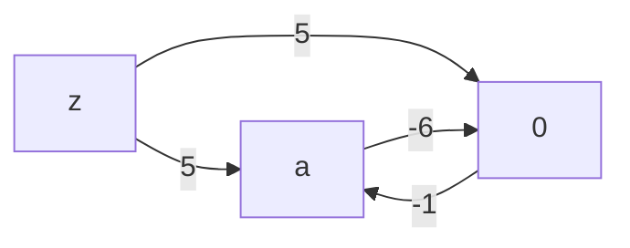
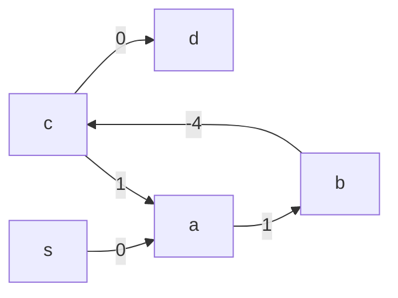

# Bellman Ford
The Bellman Ford algorithm finds the shortest distance paths from a particular node to all others in a directed graph.

Suppose we have a graph with the following edges:

```ocaml
let edges =
  [ ('a', '0', 3)
  ; ('0', 'a', -1)
  ; ('z', '0', 5)
  ; ('z', 'a', 5)
  ]
```

It looks something like this:


If we wanted to find the shortest distance paths from `z` to every other node,wWe can run bellman ford against the edge list and it will tell us:

```ocaml
print_bellman_ford ~label:"OK cycle" ~src:'z' edges;
```

```bash
No negative cycle found.
dist(z) = 0
dist(a) = 4
dist(0) = 5
```

The shortest distance path from `z` to `0` is just the direct edge `z -> 0` with weight `5`.

The shortest distance path from `z` to `a` is `4`, because we can go from `z` to `0` for cost `5`, then from `0` to `a` with cost `-1` to give us a shortest distance of `4`.

If we jumped from `a` back to `0` for a cost of `3`, our distance would go from `4` to `7`. So even though we can go back and forth from `a` to `0`, it will just add cost to our path to `a` to cycle back to `0`. This means there is **no negative cycle**.

But if we changed the edge from `a -> 0` to have cost `-6`...

```ocaml
let edges =
  [ ('a', '0', -6)
  ; ('0', 'a', -1)
  ; ('z', '0', 5)
  ; ('z', 'a', 5)
  ]
in
print_bellman_ford ~label:"Negative Cycle" ~src:'z' edges;
```



...then Bellman Ford will tell us:

```
Example: [Negative Cycle]
Negative cycle found:
- 0 -> a (-1)
- a -> 0 (-6)
```

After going from `z` to `0` for cost `5`, going to `0` from `a` costs us `-1`, which leads us to total cost of `4`. And now going from `a` *back* to `0` would cost us `-6` weight for a total sum of `-2`, which is less than our previous path to `a`. We can do this as many times as we want and will end up with lower and lower weights.

So there is no shortest path from `z` to `a`, because for any shortest-path `P` we find for it, we can find a shorter path `P'` by circling over `a` and `0`. And as a consequence, we have no shortest path from `z` to *any* other node, because we can loop over the `a` and `0` edges once more for any other claimed shortest path and get a lower distance path. Thus, we have a **negative cycle**.

## Core Relaxation Loop

Bellman Ford is able to tell us all this about our graphs rather elegantly. The main idea is to iterate over the edges and "relax" the distance state at each iteration. At each iteration at some edge `(from, to, cost)`, we lower the distance state of the `to` node based on our current distance to the `from` node with our current distance to the `to` node:

```ocaml
let relax_edge (dist : tbl) (was_updated : bool) (edge : Node.t edge) : bool =
  let from_, to_, cost = edge in
  match Hashtbl.find dist from_, Hashtbl.find dist to_ with
  ...
```

If our current distance to `from` plus `cost` is less than our current shortest distance to the `to` node (`dist(from) + cost < dist(to)`), then we update our shortest distance to `to` with that sum.

Our distance table implementation uses an option to represent the distance state, with `None` being the initial "Infinity" state and `Some dist` being a concrete distance sum from the graph. In either case, we are effectively finding that `dist(from) + cost < dist(to)`, with the `Some` case being the case where we explicitly compare the sum

```ocaml
let relax_edge (dist : tbl) (was_updated : bool) (edge : Node.t edge) : bool =
  let from_, to_, cost = edge in
  match Hashtbl.find tbl from_, Hashtbl.find tbl to_ with
  | (Some du, _), (None, _) -> ...
  | (Some du, _), (Some dv, _) when du + cost < dv -> ...
```

For a graph with `NUM_NODES` nodes, we run the above edges iteration a max of `NUM_NODES - 1` times:

```ocaml
let relax_edges (edges : Node.t edge list) (dist : tbl) (i : int)
  : [ `Continue of tbl | `Stop of tbl ] =
  let num_nodes = Hashtbl.length dist in
  if i >= num_nodes - 1 then `Stop dist
  ...
```

A common optimization is to early return when no distances are updated in some iteration. We can implement this using a `fold_until` loop where we only `Continue` the next relaxation iteration when at least one distance has been updated. We are able to track this state by having our `relax_edge` function return whether it updated the distance table.

If we relax at least one distance at any point during the edges iteration, we return `true` by or-ing the previous boolean value with a `true`:

```ocaml
let relax_edge (dist : tbl) (was_updated : bool) (edge : Node.t edge) : bool =
  ...
  match Hashtbl.find dist from_, Hashtbl.find dist to_ with
  | (Some du, _), (None, _) ->
    ...
    was_updated || true
  | (Some du, _), (Some dv, _) when du + cost < dv ->
    ...
    was_updated || true
```

Otherwise we just or the boolean state value with a `false`:

```ocaml
  let relax_edge (dist : tbl) (was_updated : bool) (edge : Node.t edge) : bool =
    let from_, to_, cost = edge in
    match Hashtbl.find dist from_, Hashtbl.find dist to_ with
    ...
    | _ -> was_updated || false
```

Notice how once we return a `true` flag, subsequent calls to relax_distance will *always* return `true` because even if a subsequent call doesn't relax a distance, or-ing a `false` with a `true` is still `true`:

So the parent `relax_edges` just checks that boolean flag at the end of the edges iteration to decide between continuining or stopping:

```ocaml
let relax_edges (edges : Node.t edge list) (dist : tbl) (i : int)
  ...
  else
    let is_dist_updated = List.fold_left (relax_edge dist) false edges
    in
    if is_dist_updated then `Continue dist
    else `Stop dist
```

Then building the final distance table state is just a matter of initializing the table and then iterating over the *nodes*:

```ocaml
let find_distances ~(src : Node.t) (edges : Node.t edge list) =
  let dist = create_tbl ~src edges in
  let num_nodes = Hashtbl.length dist in
  let vertices = List.init num_nodes Fun.id in
  let final_tbl = List_utils.fold_until
    (relax_edges edges)
    Fun.id
    dist
    vertices
  in
  final_tbl
```

Where `create_tbl` explicitly initializes each node table entry and sets the distance from `src` to itself to 0 so we can advance the distance table state in the initial iteration:

```ocaml
let create_tbl ~(src : Node.t) (edges : Node.t edge list) =
  let bindings =
    edges
    |> to_node_list
    |> List.map (fun node -> node, (None, None))
    |> List.to_seq
  in
  let tbl = Hashtbl.of_seq bindings in
  let () =
    Hashtbl.replace tbl src (Some 0, None)
  in
  tbl
```

## Predecessors and the Minimum Distance Path

You can think of `find_distances` as the "raw" Bellman Ford implementation that returns the final distance table regardless of whether a negative cycle exists. When there is no negative cycle, then the distance table is our effective return value of the `bellman_ford` implementation:

```ocaml
let bellman_ford
  (type node)
  (module Node : Baby.OrderedType with type t = node)
 ~(src : node)
  (edges : node edge list)
  : [ `No_negative_cycle of (node * int) list
    | `Negative_cycle of node edge list
    ] =
  let open Make (Node) in
  let tbl = find_distances ~src edges in
  match find_cycle_entry_opt edges tbl with
  | None -> `No_negative_cycle (
    tbl
    |> Hashtbl.to_seq
    |> Seq.map (fun (node, entry) ->
      match fst entry with
      | None -> node, Int.max_int
      | Some dist -> node, dist
    )
    |> List.of_seq
  )
```

The only change we make to the bindings is picking out the first tuple element `dist` from the values. We do this because our distance table state encodes a second "predecessor edge" for the second element in the values.

The predecessor edge is the edge that connects the immediate tail (outgoing) node that to the key-ed node. In other words, it is the edge that caused the last update to the distance state for the key-ed node.

For `relax_edge`, this is just the `edge` argument. Whenever the relaxation condition is met, we append the 2-tuple of `du + cost`, `edge` rather than `du + cst` alone:

```ocaml
let relax_edge (dist : tbl) (was_updated : bool) (edge : Node.t edge) : bool =
  let from_, to_, cost = edge in
  match Hashtbl.find dist from_, Hashtbl.find dist to_ with
  | (Some du, _), (None, _) ->
    Hashtbl.replace dist to_ (Some (du + cost), Some edge);
    ...
  | (Some du, _), (Some dv, _) when du + cost < dv ->
    Hashtbl.replace dist to_ (Some (du + cost), Some edge);
    ...
```

You can think of the `(distance, predecessor)` as *separate* derivations of the *same* state. `distance` tells us the shortest distance, while `predecessor` allows us to derive the corresponding shortest-distance path from `src`.

We lookup the `predecessor` *edge* with `find_predecessor_edge`:

```ocaml
let find_predecessor_edge (node : Node.t) (dist : tbl)
  : Node.t edge option =
  snd @@ Hashtbl.find dist node
```

And then the `predecessor` *node* with `find_predecessor`, where we just take out the `from_` tuple element:

```ocaml
let find_predecessor (node : Node.t) (tbl : tbl) : Node.t option =
  Option.map (fun (from_, _, _) -> from_) (find_predecessor_edge node tbl)
```

> The typical implementation of Bellman Ford keeps two *separate* tables for both distance and the predecessor *node*. This is usualy the better option, but I felt that in a functional language like OCaml, it would be more idiomatic to merge them into 1 table because they are dependent on the same state (not unlike the [grouping related state pattern](https://react.dev/learn/choosing-the-state-structure#group-related-state) from React).

Revisiting our `OK cycle` example of a non-negative cyclic graph where we set `src` to `z`:

```ocaml
let edges =
  [ ('a', '0', 3)
  ; ('0', 'a', -1)
  ; ('z', '0', 5)
  ; ('z', 'a', 5)
  ]
```


The shortest path from `z` to `a` has distance `4`, which we can immediately *read* from our distance table state:

```ocaml
let module BellmanFord = Bellman_ford.Make (Char) in
let dist = BellmanFord.find_distances ~src:'z' edges in
Printf.printf "Minimum distance to 'a' = %d\n" (fst @@ Hashtbl.find dist 'a');
```

```bash
Minimum distance to 'a' = 4
```

The shortest distance path is `z -> 0 -> a`, which we can *derive* from the predecessor edge:

```ocaml
let predecessor_edge_of_a = BellmanFord.find_predecessor_edge 'a' dist in
Printf.printf "Predecessor edge is: %s\n" (pp_edge_opt predecessor_edge_of_a);
```

```bash
Predecessor edge is: 0 -> a (-1)
```

`predecessor_edge_of_a` says `0` is the last node in the shortest-distance path before we hit `a`. Then finding the predecessor edge of `0`...

```ocaml
let predecessor_edge_of_0 = BellmanFord.find_predecessor_edge '0' dist in
Printf.printf "Predecessor edge is: %s\n" (pp_edge_opt predecessor_edge_of_0);
```

```bash
Predecessor edge is: z -> 0 (5)
```

Leads us back to our source node `z`. So the main takeaway is that 1 edge is enough to trace back the minimum distance path.

## Detecting Negative Cycles
For the purposes of the Blue3 solver, we don't care about the shortest distance paths and only care about the distance values themselves when bellman ford is able to return a meaningful distance table. This is why we filter out the predecessor in the `No_negative_cycle` case:

```ocaml
let bellman_ford
  ...
  match find_cycle_entry_opt edges tbl with
  | None -> `No_negative_cycle (
    tbl
    |> Hashtbl.to_seq
    |> Seq.map (fun (node, entry) ->
      match fst entry with
      | None -> node, Int.max_int
      | Some dist -> node, dist
    )
```

The predecessor becomes useful when `find_cycle_entry_opt` returns the other `Negative_cycle` case:

```ocaml
let bellman_ford
  ...
  match find_cycle_entry_opt edges tbl with
  | None -> ...
  | Some entry -> (* we need predecessor to handle this case *)
```

`find_cycle_entry` finds the first node from the edges list that is within the negative cycle. It does this by first running one more relaxation pass over the edges via `find_relaxed_node_opt`:

```ocaml
let find_cycle_entry_opt (edges : Node.t edge list) (dist : tbl)
  : Node.t option =
  let num_nodes = Hashtbl.length dist in
  let relaxed_predecessor = find_relaxed_node_opt edges dist in
```

If `find_relaxed_node_opt` is able to update at least one more entry, it returns the `to` node of that entry

```ocaml
let find_relaxed_node_opt (edges : Node.t edge list) (dist : tbl) : Node.t option =
  List.find_map (fun ((_, to_, _) as edge) ->
    if relax_edge dist false edge then
      Some to_
    else None)
  edges
```

The basic idea is that the minimum distance paths take at most `NUM_NODES - 1` iterations over the edges to find. If we can relax any edge after those `NUM_NODES - 1` iterations, then there is a negative cycle, because the subsequent `NUM_NODES + 1, NUM_NODES + 2, ...` iterations of `relax_edge` will also return `true` infinitely.

This returned node by `find_relaxed_node_opt` may not necessarily be in the cycle, however.

Consider the graph where we have the negative cycle of `a -> b -> c -> a`:



If we just used the node from `find_relaxed_node_opt` instead of a real node in the cycle, then we'd incorrectly include `c -> d` in the reconstructed cycle:

```ocaml
let edges =
  [ ('c', 'd', 0)   (* outgoing edge from cycle to non-cycle node *)
  ; ('s', 'a', 0)
  ; ('a', 'b', 1)
  ; ('b', 'c', -4)
  ; ('c', 'a', 1)
  ]
in
let cycle_entry = BellmanFord.find_relaxed_node edges (fst dist) in
Printf.printf "First relaxed node found: %c\n" cycle_entry;
let cycle_from_entry = BellmanFord.collect_cycle cycle_entry dist in
List.iter (fun edge ->
  Printf.printf "- %s\n" (pp_edge edge))
  cycle_from_entry
```

```bash
First relaxed node found: d
- b -> c (-4)
- c -> a (1)
- a -> b (1)
- b -> c (-4)
- c -> d (0)
```

To find a node that is actually in the cycle, we just have to back track from `to` until we've backtracked `NUM_NODES` parents (because after following NUM_NODES predecessor links, the pigeonhole principle guarantees we have skipped any non-cycle tail and landed on a node inside the cycle.) or until we hit our start node again:

```ocaml
let find_cycle_entry_opt (edges : Node.t edge list) (tbl, num_nodes : t)
  : Node.t option =
  let relaxed_predecessor = find_relaxed_node_opt edges tbl in
  match relaxed_predecessor with
  | None -> None
  | Some entry ->
    let rec move_back node n =
      if n = 0 then node
      else if n < num_nodes && node = entry then node
      else
        match find_predecessor node tbl with
        | None -> node
        | Some from_ -> move_back from_ (n - 1)
    in
    Some (move_back entry num_nodes)
```

Then with this entry node found, we can terminate the algorithm by building the negative cycle. We build it by backtracking one more time along the predecessor edges starting from our entry node:

```ocaml
let collect_cycle (start : Node.t) (tbl, num_nodes : t) : Node.t edge list =
  let rec loop curr n acc =
    if n = 0 then
      acc
    else
      match find_predecessor_edge curr tbl with
      | None -> acc
      | Some ((from_, _, _) as pred_edge) ->
        let acc = pred_edge :: acc in
        if Node.compare from_ start = 0 then acc
        else loop from_ (n - 1) acc
  in
  loop start num_nodes []
```

And that's all Bellman Ford needs to return the negative cycle edges:

```ocaml
let bellman_ford
  (type node)
  (module Node : Baby.OrderedType with type t = node)
 ~(src : node)
  (edges : node edge list)
  : [ `No_negative_cycle of (node * int) list
    | `Negative_cycle of node edge list
    ] =
  let open Make (Node) in
  let tbl = find_distances ~src edges in
  match find_cycle_entry_opt edges tbl with
  | None -> ...
  | Some entry -> `Negative_cycle (collect_cycle entry tbl)
```

```ocaml
let edges =
  [ ('s', 'a', 2)
  ; ('a', 'b', 1)
  ; ('b', 'c', -4)
  ; ('c', 'a', 1)
  ; ('c', 'd', 3)
  ]
in
let dist = BellmanFord.find_distances ~src:'s' edges in
let cycle_entry = BellmanFord.find_cycle_entry edges dist in
let cycle_from_entry = BellmanFord.collect_cycle cycle_entry dist in
Printf.printf "Negative cycle found:\n";
List.iter (fun edge ->
  Printf.printf "- %s\n" (pp_edge edge))
  cycle_from_entry;
```

```bash
Negative cycle found:
- b -> c (-4)
- c -> a (1)
- a -> b (1)
```
