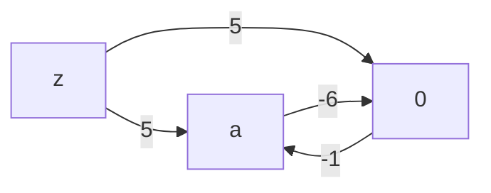
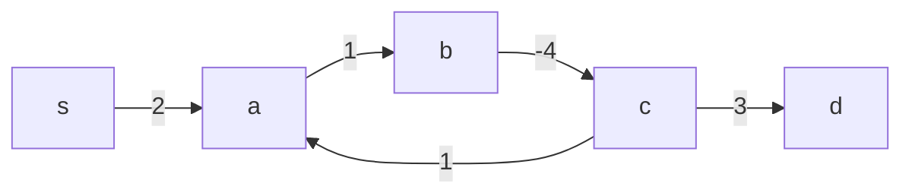

# Bellman Ford
The Bellman Ford algorithm finds the shortest distance paths from a particular node to all others in a directed graph.

Suppose we have a graph with the following edges:

```ocaml
let edges =
  [ ('a', '0', 3)
  ; ('0', 'a', -1)
  ; ('z', '0', 5)
  ; ('z', 'a', 5)
  ]
```

It looks something like this:


Now let's say we wanted to find the shortest distance paths from `z` to every other node. We can run bellman ford against this edge list...

```ocaml
let pp_result ~src result =
  match result with
  | `No_negative_cycle distances ->
    print_endline "No negative cycle found.";
    List.iter (fun (node, distance) ->
      if node = src then ()
      else
        Printf.printf "dist(%c) = %d\n" node distance)
      distances

  | `Negative_cycle cycle_edges ->
    print_endline "Negative cycle found:";
    List.iter (fun edge ->
      Printf.printf "- %s\n" (pp_edge edge))
      cycle_edges

let print_bellman_ford ~label ~src edges =
  Printf.printf "Example: [%s]\n" label;
  pp_result ~src (bellman_ford ~src edges);
  print_newline ()
```

and it will tell us:

```ocaml
print_bellman_ford ~label:"OK cycle" ~src:'z' edges;
```

```bash
No negative cycle found.
dist(z) = 0
dist(a) = 4
dist(0) = 5
```

The shortest distance path from `z` to `0` is just the direct edge `z -> 0` with weight `5`.

The shortest distance path from `z` to `a` is `4`, because we can go from `z` to `0` for cost `5`, then from `0` to `a` with cost `-1` to give us a shortest distance of `4`.

If we jumped from `a` back to `0` for a cost of `3`, our distance would go from `4` to `7`. So even though we can go back and forth from `a` to `0`, it will just add cost to our path to `a` to cycle back to `0`. This means there is **no negative cycle**.

Now if we changed the edge from `a -> 0` to have cost `-6`...

```ocaml
let edges =
[ ('a', '0', -6)
; ('0', 'a', -1)
; ('z', '0', 5)
; ('z', 'a', 5)
]
in
print_bellman_ford ~label:"Negative Cycle" ~src:'z' edges;
```



...then Bellman Ford will tell us:

```
Example: [Negative Cycle]
Negative cycle found:
- 0 -> a (-1)
- a -> 0 (-6)
```

After going from `z` to `0` for cost `5`, going to `0` from `a` costs us `-1`, which leads us to total cost of `4`. And now going from `a` *back* to `0` would cost us `-6` weight for a total sum of `-2`, which is less than our previous path to `a`. We can do this as many times as we want and will end up with lower and lower weights.

So there is no shortest path from `z` to `a`, because for any shortest-path `P` we find for it, we can find a shorter path `P'` by circling over `a` and `0`. And as a consequence, we have no shortest path from `z` to *any* other node, because we can loop over the `a` and `0` edges once more for any other claimed shortest path and get a lower distance path. Thus, we have a **negative cycle**.

## The Core Relaxation Loop

Bellman Ford is able to tell us all this about our graphs rather elegantly. The main idea is to iterate over the edges and "relax" the distance state at each iteration:

```ocaml
let relax_distances (edges : Node.t edge list) (tbl : tbl) : bool =
  List.fold_left
  (fun is_updated edge -> relax_distance is_updated edge tbl)
  false edges
```

To relax the distance state based on the edge `(from, to, cost)`, we just compare our current distance to the `from` node with our current distance to the `to` node:

```ocaml
let relax_distance (last_updated : bool) (edge : Node.t edge) (tbl : tbl) : bool =
  let from_, to_, cost = edge in
  match Hashtbl.find_opt tbl from_, Hashtbl.find_opt tbl to_ with
  ...
```

If our current distance to `from` plus `cost` is less than our current shortest distance to the `to` node (`dist(from) + cost < dist(to)`), then we update our shortest distance to `to` with that sum:

```ocaml
let relax_distance (last_updated : bool) (edge : Node.t edge) (tbl : tbl) : bool =
  let from_, to_, cost = edge in
  match Hashtbl.find_opt tbl from_, Hashtbl.find_opt tbl to_ with
  | Some (du, _), None ->
    Hashtbl.replace tbl to_ (du + cost, Some edge);
    ...
  | Some (du, _), Some (dv, _) when du + cost < dv ->
    Hashtbl.replace tbl to_ (du + cost, Some edge);
    ...
  ...
```

For a graph with `NUM_NODES` nodes, we run the above edges iteration a max of `NUM_NODES - 1` times:

```ocaml
let relax (edges : Node.t edge list) (tbl, num_nodes : t) (i : int)
  : [ `Continue of t | `Stop of tbl ] =
  if i = num_nodes - 1 then `Stop tbl
  ...
```

A common optimization is to early return when no distances are updated in some iteration. We can implement this using a `fold_until` loop where we only `Continue` the next relaxation iteration when at least one distance has been updated.

In the implementation, `relax` is what decides between `Continue` and `Stop` based on the bool flag returned by `relax_distances`, where it is initialized with `false` so that an explicit update is what actually makes us stop

```ocaml
let relax_distances (edges : Node.t edge list) (tbl : tbl) : bool =
  List.fold_left
  (fun is_updated edge -> relax_distance is_updated edge tbl)
  false edges

let relax (edges : Node.t edge list) (tbl, num_nodes : t) (i : int)
  : [ `Continue of t | `Stop of tbl ] =
  ...
  else if relax_distances edges tbl then `Continue (tbl, num_nodes)
  else `Stop tbl
```

`relax_distance` is what advances our update flag state. If we relax at least one distance at any point during the edges iteration, we return `true` by or-ing the previous boolean value with a `true`:

```ocaml
let relax_distance (last_updated : bool) (edge : Node.t edge) (tbl : tbl) : bool =
  let from_, to_, cost = edge in
  match Hashtbl.find_opt tbl from_, Hashtbl.find_opt tbl to_ with
  | Some (du, _), None ->
    Hashtbl.replace tbl to_ (du + cost, edge);
    last_updated || true
  | Some (du, _), Some (dv, _) when du + cost < dv ->
    Hashtbl.replace tbl to_ (du + cost, edge);
    last_updated || true
```

Once the flag is set to `true`, subsequent calls to relax_distance will *always* return `true` because even if a subsequent call doesn't relax a distance, or-ing a `false` with a `true` is still `true`:

```ocaml
let relax_distance (last_updated : bool) (edge : Node.t edge) (tbl : tbl) : bool =
  let from_, to_, cost = edge in
  match Hashtbl.find_opt tbl from_, Hashtbl.find_opt tbl to_ with
  ...
  | _ -> last_updated || false
```

This allows our parent `relax` function to short-circuit accordingly:

```ocaml
let relax (edges : Node.t edge list) (tbl, num_nodes : t) (i : int)
  : [ `Continue of t | `Stop of tbl ] =
  if i = num_nodes - 1 then `Stop tbl
  else if relax_distances edges tbl then `Continue (tbl, num_nodes)
  else `Stop tbl
```

Then building the final distance table state is just a matter of initializing the table and then iterating over the *nodes*:

```ocaml
let find_distances ~(src : Node.t) (edges : Node.t edge list) =
  let tbl, num_nodes = create_tbl ~src edges in
  let vertices = List.init num_nodes Fun.id in
  let final_tbl = List_utils.fold_left_until
    (fun t i -> relax edges t i)
    fst
    (tbl, num_nodes)
    vertices
  in
  final_tbl, num_nodes
```

Where `create_tbl` sets the distance from `src` to itself to 0 so we can advance the distance table state in the initial iteration:

```ocaml
let create_tbl ~(src : Node.t) (edges : Node.t edge list) : t =
  let n = count edges in
  let tbl = Hashtbl.create n in
  let () =
    Hashtbl.add tbl src (0, None)
  in
  tbl, n
```

## Predecessors and the Minimum Distance Path

You can think of `find_distances` as the "raw" Bellman Ford implementation that returns the final distance table regardless of whether a negative cycle exists. When there is no negative cycle, then the distance table is our effective return value of the `bellman_ford` implementation:

```ocaml
let bellman_ford
  (type node)
  (module Node : Baby.OrderedType with type t = node)
 ~(src : node)
  (edges : node edge list)
  : [ `No_negative_cycle of (node * int) list
    | `Negative_cycle of node edge list
    ] =
  let open Make (Node) in
  let tbl, num_nodes = find_distances ~src edges in
  let cycle_edge = find_cycle_edge_opt edges tbl in
  match cycle_edge with
  | None -> `No_negative_cycle (
    tbl
    |> Hashtbl.to_seq
    |> Seq.map (fun (node, (dist, _)) -> node, dist)
    |> List.of_seq
  )
```

The only change to the key-value structure is picking out the first tuple element `dist` from the values. We do this because our distance table state encodes a second "predecessor edge" for the second element in the values.

The predecessor edge is the edge that connects the immediate tail (outgoing) node that to the key-ed node. In other words, it is the edge that caused the last update to the distance state for the key-ed node.

For `relax_distance`, this is just the `edge` argument. Whenever the relaxation condition is met, we append the 2-tuple of `du + cost`, `edge` rather than `du + cost` alone:

```ocaml
let relax_distance (last_updated : bool) (edge : Node.t edge) (tbl : tbl) : bool =
  let from_, to_, cost = edge in
  match Hashtbl.find_opt tbl from_, Hashtbl.find_opt tbl to_ with
  | Some (du, _), None ->
    Hashtbl.replace tbl to_ (du + cost, Some edge);
    ...
  | Some (du, _), Some (dv, _) when du + cost < dv ->
    Hashtbl.replace tbl to_ (du + cost, Some edge);
    ...
  ...
```

You can think of the `(distance, predecessor)` as *separate* derivations of the *same* state. `distance` *tells* us the **shortest distance**, while `predecessor` *allows* us to derive the corresponding shortest-distance path from `src`.

We lookup the `predecessor` *edge* with `find_predecessor_edge`:

```ocaml
let find_predecessor_edge (node : Node.t) (tbl : tbl)
  : Node.t edge option =
  snd @@ Hashtbl.find tbl node
```

And then the `predecessor` *node* with `find_predecessor`, where we just take out the `from_` tuple element:

```ocaml
let find_predecessor (node : Node.t) (tbl : tbl) : Node.t option =
  Option.map (fun (from_, _, _) -> from_) (find_predecessor_edge node tbl)
```

> The typical implementation of Bellman Ford keeps two *separate* tables for both distance and the predecessor *node*. This seems like the simpler option, but I felt that in a functional language like OCaml, it would be more idiomatic to merge them into 1 table because they are dependent on the same state (not unlike the [grouping related state pattern](https://react.dev/learn/choosing-the-state-structure#group-related-state) from React).

Revisiting our `OK cycle` example of a non-negative cyclic graph where we set `src` to `z`:

```ocaml
let edges =
  [ ('a', '0', 3)
  ; ('0', 'a', -1)
  ; ('z', '0', 5)
  ; ('z', 'a', 5)
  ]
```


The shortest path from `z` to `a` has distance `4`, which we can immediately *read* from our distance table state:

```ocaml
let module BellmanFord = Bellman_ford.Make (Char) in
let dist, _num_nodes = BellmanFord.find_distances ~src:'z' edges in
Printf.printf "Minimum distance to 'a' = %d\n" (fst @@ Hashtbl.find dist 'a');
```

```bash
Minimum distance to 'a' = 4
```

The shortest distance path is `z -> 0 -> a`, which we can *derive* from the predecessor edge:

```ocaml
let predecessor_edge_of_a = BellmanFord.find_predecessor_edge 'a' dist in
Printf.printf "Predecessor edge is: %s\n" (pp_edge_opt predecessor_edge_of_a);
```

```bash
Predecessor edge is: 0 -> a (-1)
```

`predecessor_edge_of_a` says `0` is the last node in the shortest-distance path before we hit `a`. Then finding the predecessor edge of `0`...

```ocaml
let predecessor_edge_of_0 = BellmanFord.find_predecessor_edge '0' dist in
Printf.printf "Predecessor edge is: %s\n" (pp_edge_opt predecessor_edge_of_0);
```

```bash
Predecessor edge is: z -> 0 (5)
```

Leads us back to our source node `z`. So the main takeaway is that 1 edge is enough to trace back the minimum distance path.

## Detecting Negative Cycles
For the purposes of the Blue3 solver, we don't care about the shortest distance paths and only care about the distance values themselves when bellman ford is able to return a meaningful distance table. This is why we filter out the predecessor in the `No_negative_cycle` case:

```ocaml
match find_cycle_entry_opt edges tbl with
| None -> `No_negative_cycle (
  tbl
  |> Hashtbl.to_seq
  |> Seq.map (fun (node, (dist, _)) -> node, dist)
  |> List.of_seq
)
```

The predecessor becomes useful when `find_cycle_entry_opt` returns the other `Negative_cycle` case:

```ocaml
let bellman_ford
  (type node)
  (module Node : Baby.OrderedType with type t = node)
 ~(src : node)
  (edges : node edge list)
  : [ `No_negative_cycle of (node * int) list
    | `Negative_cycle of node edge list
    ] =
  let open Make (Node) in
  let tbl, num_nodes = find_distances ~src edges in
  match find_cycle_entry_opt edges tbl with
  | None -> ...
  | Some end_ -> (* we need predecessor to handle this case *)
```

`find_cycle_entry_opt` finds a node we can backtrack from to find a negative cycle when it exists. It finds the node by attempting to relax the distance state once more in a fashion very similar to `relax_distances`:

```ocaml
let find_cycle_entry_opt (edges : Node.t edge list) (tbl : tbl)
  : Node.t option =
  List.find_map
    (fun ((_, to_, _) as edge) ->
      if relax_distance false edge tbl then
        Some to_
      else None)
    edges
```

The basic idea is that the minimum distance paths take at most `NUM_NODES - 1` iterations over the edges to find. If we can relax any distance after those `NUM_NODES - 1` iterations...

```ocaml
let relax_distance (last_updated : bool) (edge : Node.t edge) (tbl : tbl) : bool =
  ...
  match Hashtbl.find_opt tbl from_, Hashtbl.find_opt tbl to_ with
  | Some (du, _), None -> ...
  | Some (du, _), Some (dv, _) when du + cost < dv ->
    Hashtbl.replace tbl to_ (du + cost, Some edge);
    last_updated || true
  | _ -> ...
```

...then there is a negative cycle, because the subsequent `NUM_NODES + 1, NUM_NODES + 2, ...` iterations of `relax_distance` will also return `true` infinitely.

`find_cycle_entry_opt` returns the `to_` node of the first edge that was able to be relaxed.

For example, for the graph with negative cycle `a -> b -> c -> a`:

```ocaml
let edges =
[ ('s', 'a', 2)
; ('a', 'b', 1)
; ('b', 'c', -4)
; ('c', 'a', 1)
; ('c', 'd', 3)
]
```



`find_entry_opt` would return `b`:

```ocaml
let dist, _ = BellmanFord.find_distances ~src:'s' edges in
let cycle_entry = BellmanFord.find_cycle_entry edges dist in
Printf.printf "Cycle entry is: %c\n" cycle_entry;
```

```bash
Cycle entry is: b
```

To illustrate why `b` was chosen specifically, let's consider the 2 distance states of the state from the initial edges pass, along with the state from any subsequent passes thereafter:

1. On the initial pass, our distance to `a` gets updated to `2` from the direct path while our distance state for `b` is set to `3` (from `s -> a -> b`):

    | variable | distance |
    | -------- | -------- |
    |    a     |     2    |
    |    b     |     3    |
    |    c     |    -1    |
    
    Once `c -> a` is visited, the distance to `a` gets updated to `0` because the edge `c -> a` meets the relaxation condition `dist(c) + weight < dist(a)`, or written out explicitly:

    ```bash
    (-1 + 1 = 0) < 2 # obviously...
    ```

    | variable | distance |
    | -------- | -------- |
    |    a     |     0    |
    |    b     |     3    |
    |    c     |    -1    |
    
2. On the second pass, when we visit `a -> b` again, we see that `dist(a) + cost < dist(b)` again, so we relax `b` again, this time to `0 + 1 = 1`:

    | variable | distance |
    | -------- | -------- |
    |    a     |     0    |
    |    b     |     1    |
    |    c     |    -1    |

    For the remainder of the `NUM_NODES - 1` iterations over the edges, we will always update `b` (along with `a` and `c`), which implies we will exhaust all `NUM_NODES - 1` iterations:

    ```ocaml
    let relax (edges : Node.t edge list) (tbl, num_nodes : t) (i : int)
      : [ `Continue of t | `Stop of tbl ] =
      if i = num_nodes - 1 then `Stop tbl
      ...
    ```
    
    Due to the presence of the negative cycle, `find_cycle_entry_opt` will end up being able to relax the distance for at least one node, so it will return the `Some to_` option:

    ```ocaml
    let find_cycle_entry_opt (edges : Node.t edge list) (tbl : tbl)
      : Node.t option =
      List.find_map
        (fun ((_, to_, _) as edge) ->
          if relax_distance false edge tbl then
            Some to_
          else None)
        edges
    ```
    
`List.find_map` returns on the first match it finds. This means that the first edge from the `edges` list that it can relax will be the one chosen. In our case, that edge is `a -> b`, so `find_cycle_entry_opt` returns `b`.

Then with an entry point into the cycle, Bellman Ford implementation concludes as follows