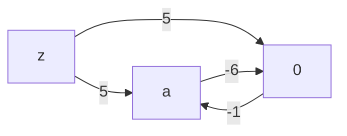
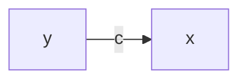
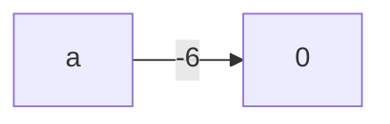
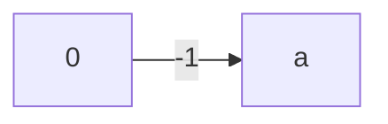
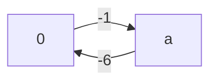
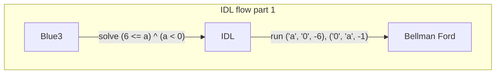
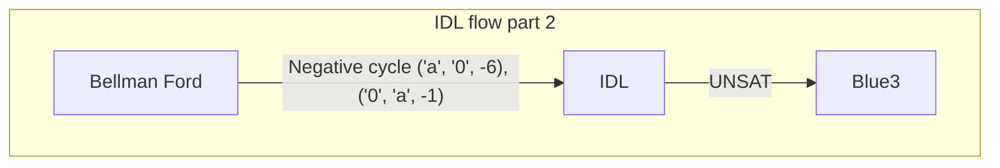
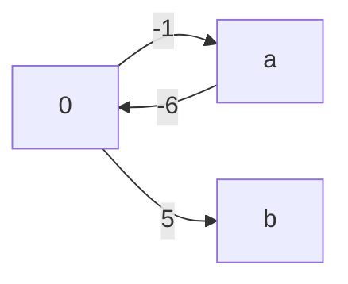

# Difference Logic
Integer Difference Logic, or IDL for short, is about solving **difference** formulas that operate on *integers*, and is a subtheory of the Linear Integer Arithmetic logic. There is a variant of IDL that works over the reals, but caprice only uses ints for its formulas, so we will describe the integer version here. Speaking more formally, a solver for IDL handles terms that take on the shape:

```
(x - y) <> c
```

Where `x` and `y` are either integer *variables* or the *constant* `0`, `c` is any integer *constant*, and `<>` is a binary operator that is one of `<`, `<=`, `>`, `>=`, and `=`. Specifically, it does *not* handle the `Not equal` operator `!=`, nor does it handle formulas where the left side is the *sum* `x + y`, or any other operator other than `-` for that matter.

As it turns out, many of our "simple" cases are exactly in this difference form, including our example:

```
(6 <= a) ^ (a < 0)
```

Because we can rewrite this as:

```
(0 <= a - 6) ^ (a <= -1)
```

Then writing out out the difference with 0 explicitly...
```
(0 - a <= -6) ^ (a - 0 <= -1)
```

As humans, all this rewriting may seem like extra work because we don't need to do all this to figure out this formula is UNSAT; we just "know" from looking at the formula that it is UNSAT.

But Difference Logic allows us to encode how we "know" that this is UNSAT in a way a computer can understand. Moreover, it is able to handle the "simple" formula cases that we didn't even know were "simple", because it formalizes what type of formula it can solve.

We get the computer to tell us whether formulas like `(6 <= a) ^ (a < 0)` are satisfiable through a familiar shortest distance graph algorithm.

## Bellman Ford
The Bellman Ford algorithm finds the shortest distance paths from a particular node to all others in a directed graph.

Suppose we have a graph with the following edges:

```ocaml
let edges =
  [ ('a', '0', 3)
  ; ('0', 'a', -1)
  ; ('z', '0', 5)
  ; ('z', 'a', 5)
  ]
```

It looks something like this:


Now let's say we wanted to find the shortest distance paths from `z` to every other node. We can run bellman ford against this edge list...

```ocaml
let pp_result ~src result =
  match result with
  | `No_negative_cycle distances ->
    print_endline "No negative cycle found.";
    List.iter (fun (node, distance) ->
      if node = src then ()
      else
        Printf.printf "dist(%c) = %d\n" node distance)
      distances

  | `Negative_cycle cycle_edges ->
    print_endline "Negative cycle found:";
    List.iter (fun edge ->
      Printf.printf "- %s\n" (pp_edge edge))
      cycle_edges

let print_bellman_ford ~label ~src edges =
  Printf.printf "Example: [%s]\n" label;
  pp_result ~src (bellman_ford ~src edges);
  print_newline ()
```

and it will tell us:

```ocaml
print_bellman_ford ~label:"OK cycle" ~src:'z' edges;
```

```bash
No negative cycle found.
dist(z) = 0
dist(a) = 4
dist(0) = 5
```

The shortest distance path from `z` to `0` is just the direct edge `z -> 0` with weight `5`.

The shortest distance path from `z` to `a` is `4`, because we can go from `z` to `0` for cost `5`, then from `0` to `a` with cost `-1` to give us a shortest distance of `4`.

If we jumped from `a` back to `0` for a cost of `3`, our distance would go from `4` to `7`. So even though we can go back and forth from `a` to `0`, it will just add cost to our path to `a` to cycle back to `0`. This means there is **no negative cycle**.

Now if we changed the edge from `a -> 0` to have cost `-6`...

```ocaml
let edges =
[ ('a', '0', -6)
; ('0', 'a', -1)
; ('z', '0', 5)
; ('z', 'a', 5)
]
in
print_bellman_ford ~label:"Negative Cycle" ~src:'z' edges;
```



...then Bellman Ford will tell us:

```
Example: [Negative Cycle]
Negative cycle found:
- 0 -> a (-1)
- a -> 0 (-6)
```

Because after going from `z` to `0` for cost `5`, going to `0` from `a` costs us `-1`, which leads us to total cost of `4`. And now going from `a` *back* to `0` would cost us `-6` weight for a total sum of `-2`, which is less than our previous path to `a`. We can do this as many times as we want and will end up with lower and lower weights.

So there is no shortest path from `z` to `a`, because for any shortest-path `P` we find for it, we can find a shorter path `P'` by circling over `a` and `0`. And as a consequence, we have no shortest path from `z` to *any* other node, because we can loop over the `a` and `0` edges once more for any other claimed shortest path and get a lower distance path. Thus, we have a **negative cycle**.

Bellman Ford is able to tell us all this about our graphs rather elegantly. The algorithm revolves around iterating over each edge in the edge list, where for each edge in the iteration, we run a `relax` function against it:

```ocaml
let relax_distances (num_nodes : int) (edges : int edge list) (state : loop) (i : int)
  ...
    let iter =
      List.fold_left relax_distance { paths ; is_updated } edges
    in
  ...
```

For each call to `relax_distance` against an edge `(from, to, weight)`, we just have to compare our current shortest distance to the `from` node and our current shortest to the `to` node. If our current shortest distance to `from` plus `weight` is less than our current shortest distance to the `to` node, or `dist(from) + weight < dist(to)`, then we update our shortest distance to `to` with that sum:

```ocaml
let relax_distance
  (state : loop)
  (edge : int edge)
  : loop =
  ...
  let from_, to_, weight = edge in
  match distance.(from_), distance.(to_) with
    ...
    | Some du, Some dv when du + weight < dv ->
      distance.(to_) <- Some (du + weight);
      ...
```

And for a graph with `NUM_NODES` nodes, we just run the above edges iteration a max of `NUM_NODES - 1` times:

```ocaml
let relax_distances (num_nodes : int) (edges : int edge list) (state : loop) (i : int)
  : [ `Continue of loop
    | `Stop of min_paths
    ] =
  let { paths ; is_updated } = state in
  if i = num_nodes - 1 then `Stop paths
  else
    let iter =
      List.fold_left relax_distance { paths ; is_updated } edges
    in
    if iter.is_updated then `Continue iter
    else `Stop paths
```

A common optimization is to early return when no distances were updated in some iteration. I implemented this using a `fold_until` style loop where we only ``Continue` the next relaxation iteration when the `is_updated` flag is set. This flag is set in an edges iteration when at least one shortest distance from the loop state is lowered. So when the relaxation condition described is hit, `is_updated` is set to true:

```ocaml
let relax_distance
  ...
  match distance.(from_), distance.(to_) with
  ...
  | Some du, Some dv when du + weight < dv ->
    distance.(to_) <- Some (du + weight);
    predecessor.(to_) <- Some { edge ; tail = from_ };
    { paths = ~distance, ~predecessor ; is_updated = true }
  ...
```

Along with when a distance was initially "discovered", which is the first case the `match` handles...

```ocaml
let relax_distance
  ...
  match distance.(from_), distance.(to_) with
  | Some du, None ->
    distance.(to_) <- Some (du + weight);
    predecessor.(to_) <- Some { edge ; tail = from_ };
    { paths = (~distance, ~predecessor) ; is_updated = true }
  ...
```

... where we favor using `None` over an integer max to represent the initial distances, because this is OCaml.

## Bellman Ford as a Difference Logic solver
Bellman Ford is useful because it solves our difference formulas. Difference formulas are made of literals:

```
(x - y) <> c
# Rewritten
(x <> y + c)
```

where `x` and `y` are either an int variable or the constant `0`, `c` is some constant, and `<>` is an operator that is one of:

```
<, <=, >, >=, =
```

We encode an edge *from* `y` *to* `x` with cost `c` like so:



### Bellman Ford UNSAT Case 

Referring back to our simple UNSAT example formula:

```
(6 <= a) ^ (a < 0)
(0 - a <= -6) ^ (a - 0 <= -1)
```

We can map `6 <= a` to the edge `('a', '0', -6)`...



...because rewritten in the difference form it is `0 - a <= -6` or `0 <= a - 6`.

So our `x` is `0`, `y` is `a`, and `c` is `-6`:

| Difference | Formula |
| ---------- | ------- |
|    `x`     |   `0`   |
|    `y`     |   `a`   |
|    `c`     |  `-6`   |
|    `<>`    |  `<=`   |

We can similarly map the `a < 0` clause to the edge `('0', 'a', -1)`:



| Difference | Formula |
| ---------- | ------- |
|    `x`     |   `a`   |
|    `y`     |   `0`   |
|    `c`     |  `-1`   |
|    `<>`    |  `<=`   |

Both clauses use the `<=` operator which means we can map this to our graph. The full graph looks something like this:



Then running Bellman Ford on this with source node `src` set to `a`, it tells us:

```ocaml
let edges =
[ ('a', '0', -6)
; ('0', 'a', -1)
]
in
print_bellman_ford ~label:"Negative Cycle src a" ~src:'a' edges;
```

```bash
Example: [Negative Cycle src a]
Negative cycle found:
- a -> 0 (-6)
- 0 -> a (-1)
```

Changing the `src` to `0` doesn't affect the outcome:

```ocaml
print_bellman_ford ~label:"Negative Cycle src 0" ~src:'0' edges;
```

```bash
Example: [Negative Cycle src 0]
Negative cycle found:
- a -> 0 (-6)
- 0 -> a (-1)
```

In other words this is a negative cycle made up of the edges `('a', '0', -6)`, `('0', 'a', -1)`, which are all the edges from our input edge list. These edges map directly to our difference formula `0 - a <= -6` or `0 <= a - 6`, which is our rewritten version of the original formula:

```
(6 <= a) ^ (a < 0)
```

Returning to the original task of finding a full SMT solution for this formula, we would map the `Negative cycle` result to `UNSAT`, which is exactly what we wanted our solver to find. Speaking in terms of the SMT architecture, Blue3 *uses* the IDL solver to find a final solution, and the IDL solver *uses* Bellman Ford so Blue3 can find that the formula is UNSAT.





Before discussing the SAT case, let's see what happens if we adjust our working graph slightly.

Let's add one node `b` to our graph and one edge `('0', 'b', 5)`:

```ocaml
let edges =
  [ ('a', '0', -6)
  ; ('0', 'a', -1)
  ; ('0', 'b', 5)
  ]
in
print_bellman_ford ~label:"Augmented src a" ~src:'a' edges;
print_bellman_ford ~label:"Augmented src 0" ~src:'0' edges;
```



Bellman Ford can still find the negative cycle in the graph if we search from either `a` and `0`:

```bash
Example: [Augmented src a]
Negative cycle found:
- 0 -> a (-1)
- a -> 0 (-6)

Example: [Augmented src 0]
Negative cycle found:
- 0 -> a (-1)
- a -> 0 (-6)
```

But if we searched from `b` instead, we would not find the negative cycle:

```ocaml
print_bellman_ford ~label:"Augmented src b" ~src:'b' edges;
```

```bash
Example: [Augmented src b]
No negative cycle found.
dist(a) = 4611686018427387903
dist(0) = 4611686018427387903
```

Where the int max distances represent a distance of infinity which is the initial state of the min distance table. This is because `r` has no outgoing edges, so bellman ford terminates after the first iteration over the edges.
