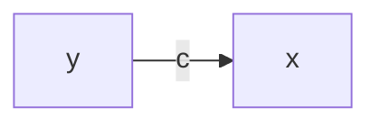
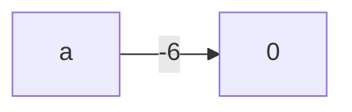
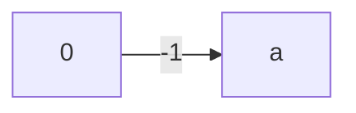
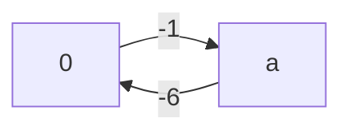
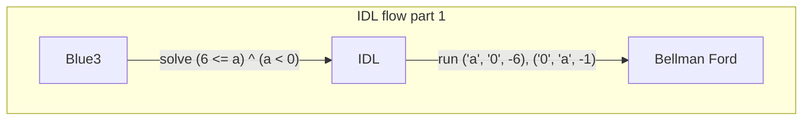
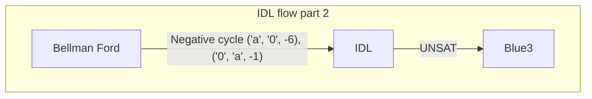
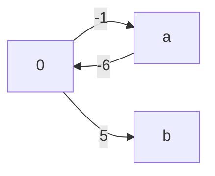

# Difference Logic
Integer Difference Logic, or IDL for short, is about solving **difference** formulas that operate on *integers*, and is a subtheory of the Linear Integer Arithmetic logic. There is a variant of IDL that works over the reals, but caprice only uses ints for its formulas, so we will describe the integer version here. Speaking more formally, a solver for IDL handles terms that take on the shape:

```
(x - y) <> c
```

Where `x` and `y` are either integer *variables* or the *constant* `0`, `c` is any integer *constant*, and `<>` is a binary operator that is one of `<`, `<=`, `>`, `>=`, and `=`. Specifically, it does *not* handle the `Not equal` operator `!=`, nor does it handle formulas where the left side is the *sum* `x + y`, or any other operator other than `-` for that matter.

As it turns out, many of our "simple" cases are exactly in this difference form, including our example:

```
(6 <= a) ^ (a < 0)
```

Because we can rewrite this as:

```
(0 <= a - 6) ^ (a <= -1)
```

Then writing out out the difference with 0 explicitly...
```
(0 - a <= -6) ^ (a - 0 <= -1)
```

As humans, all this rewriting may seem like extra work because we don't need to do all this to figure out this formula is UNSAT; we just "know" from looking at the formula that it is UNSAT.

But Difference Logic allows us to encode how we "know" that this is UNSAT in a way a computer can understand. Moreover, it is able to handle the "simple" formula cases that we didn't even know were "simple", because it formalizes what type of formula it can solve.

We get the computer to tell us whether formulas like `(6 <= a) ^ (a < 0)` are satisfiable through a familiar shortest distance graph algorithm.

## Bellman Ford as a Difference Logic solver
Bellman Ford is useful because it solves our difference formulas. Difference formulas are made of literals:

```
(x - y) <> c
# Rewritten
(x <> y + c)
```

where `x` and `y` are either an int variable or the constant `0`, `c` is some constant, and `<>` is an operator that is one of:

```
<, <=, >, >=, =
```

We encode an edge *from* `y` *to* `x` with cost `c` like so:



### Bellman Ford UNSAT Case

Referring back to our simple UNSAT example formula:

```
(6 <= a) ^ (a < 0)
(0 - a <= -6) ^ (a - 0 <= -1)
```

We can map `6 <= a` to the edge `('a', '0', -6)`...



...because rewritten in the difference form it is `0 - a <= -6` or `0 <= a - 6`.

So our `x` is `0`, `y` is `a`, and `c` is `-6`:

| Difference | Formula |
| ---------- | ------- |
|    `x`     |   `0`   |
|    `y`     |   `a`   |
|    `c`     |  `-6`   |
|    `<>`    |  `<=`   |

We can similarly map the `a < 0` clause to the edge `('0', 'a', -1)`:



| Difference | Formula |
| ---------- | ------- |
|    `x`     |   `a`   |
|    `y`     |   `0`   |
|    `c`     |  `-1`   |
|    `<>`    |  `<=`   |

Both clauses use the `<=` operator which means we can map this to our graph. The full graph looks something like this:



Then running Bellman Ford on this with source node `src` set to `a`, it tells us:

```ocaml
let edges =
[ ('a', '0', -6)
; ('0', 'a', -1)
]
in
print_bellman_ford ~label:"Negative Cycle src a" ~src:'a' edges;
```

```bash
Example: [Negative Cycle src a]
Negative cycle found:
- a -> 0 (-6)
- 0 -> a (-1)
```

Changing the `src` to `0` doesn't affect the outcome:

```ocaml
print_bellman_ford ~label:"Negative Cycle src 0" ~src:'0' edges;
```

```bash
Example: [Negative Cycle src 0]
Negative cycle found:
- a -> 0 (-6)
- 0 -> a (-1)
```

In other words this is a negative cycle made up of the edges `('a', '0', -6)`, `('0', 'a', -1)`, which are all the edges from our input edge list. These edges map directly to our difference formula `0 - a <= -6` or `0 <= a - 6`, which is our rewritten version of the original formula:

```
(6 <= a) ^ (a < 0)
```

Returning to the original task of finding a full SMT solution for this formula, we would map the `Negative cycle` result to `UNSAT`, which is exactly what we wanted our solver to find. Speaking in terms of the SMT architecture, Blue3 *uses* the IDL solver to find a final solution, and the IDL solver *uses* Bellman Ford so Blue3 can find that the formula is UNSAT.





Before discussing the SAT case, let's see what happens if we adjust our working graph slightly.

Let's add one node `b` to our graph and one edge `('0', 'b', 5)`:

```ocaml
let edges =
  [ ('a', '0', -6)
  ; ('0', 'a', -1)
  ; ('0', 'b', 5)
  ]
in
print_bellman_ford ~label:"Augmented src a" ~src:'a' edges;
print_bellman_ford ~label:"Augmented src 0" ~src:'0' edges;
```



Bellman Ford can still find the negative cycle in the graph if we search from either `a` and `0`:

```bash
Example: [Augmented src a]
Negative cycle found:
- 0 -> a (-1)
- a -> 0 (-6)

Example: [Augmented src 0]
Negative cycle found:
- 0 -> a (-1)
- a -> 0 (-6)
```

But if we searched from `b` instead, we would not find the negative cycle:

```ocaml
print_bellman_ford ~label:"Augmented src b" ~src:'b' edges;
```

```bash
Example: [Augmented src b]
No negative cycle found.
dist(a) = ∞
dist(0) = ∞
```

We ended up with shortest distances of infinity because `r` has no outgoing edges, so bellman ford terminates after the first iteration over the edges, which is always called on the initial distance table state:

```ocaml
let relax (edges : Node.t edge list) (tbl, num_nodes : t) (i : int)
  : [ `Continue of t | `Stop of tbl ] =
  if i = num_nodes - 1 then `Stop tbl
  else if update edges tbl then `Continue (tbl, num_nodes)
  else `Stop tbl
```
